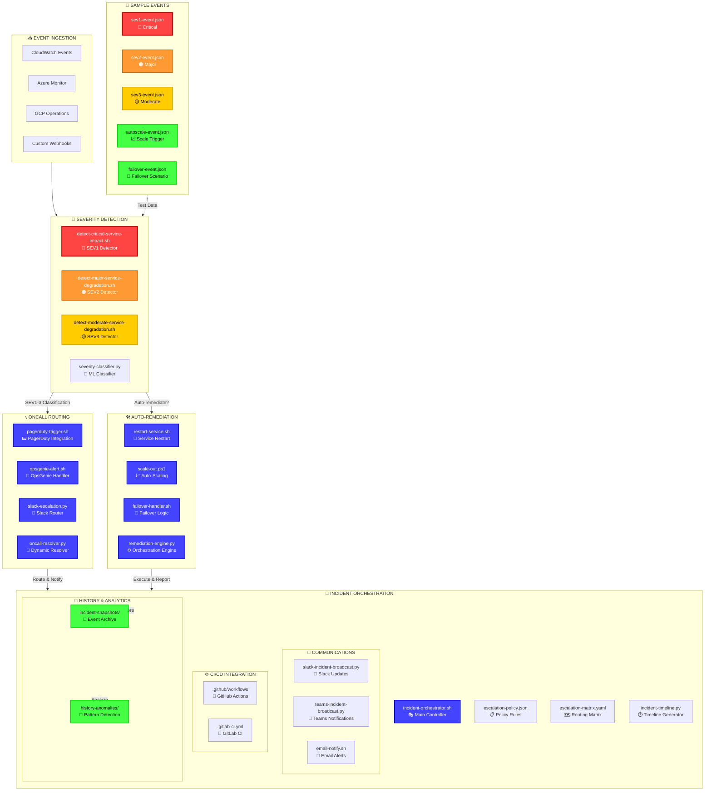

# escalation-handlers — Multi‑Stage Incident Severity & Escalation Engine

<div align="center">

**A capability‑centric module for severity detection, on‑call routing, auto‑remediation, and incident orchestration.**

Designed for **multi‑cloud**, **multi‑signal**, **enterprise‑grade** incident response pipelines.

</div>

---

## 📁 Folder Structure

| Folder | Purpose | Key Components |
|--------|---------|----------------|
| **🔎 severity-detection** | Detect critical/major/moderate service impact from event payloads | ML classifiers, threshold analyzers, signal aggregators |
| **📞 oncall-routing** | Trigger PagerDuty/OpsGenie/Slack routing paths | Integration handlers, escalation resolvers, notification engines |
| **🛠️ auto-remediation** | Automated recovery actions (restart, scale, failover) | Service controllers, scaling logic, failover orchestrators |
| **🧭 incident-orchestration** | Full incident lifecycle orchestration, comms, CI/CD, history | Policy engines, timeline generators, broadcast systems |
| **🧪 sample-events** | Synthetic event payloads for testing | SEV1-5 scenarios, edge cases, multi-signal events |

---

## 🧠 Architecture Overview


---

## 🔧 Core Capabilities

<table>
<tr>
<th width="25%">Capability</th>
<th width="75%">Features</th>
</tr>

<tr>
<td><strong>🔎 Severity Detection</strong></td>
<td>

- Multi‑signal evaluation (error rate, latency, uptime, feature flags)
- **SEV1** (Critical) / **SEV2** (Major) / **SEV3** (Moderate) classification
- Python ML classifier + Bash threshold detectors
- Deterministic output for downstream routing
- JSON/YAML event schema validation

</td>
</tr>

<tr>
<td><strong>📞 On‑Call Routing</strong></td>
<td>

- **PagerDuty** high-urgency incident creation
- **OpsGenie** multi-team alert distribution
- **Slack** channel-based escalation workflows
- Dynamic resolver for multi-region/multi-team routing
- Fallback chains (primary → secondary → manager)

</td>
</tr>

<tr>
<td><strong>🛠️ Auto‑Remediation</strong></td>
<td>

- Service restart with health check validation
- Horizontal/vertical scale-out actions
- Multi-region failover handlers
- Python remediation engine for complex decision trees
- Rollback capabilities on remediation failure

</td>
</tr>

<tr>
<td><strong>🧭 Incident Orchestration</strong></td>
<td>

- Full incident lifecycle automation (detection → resolution)
- Policy-driven + matrix-driven escalation
- Real-time timeline generation with blame-free RCA
- Multi-channel broadcast (Slack/Teams/Email)
- CI/CD integration for incident-triggered deployments
- Historical snapshots + anomaly pattern detection

</td>
</tr>

</table>

---

## 🎯 Design Principles

| Principle | Implementation |
|-----------|----------------|
| **Atomic Capabilities** | One script = one operation. No monolithic handlers. |
| **Multi‑Cloud Parity** | AWS, Azure, GCP signals treated equally. Cloud-agnostic APIs. |
| **Deterministic Outputs** | Reproducible, auditable. Same input → same classification. |
| **Capability‑Centric Foldering** | Mirrors your entire incident response toolkit. |
| **Operational Realism** | Matches real SRE/Incident Commander workflows. |
| **Extensible Architecture** | New severity levels, routing paths, or remediations drop in cleanly. |

---

## ▶️ Usage Examples

### Standalone Severity Detection
```bash
export EVENT_FILE=sample-events/sev1-event.json
./severity-detection/detect-critical-service-impact.sh
```

**Output:**
```
🔴 SEVERITY: CRITICAL (SEV1)
📊 Error Rate: 45.2% (threshold: 10%)
⏱️  P99 Latency: 8500ms (threshold: 2000ms)
🎯 Confidence: 98.7%
```

### On-Call Routing Chain
```bash
./oncall-routing/oncall-resolver.py \
  --severity SEV1 \
  --service payment-api \
  --region us-east-1
```

### Full Incident Orchestration
```bash
./incident-orchestration/incident-orchestrator.sh \
  --event-file sample-events/sev1-event.json \
  --auto-remediate \
  --broadcast-channels "#incidents,#payments-team"
```

### Auto-Remediation Dry Run
```bash
./auto-remediation/remediation-engine.py \
  --action restart \
  --service payment-api \
  --dry-run
```

---

## 📊 Severity Classification Matrix

| Severity | Error Rate | P99 Latency | Uptime | Response Time | Auto-Remediate |
|----------|-----------|-------------|--------|---------------|----------------|
| **🔴 SEV1** (Critical) | > 10% | > 5000ms | < 95% | Immediate | ✅ Yes |
| **🟠 SEV2** (Major) | 5-10% | 2000-5000ms | 95-98% | < 5 min | ✅ Yes |
| **🟡 SEV3** (Moderate) | 2-5% | 1000-2000ms | 98-99.5% | < 15 min | ⚠️ Optional |
| **🟢 SEV4** (Minor) | < 2% | < 1000ms | > 99.5% | < 1 hour | ❌ No |

---

## 🔐 Security & Compliance

- **Secret Management**: Vault/AWS Secrets Manager integration
- **Audit Logging**: All actions logged to immutable storage
- **RBAC**: Role-based access for remediation actions
- **Encryption**: At-rest and in-transit encryption for incident data
- **Compliance**: SOC 2, GDPR, HIPAA-ready architecture

---

## 🚀 Next Steps

1. **Generate Subfolder READMEs** — Detailed docs for each capability module
2. **Script Development** — Implement core scripts per Development Plan
3. **Integration Testing** — Validate against sample events
4. **Runbook Generation** — Create operational playbooks
5. **Metrics Dashboard** — Build Grafana/Datadog dashboards

---

<div align="center">

**Ready to handle incidents at scale** 🎯

*Built for teams who value reliability, speed, and operational excellence.*

</div>
