# escalation-handlers — Enterprise‑Grade Incident Automation Suite

A capability‑centric, fully modular incident‑response engine that powers  
**severity detection → routing → remediation → communication → history → anomaly intelligence → CI/CD orchestration**.

Designed for **deterministic**, **auditable**, **multi‑cloud**, **multi‑signal**,  
**SRE‑grade operational automation**.

---

## 📁 Folder Structure (Top‑Level)

| Folder | Purpose | Key Technologies |
|--------|---------|------------------|
| **🔎 severity-detection/** | Classify CRITICAL / MAJOR / MODERATE / NONE events | Python, Bash, ML classifiers |
| **📞 oncall-routing/** | PagerDuty, OpsGenie, Slack routing, resolver logic | REST APIs, Python, Bash |
| **🛠️ auto-remediation/** | Restart, scale‑out, failover, remediation engine | Python, Bash, PowerShell |
| **🧭 incident-orchestration/** | Full pipeline orchestration, policies, CI/CD, comms, history, anomalies | Bash orchestrator, JSON/YAML |
| **📜 README.md** | This file | Markdown |

---

## 🧠 Full Architecture Overview (Mermaid)

```mermaid
flowchart TD
    Start([🎯 Incident Trigger]) --> SD

    %% ============================
    %% Severity Detection
    %% ============================
    subgraph SD[🔎 SEVERITY DETECTION]
        style SD fill:#ff6b6b,stroke:#c92a2a,stroke-width:3px,color:#fff
        SD1[📊 severity-classifier.py<br/>ML-based classification]
        SD2[🔴 detect-critical-service-impact.sh<br/>P0/P1 detection]
        SD3[🟠 detect-major-service-degradation.sh<br/>P2 detection]
        SD4[🟡 detect-moderate-service-degradation.sh<br/>P3 detection]
        
        SD1 --> SD2
        SD1 --> SD3
        SD1 --> SD4
    end

    %% ============================
    %% Orchestration Root
    %% ============================
    SD --> O1
    subgraph ORCH[🧭 INCIDENT ORCHESTRATION]
        style ORCH fill:#4c6ef5,stroke:#364fc7,stroke-width:3px,color:#fff
        O1[⚡ incident-orchestrator.sh<br/>Main pipeline controller]
        O2[📋 escalation-policy.json<br/>Routing rules]
        O3[🗺️ escalation-matrix.yaml<br/>Team mappings]
        O4[⏱️ incident-timeline.py<br/>Event sequencing]
        O5[📈 ascii-visualization.txt<br/>Dashboards]
        O6[📦 sample-events/<br/>Test payloads]
        
        O1 -.->|uses| O2
        O1 -.->|uses| O3
        O1 -->|tracks| O4
    end

    %% ============================
    %% On-Call Routing
    %% ============================
    O1 --> OCR
    subgraph OCR[📞 ONCALL ROUTING]
        style OCR fill:#37b24d,stroke:#2b8a3e,stroke-width:3px,color:#fff
        OCR1[📟 pagerduty-trigger.sh<br/>PagerDuty integration]
        OCR2[🚨 opsgenie-alert.sh<br/>OpsGenie integration]
        OCR3[💬 slack-escalation.py<br/>Slack escalation]
        OCR4[🎯 oncall-resolver.py<br/>Team resolver logic]
        
        OCR4 --> OCR1
        OCR4 --> OCR2
        OCR4 --> OCR3
    end

    %% ============================
    %% Auto-Remediation
    %% ============================
    O1 --> AR
    subgraph AR[🛠️ AUTO-REMEDIATION]
        style AR fill:#f59f00,stroke:#e67700,stroke-width:3px,color:#fff
        AR1[🔄 restart-service.sh<br/>Service restart logic]
        AR2[📈 scale-out.ps1<br/>Auto-scaling handler]
        AR3[🔀 failover-handler.sh<br/>Failover orchestration]
        AR4[🤖 remediation-engine.py<br/>ML-driven remediation]
        
        AR4 --> AR1
        AR4 --> AR2
        AR4 --> AR3
    end

    %% ============================
    %% Comms
    %% ============================
    O1 --> COMMS
    subgraph COMMS[📣 COMMUNICATIONS]
        style COMMS fill:#9c36b5,stroke:#7c2d99,stroke-width:3px,color:#fff
        C1[💬 slack-incident-broadcast.py<br/>Slack notifications]
        C2[👥 teams-incident-broadcast.py<br/>Teams notifications]
        C3[📧 email-notify.sh<br/>Email alerts]
    end

    %% ============================
    %% History
    %% ============================
    O1 --> HIST
    subgraph HIST[📜 HISTORY ENGINE]
        style HIST fill:#0ea5e9,stroke:#0284c7,stroke-width:3px,color:#fff
        H1[💾 record-incident-history.py<br/>Event logging]
        H2[📋 list-history.sh<br/>Query interface]
        H3[🔍 get-latest-history.py<br/>Recent incidents]
        H4[🧹 prune-history.sh<br/>Retention policy]
        
        H1 --> H2
        H2 --> H3
        H2 --> H4
    end

    %% ============================
    %% History Anomalies
    %% ============================
    HIST --> ANOM
    subgraph ANOM[🚨 ANOMALY INTELLIGENCE]
        style ANOM fill:#e03131,stroke:#c92a2a,stroke-width:3px,color:#fff
        A1[📊 detect-anomaly-trends.py<br/>Pattern detection]
        A2[🎯 anomaly-score.py<br/>Risk scoring]
        A3[🔥 anomaly-heatmap.sh<br/>Visualization]
        A4[📝 summarize-anomalies.py<br/>Report generation]
        
        A1 --> A2
        A2 --> A3
        A2 --> A4
    end

    %% ============================
    %% CI/CD
    %% ============================
    O1 --> CICD
    subgraph CICD[⚙️ CI/CD AUTOMATION]
        style CICD fill:#20c997,stroke:#12b886,stroke-width:3px,color:#fff
        subgraph GH[GitHub Actions]
            style GH fill:#2f9e44,stroke:#2b8a3e,stroke-width:2px,color:#fff
            GH1[🔧 escalation-workflow.yml]
        end
        subgraph GL[GitLab CI]
            style GL fill:#fd7e14,stroke:#e8590c,stroke-width:2px,color:#fff
            GL1[🔧 escalation.gitlab-ci.yml]
        end
    end

    %% ============================
    %% End State
    %% ============================
    OCR --> End([✅ Incident Resolved])
    AR --> End
    COMMS --> End
    ANOM --> End
    CICD --> End

    classDef criticalStyle fill:#ff6b6b,stroke:#c92a2a,stroke-width:2px,color:#fff
    classDef successStyle fill:#51cf66,stroke:#37b24d,stroke-width:2px,color:#fff
```


---

## 🔧 Core Capabilities Matrix

| Capability | Input | Process | Output | SLA |
|-----------|-------|---------|--------|-----|
| **🔎 Severity Detection** | Raw events, metrics, logs | ML classification + threshold rules | CRITICAL/MAJOR/MODERATE/NONE | < 5s |
| **📞 On‑Call Routing** | Classified severity + team matrix | Multi-level escalation logic | PagerDuty/OpsGenie/Slack alerts | < 10s |
| **🛠️ Auto‑Remediation** | Incident context + runbooks | Restart/scale/failover execution | Service recovery + audit logs | < 60s |
| **📣 Communications** | Incident payload + severity | Multi-channel broadcast | Slack/Teams/Email notifications | < 15s |
| **📜 History Engine** | All incident events | Timestamped persistence | Queryable incident database | Real-time |
| **🚨 Anomaly Intelligence** | Historical incident data | Pattern detection + scoring | Trend reports + heatmaps | < 30s |
| **⚙️ CI/CD Orchestration** | Pipeline triggers | Full workflow automation | Deployed changes + validations | Pipeline-dependent |

---

## 📊 Severity Classification Matrix

| Severity | Color | Threshold Criteria | Auto-Remediation | Escalation | Example |
|----------|-------|-------------------|------------------|------------|---------|
| **🔴 CRITICAL** | Red (#c92a2a) | - Service unavailable<br/>- Data loss risk<br/>- Security breach | ✅ Immediate failover | P0: CTO + VP Eng | `critical-service-outage.json` |
| **🟠 MAJOR** | Orange (#e8590c) | - Degraded performance<br/>- Partial outage<br/>- SLA breach risk | ✅ Scale-out + restart | P1: Engineering leads | `major-performance-degradation.json` |
| **🟡 MODERATE** | Yellow (#fab005) | - Minor degradation<br/>- Non-critical alerts<br/>- Warning thresholds | ⚠️ Manual review | P2: On-call engineer | `moderate-degradation.json` |
| **🟢 NONE** | Green (#37b24d) | - Normal operations<br/>- Info-level events | ❌ No action | P3: Logging only | `load-spike-handled.json` |

---

## 🗂️ Detailed Module Breakdown

### **1. 🔎 Severity Detection Engine**

| Script | Purpose | Input Format | Output |
|--------|---------|--------------|--------|
| `severity-classifier.py` | ML-based event classification | JSON event payload | Severity label + confidence score |
| `detect-critical-service-impact.sh` | P0/P1 detection logic | Metrics + thresholds | Boolean + details |
| `detect-major-service-degradation.sh` | P2 detection with context | Performance metrics | Boolean + context |
| `detect-moderate-service-degradation.sh` | P3 warning detection | Service health checks | Boolean + warnings |

**Key Features:**
- ✅ Multi-signal fusion (logs + metrics + traces)
- ✅ Configurable thresholds via YAML
- ✅ Historical context awareness
- ✅ False positive suppression

---

### **2. 📞 On‑Call Routing Engine**

| Script | Purpose | Integration | Escalation Logic |
|--------|---------|-------------|------------------|
| `pagerduty-trigger.sh` | PagerDuty incident creation | REST API v2 | Severity-based routing |
| `opsgenie-alert.sh` | OpsGenie alert dispatch | REST API | Team-aware escalation |
| `slack-escalation.py` | Slack channel notifications | Webhook + Bot API | Multi-channel broadcast |
| `oncall-resolver.py` | Determines on-call owner | `escalation-matrix.yaml` | Primary + backup resolution |

**Escalation Matrix Example:**
```yaml
teams:
  backend:
    primary: ["alice@company.com", "bob@company.com"]
    backup: ["charlie@company.com"]
    escalation_delay: 300  # 5 minutes
  
  frontend:
    primary: ["dave@company.com"]
    backup: ["eve@company.com"]
    escalation_delay: 180  # 3 minutes
```

---

### **3. 🛠️ Auto‑Remediation Engine**

| Script | Purpose | Technology | Idempotency |
|--------|---------|------------|-------------|
| `restart-service.sh` | Service restart with health checks | systemctl, Docker, K8s | ✅ Safe retry |
| `scale-out.ps1` | Horizontal scaling automation | Azure VMSS, AWS ASG | ✅ Max limit enforced |
| `failover-handler.sh` | Database/service failover | DNS, load balancer | ✅ State verification |
| `remediation-engine.py` | Orchestrates all remediation | Python + subprocess | ✅ Atomic operations |

**Remediation Decision Tree:**
```
CRITICAL → Immediate failover → Notify CTO
    ↓
MAJOR → Scale-out (if load) OR Restart (if crash) → Notify leads
    ↓
MODERATE → Log + monitor → Notify on-call
    ↓
NONE → No action
```

---

### **4. 📣 Multi‑Channel Communication Engine**

| Channel | Script | Features | Payload Format |
|---------|--------|----------|----------------|
| **Slack** | `slack-incident-broadcast.py` | - Color-coded messages<br/>- @channel mentions<br/>- Threaded updates | JSON with blocks API |
| **Teams** | `teams-incident-broadcast.py` | - Adaptive cards<br/>- Action buttons<br/>- Channel webhooks | JSON adaptive card schema |
| **Email** | `email-notify.sh` | - HTML formatting<br/>- Distribution lists<br/>- SMTP/SendGrid | MIME multipart |

**Message Template (Slack):**
```json
{
  "attachments": [{
    "color": "#c92a2a",
    "title": "🔴 CRITICAL: Service Outage",
    "fields": [
      {"title": "Service", "value": "payment-api", "short": true},
      {"title": "Duration", "value": "5m 32s", "short": true}
    ],
    "footer": "Incident ID: INC-2025-001"
  }]
}
```

---

### **5. 📜 History & Timeline Engine**

| Script | Purpose | Storage | Retention |
|--------|---------|---------|-----------|
| `record-incident-history.py` | Append-only incident log | JSON files (`history/*.json`) | 90 days default |
| `list-history.sh` | Query interface with filters | Filesystem scan | N/A |
| `get-latest-history.py` | Retrieve most recent N incidents | Sorted by timestamp | Configurable |
| `prune-history.sh` | Enforce retention policy | Delete old files | Cron-scheduled |

**History Entry Schema:**
```json
{
  "incident_id": "INC-2025-001",
  "timestamp": "2025-01-01T14:23:45Z",
  "severity": "CRITICAL",
  "service": "payment-api",
  "actions_taken": ["failover", "scale-out"],
  "resolution_time": 320,
  "owner": "alice@company.com"
}
```

---

### **6. 🚨 Anomaly Intelligence Engine**

| Script | Purpose | Algorithm | Output Format |
|--------|---------|-----------|---------------|
| `detect-anomaly-trends.py` | Detect recurring patterns | Sliding window analysis | JSON anomaly report |
| `anomaly-score.py` | Risk scoring (0-100) | Weighted severity + frequency | Numeric score |
| `anomaly-heatmap.sh` | ASCII heatmap generation | Histogram bucketing | Terminal visualization |
| `summarize-anomalies.py` | Executive summary | NLP-based summarization | Markdown report |

**Anomaly Scoring Formula:**
```
score = (critical_count × 10 + major_count × 5 + moderate_count × 2) / time_window_hours
```

**Heatmap Example:**
```
Service Incident Heatmap (Last 7 Days)
━━━━━━━━━━━━━━━━━━━━━━━━━━━━━━━━━━━━━━━
payment-api    🔴🔴🔴🟠🟠🟡🟢
user-service   🟠🟡🟢🟢🟢🟢🟢
auth-service   🔴🟠🟠🟡🟢🟢🟢
```

---

### **7. ⚙️ CI/CD Orchestration**

#### GitHub Actions Workflow
```yaml
name: Incident Response Pipeline
on: 
  workflow_dispatch:
    inputs:
      event_file:
        required: true
        type: string

jobs:
  orchestrate:
    runs-on: ubuntu-latest
    steps:
      - name: Checkout
        uses: actions/checkout@v3
      
      - name: Severity Detection
        run: python3 severity-detection/severity-classifier.py
      
      - name: Route to On-Call
        run: ./oncall-routing/oncall-resolver.py
      
      - name: Auto-Remediate
        run: ./auto-remediation/remediation-engine.py
      
      - name: Notify Stakeholders
        run: python3 incident-orchestration/comms/slack-incident-broadcast.py
      
      - name: Record History
        run: python3 incident-orchestration/history/record-incident-history.py
```

#### GitLab CI Pipeline
```yaml
stages:
  - detect
  - route
  - remediate
  - notify
  - archive

severity_check:
  stage: detect
  script:
    - python3 severity-detection/severity-classifier.py
  artifacts:
    paths:
      - severity_result.json

oncall_routing:
  stage: route
  script:
    - ./oncall-routing/oncall-resolver.py
  dependencies:
    - severity_check
```

---

## 🎯 Design Principles

| Principle | Implementation | Benefit |
|-----------|----------------|---------|
| **🧩 Capability‑Centric Modularity** | One folder = one capability | Easy to extend, test, replace |
| **⚛️ Atomic Scripts** | One script = one deterministic action | Debuggable, composable, reliable |
| **☁️ Multi‑Cloud Realism** | AWS, Azure, GCP abstractions | Vendor-agnostic operations |
| **📝 Auditable Lifecycle** | History + anomalies + timeline | Compliance, forensics, learning |
| **🔌 Extensible Architecture** | Plugin-based remediation | Add new actions without refactoring |
| **🚀 CI/CD‑Ready** | GitHub Actions + GitLab CI | Automated testing + deployment |

---

## ▶️ Quick Start Guide

### **1. Run Full Orchestration**
```bash
# Set event payload
export EVENT_FILE=incident-orchestration/sample-events/critical-service-outage.json

# Execute pipeline
./incident-orchestration/incident-orchestrator.sh

# Expected output:
# ✅ Severity: CRITICAL
# ✅ Routed to: alice@company.com (PagerDuty incident created)
# ✅ Remediation: Failover executed
# ✅ Notifications: Slack + Teams + Email sent
# ✅ History: Recorded to history/INC-2025-001.json
```

### **2. Validate Configuration**
```bash
python3 incident-orchestration/validate-incident-config.py

# Checks:
# ✅ escalation-policy.json syntax
# ✅ escalation-matrix.yaml structure
# ✅ All scripts executable
# ✅ Required environment variables set
```

### **3. Generate Timeline Report**
```bash
python3 incident-orchestration/incident-timeline.py --incident-id INC-2025-001

# Output: Markdown timeline with:
# - Event sequence
# - Action durations
# - Resolution path
# - Root cause summary
```

### **4. Test with Sample Events**
```bash
ls incident-orchestration/sample-events/

# Available test payloads:
# - critical-service-outage.json
# - major-performance-degradation.json
# - moderate-degradation.json
# - load-spike-handled.json
```

---

## 📈 Metrics & Observability

| Metric | Calculation | Target | Alert Threshold |
|--------|-------------|--------|-----------------|
| **Mean Time to Detect (MTTD)** | Event timestamp → severity classification | < 5s | > 10s |
| **Mean Time to Acknowledge (MTTA)** | Classification → on-call ack | < 3min | > 5min |
| **Mean Time to Remediate (MTTR)** | Ack → service restored | < 15min | > 30min |
| **False Positive Rate** | Incorrect severity / total events | < 2% | > 5% |
| **Escalation Rate** | Primary → backup escalations | < 10% | > 20% |

---

## 🔐 Security & Compliance

| Requirement | Implementation | Audit Trail |
|------------|----------------|-------------|
| **Least Privilege** | Service accounts with minimal IAM roles | CloudTrail logs |
| **Secrets Management** | AWS Secrets Manager / Azure Key Vault | Access logs |
| **Audit Logging** | All actions logged to `history/` | Immutable S3 bucket |
| **Encryption at Rest** | AES-256 for history files | KMS key rotation |
| **Encryption in Transit** | TLS 1.3 for all API calls | Certificate monitoring |

---

## 🧪 Testing Strategy
```bash
# Unit tests
pytest severity-detection/tests/

# Integration tests
./incident-orchestration/tests/test-full-pipeline.sh

# Load tests
k6 run incident-orchestration/tests/load-test.js

# Chaos engineering
chaos-mesh apply incident-orchestration/tests/chaos-experiments.yaml
```

---

## 📚 References

- [PagerDuty API Docs](https://developer.pagerduty.com/api-reference/)
- [OpsGenie API Docs](https://docs.opsgenie.com/docs/api-overview)
- [Slack Block Kit](https://api.slack.com/block-kit)
- [AWS Systems Manager](https://docs.aws.amazon.com/systems-manager/)
- [Google SRE Book](https://sre.google/books/)

---

## 🤝 Contributing

1. Fork repository
2. Create feature branch (`git checkout -b feature/new-capability`)
3. Add tests for new functionality
4. Update documentation
5. Submit pull request with detailed description

---

## 📄 License

Apache 2.0 — Enterprise‑grade incident automation for production systems.

---

**Version:** 2.0.0 | **Last Updated:** 2025-01-01 | **Maintained by:** SRE Platform Team
