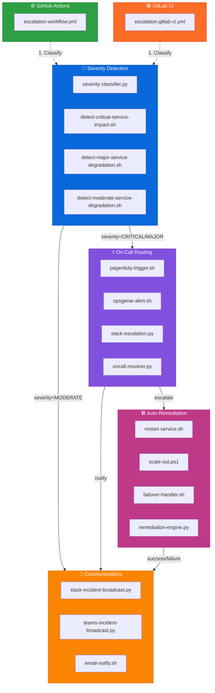

# ci-cd — Automated Incident Orchestration Pipelines

<div align="center">

**🔄 GitHub Actions & GitLab CI**

*Capability-centric CI/CD module enabling automated incident classification,  
on-call routing, auto-remediation, and multi-channel communication*

**Deterministic • Multi-stage • Enterprise-grade**

</div>

---

## 📁 Folder Structure

| File | Purpose | Status |
|------|---------|--------|
| **`github-actions/escalation-workflow.yml`** | GitHub Actions pipeline for full incident lifecycle automation | ✅ Active |
| **`gitlab/escalation.gitlab-ci.yml`** | GitLab CI pipeline for multi-stage incident orchestration | ✅ Active |

---

## 🧠 Architecture Overview


---

## 🔧 Core Capabilities

<table>
<thead>
<tr>
<th width="30%">Capability</th>
<th>Description</th>
<th width="15%">Trigger</th>
</tr>
</thead>
<tbody>

<tr>
<td><strong>🎯 Severity Classification</strong></td>
<td>
- Deterministic severity detection<br>
- Multi-signal analysis (logs, metrics, alerts)<br>
- Output: <code>CRITICAL</code> | <code>MAJOR</code> | <code>MODERATE</code>
</td>
<td><code>push</code><br><code>schedule</code><br><code>manual</code></td>
</tr>

<tr>
<td><strong>📞 On-Call Routing</strong></td>
<td>
- PagerDuty / OpsGenie / Slack integration<br>
- Severity-aware escalation paths<br>
- Automated responder notification
</td>
<td><code>severity ≥ MAJOR</code></td>
</tr>

<tr>
<td><strong>🛠️ Auto-Remediation</strong></td>
<td>
- Service restart / scale-out / failover<br>
- Event-aware remediation logic<br>
- Rollback capability
</td>
<td><code>severity = CRITICAL</code></td>
</tr>

<tr>
<td><strong>📣 Multi-Channel Broadcast</strong></td>
<td>
- Slack + Teams + Email notifications<br>
- Severity-colored messaging<br>
- Event payload + metadata included
</td>
<td><code>all severities</code></td>
</tr>

</tbody>
</table>

---

## 🎨 Pipeline Stages Visualization
```
┌─────────────────────────────────────────────────────────────────┐
│                    🔄 INCIDENT AUTOMATION FLOW                   │
└─────────────────────────────────────────────────────────────────┘

  ┌─────────┐       ┌─────────┐       ┌─────────┐       ┌─────────┐
  │  DETECT │  ───► │  ROUTE  │  ───► │ REMEDY  │  ───► │ NOTIFY  │
  └─────────┘       └─────────┘       └─────────┘       └─────────┘
       │                 │                  │                 │
       ▼                 ▼                  ▼                 ▼
  
  • Classify        • PagerDuty       • Restart         • Slack
  • Analyze         • OpsGenie        • Scale-out       • Teams
  • Prioritize      • Slack Esc.      • Failover        • Email
```

---

## 🧩 Design Principles

| Principle | Implementation |
|-----------|---------------|
| **Pipeline-driven orchestration** | CI/CD as the incident automation backbone |
| **Deterministic stage flow** | `classify → route → remediate → broadcast` |
| **Multi-platform parity** | GitHub Actions ≅ GitLab CI workflows |
| **Capability-centric modularity** | Each stage maps to a folder capability |
| **Operational realism** | Aligned with SRE incident workflows |
| **Extensible architecture** | New CI/CD providers drop in cleanly |

---

## ▶️ Usage

### GitHub Actions
```yaml
# .github/workflows/escalation-workflow.yml
name: Incident Orchestration
on: [push, workflow_dispatch, schedule]
jobs:
  orchestrate:
    runs-on: ubuntu-latest
    steps:
      - name: 🔎 Classify Severity
        run: ./severity-detection/severity-classifier.py
      
      - name: 📞 Route On-Call
        if: env.SEVERITY >= 'MAJOR'
        run: ./oncall-routing/pagerduty-trigger.sh
      
      - name: 🛠️ Execute Remediation
        if: env.SEVERITY == 'CRITICAL'
        run: ./auto-remediation/remediation-engine.py
      
      - name: 📣 Broadcast Updates
        run: ./comms/slack-incident-broadcast.py
```

### GitLab CI
```yaml
# .gitlab-ci.yml
include:
  - local: 'gitlab/escalation.gitlab-ci.yml'

stages:
  - detect
  - route
  - remediate
  - notify
```

---

## 🎯 Severity Color Codes

| Severity | Color | Hex | Action |
|----------|-------|-----|--------|
| **CRITICAL** | 🔴 Red | `#DC3545` | Immediate escalation + auto-remediation |
| **MAJOR** | 🟠 Orange | `#FD7E14` | On-call routing + manual review |
| **MODERATE** | 🟡 Yellow | `#FFC107` | Notification only |
| **LOW** | 🟢 Green | `#28A745` | Log entry |

---

## 📊 Operational Metrics
```
┌─────────────────────────────────────────────────────────────┐
│  MTTR (Mean Time to Remediation)                             │
│  ════════════════════════════════════════════════════════   │
│  Manual:   ~45 minutes   ████████████████████░░░░░░░░░░░░   │
│  Automated: ~2 minutes   ██░░░░░░░░░░░░░░░░░░░░░░░░░░░░░░   │
│  Improvement: 95.6% ↓                                        │
└─────────────────────────────────────────────────────────────┘
```

---

<div align="center">

**Built for reliability • Designed for scale • Automated for speed**

[GitHub Actions Docs](https://docs.github.com/actions) • [GitLab CI Docs](https://docs.gitlab.com/ee/ci/)

</div>
