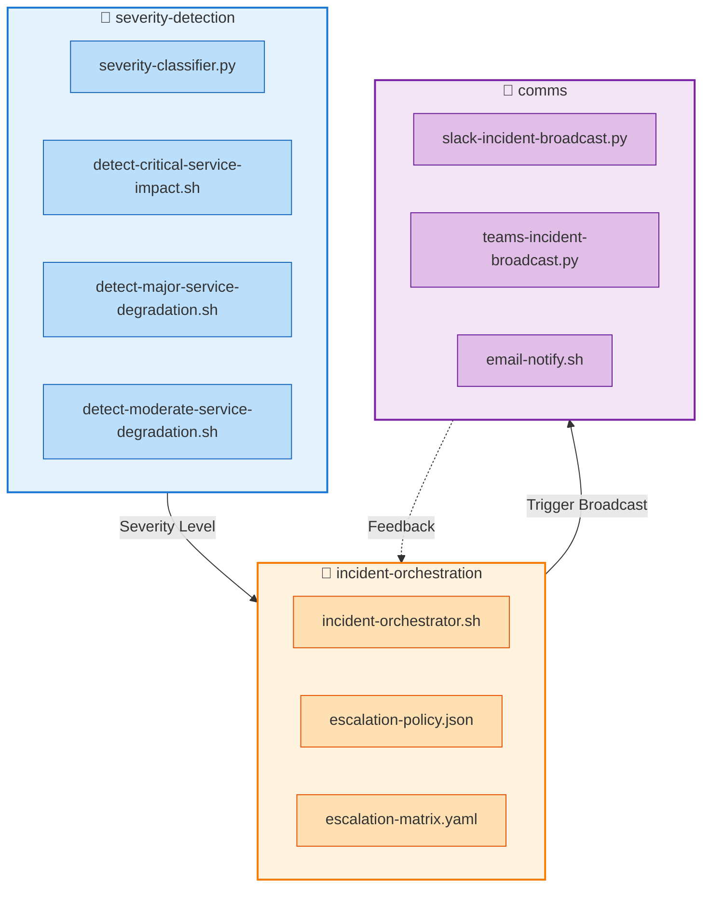
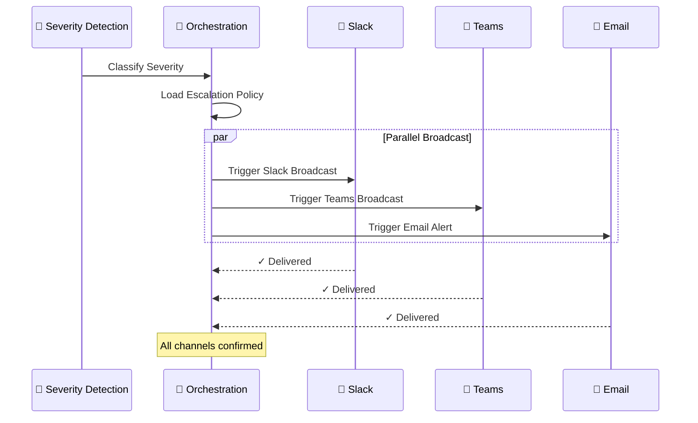

# 📣 comms — Multi‑Channel Incident Communication Engine

A capability‑centric module for **broadcasting incident updates** across Slack, Microsoft Teams, and email.  
Designed for **deterministic**, **multi‑platform**, **enterprise‑grade** communication during incident orchestration.

---

## 📁 Folder Structure

| File | Purpose | Channel |
|------|---------|---------|
| **`slack-incident-broadcast.py`** | Broadcast structured incident updates to Slack | 💬 Slack |
| **`teams-incident-broadcast.py`** | Send incident notifications to Microsoft Teams | 👥 MS Teams |
| **`email-notify.sh`** | Send email‑based incident alerts via SMTP | 📧 Email |

---

## 🧠 Architecture Overview


---

## 🔧 Core Capabilities

### **1. Slack Broadcast Engine** 💬

| Feature | Description |
|---------|-------------|
| **Structured Messages** | Color-coded blocks based on severity |
| **Rich Metadata** | Event payload, timestamps, contextual fields |
| **Custom Broadcasts** | Flexible message templates |
| **Severity Mapping** | 🔴 Critical → Red · 🟠 Major → Orange · 🟡 Moderate → Yellow |

### **2. Microsoft Teams Broadcast Engine** 👥

| Feature | Description |
|---------|-------------|
| **MessageCard Format** | Native Teams adaptive cards |
| **Theme Colors** | Severity-mapped visual indicators |
| **Formatted Blocks** | Structured event payload display |
| **Action Buttons** | Optional quick-action integrations |

### **3. Email Notification Engine** 📧

| Feature | Description |
|---------|-------------|
| **SMTP Protocol** | Universal email server compatibility |
| **Rich HTML/Text** | Dual-format messages |
| **Metadata Embedding** | Severity, timestamps, full event context |
| **Distribution Lists** | Multi-recipient support |

---

## 🎨 Severity Color Coding

| Severity | Slack | Teams | Email | Status |
|----------|-------|-------|-------|--------|
| **🔴 CRITICAL** | `#d32f2f` (Red) | `#d32f2f` | Red background | System outage |
| **🟠 MAJOR** | `#f57c00` (Orange) | `#f57c00` | Orange background | Severe degradation |
| **🟡 MODERATE** | `#fbc02d` (Yellow) | `#fbc02d` | Yellow background | Partial impact |
| **🟢 MINOR** | `#388e3c` (Green) | `#388e3c` | Green background | Low impact |
| **🔵 INFO** | `#1976d2` (Blue) | `#1976d2` | Blue background | Informational |

---

## 🧩 Design Principles

| Principle | Implementation |
|-----------|----------------|
| **⚛️ Atomic Capabilities** | One script = one communication channel |
| **🌐 Multi‑Platform Parity** | Slack, Teams, and email treated equally |
| **🎯 Deterministic Outputs** | Predictable, auditable communication |
| **📂 Capability‑Centric Foldering** | Mirrors the entire escalation suite |
| **🏭 Operational Realism** | Aligned with real SRE communication workflows |
| **🔌 Extensible** | New channels (SMS, Webex, Statuspage) drop in cleanly |

---

## ▶️ Usage Examples

### 💬 Slack Broadcast
```bash
export EVENT_FILE=event.json
export SLACK_WEBHOOK=https://hooks.slack.com/services/T00000000/B00000000/XXXXXXXXXXXX
export SEVERITY=CRITICAL
python3 slack-incident-broadcast.py
```

**Output Example:**
```
✓ Slack broadcast sent successfully
  Channel: #incidents
  Severity: CRITICAL
  Message ID: 1234567890.123456
```

---

### 👥 Microsoft Teams Broadcast
```bash
export EVENT_FILE=event.json
export TEAMS_WEBHOOK=https://outlook.office.com/webhook/abc123...
export SEVERITY=MAJOR
python3 teams-incident-broadcast.py
```

**Output Example:**
```
✓ Teams notification delivered
  Team: Operations
  Severity: MAJOR
  Card ID: 9876543210
```

---

### 📧 Email Notification
```bash
export EVENT_FILE=event.json
export EMAIL_TO=ops@example.com,sre@example.com
export EMAIL_FROM=alerts@example.com
export SMTP_SERVER=smtp.example.com
export SMTP_PORT=587
./email-notify.sh
```

**Output Example:**
```
✓ Email sent successfully
  Recipients: 2
  Subject: [CRITICAL] Incident Alert
  SMTP: smtp.example.com:587
```

---

## 🔗 Integration Flow


---

## 📊 Environment Variables Reference

| Variable | Required | Default | Description |
|----------|----------|---------|-------------|
| `EVENT_FILE` | ✅ Yes | - | Path to incident event JSON |
| `SEVERITY` | ✅ Yes | - | Incident severity level |
| `SLACK_WEBHOOK` | For Slack | - | Slack incoming webhook URL |
| `TEAMS_WEBHOOK` | For Teams | - | Teams connector webhook URL |
| `EMAIL_TO` | For Email | - | Recipient email address(es) |
| `EMAIL_FROM` | For Email | - | Sender email address |
| `SMTP_SERVER` | For Email | `localhost` | SMTP server hostname |
| `SMTP_PORT` | For Email | `25` | SMTP server port |
| `SMTP_USER` | Optional | - | SMTP authentication username |
| `SMTP_PASS` | Optional | - | SMTP authentication password |

---

## 🚀 Next Steps

- [ ] Add SMS gateway integration (`twilio-sms-notify.py`)
- [ ] Implement Statuspage API updates (`statuspage-update.py`)
- [ ] Add PagerDuty trigger capability (`pagerduty-incident-trigger.py`)
- [ ] Create Webex Teams adapter (`webex-incident-broadcast.py`)
- [ ] Build incident acknowledgment webhook receiver

---

## 📝 License & Contribution

This module is part of the **incident-orchestration** capability suite.  
Contributions should maintain **atomic capability design** and **multi-platform parity**.
