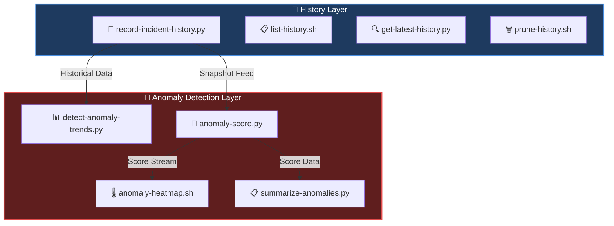

# history-anomalies — Incident Pattern & Anomaly Detection Engine

A capability‑centric module for **detecting**, **scoring**, and **summarizing** anomaly patterns across historical incident snapshots.  
Designed for **trend analysis**, **early warning signals**, and **post‑incident intelligence** in enterprise‑grade SRE environments.

---

## 📁 Folder Structure

| File | Purpose | Output Type |
|------|---------|-------------|
| **`detect-anomaly-trends.py`** | Detect spikes/drops in severity frequency across history | 📊 Trend Report |
| **`anomaly-score.py`** | Assign numerical anomaly scores to snapshots | 🔢 Score Matrix |
| **`anomaly-heatmap.sh`** | Generate ASCII heatmap of anomaly scores | 🌡️ Visual Heatmap |
| **`summarize-anomalies.py`** | Produce summary of anomaly patterns and severity distribution | 📋 Executive Summary |

---

## 🧠 Architecture Overview


---

## 🔧 Core Capabilities

| Capability | Function | Key Metrics |
|------------|----------|-------------|
| **🔍 Trend Detection** | Identifies unusual spikes/drops in severity frequency | Rolling averages, Outlier detection |
| **📊 Anomaly Scoring** | Severity‑weighted numerical scoring model | CRITICAL=3, MAJOR=2, MODERATE=1, NONE=0 |
| **🌡️ Heatmap Viz** | ASCII‑based anomaly heatmap for terminals | Terminal‑friendly, CI/CD compatible |
| **📋 Pattern Summary** | Aggregates scores & severity distributions | Highest‑impact identification |

---

## 🎯 Design Principles
```
┌─────────────────────────────────────────────────────────────┐
│ ⚛️  ATOMIC CAPABILITIES                                     │
│    Each script = one analytical function                    │
├─────────────────────────────────────────────────────────────┤
│ 🔁 DETERMINISTIC OUTPUTS                                    │
│    Reproducible anomaly scoring and summaries               │
├─────────────────────────────────────────────────────────────┤
│ 🗂️  CAPABILITY‑CENTRIC FOLDERING                           │
│    Mirrors the entire orchestration suite                   │
├─────────────────────────────────────────────────────────────┤
│ 🏭 OPERATIONAL REALISM                                      │
│    Aligned with real SRE post‑incident workflows            │
├─────────────────────────────────────────────────────────────┤
│ 🔌 EXTENSIBLE ARCHITECTURE                                  │
│    ML‑based anomaly detection ready for integration         │
└─────────────────────────────────────────────────────────────┘
```

---

## 🔢 Anomaly Scoring Model

| Severity Level | Score Weight | Detection Priority |
|----------------|--------------|-------------------|
| 🔴 **CRITICAL** | `3` | Immediate escalation |
| 🟠 **MAJOR** | `2` | High priority investigation |
| 🟡 **MODERATE** | `1` | Standard monitoring |
| ⚪ **NONE** | `0` | Baseline tracking |

**Formula**: `Total Score = Σ(severity_weight × frequency)`

---

## ▶️ Usage Examples

### 🔍 Detect Anomaly Trends
```bash
python3 detect-anomaly-trends.py
# Output: Trend analysis with spike/drop indicators
```

### 📊 Generate Anomaly Scores
```bash
python3 anomaly-score.py
# Output: Numerical scores per snapshot
```

### 🌡️ Render ASCII Heatmap
```bash
python3 anomaly-score.py | ./anomaly-heatmap.sh
# Output: Terminal heatmap visualization
```

### 📋 Summarize Anomalies
```bash
python3 summarize-anomalies.py
# Output: Executive summary with severity breakdown
```

---

## 🔄 Integration Workflow
```
┌──────────────┐
│   Incident   │
│   Occurs     │
└──────┬───────┘
       │
       ▼
┌──────────────────────┐
│ record-incident-     │
│ history.py           │
└──────┬───────────────┘
       │
       ▼
┌──────────────────────┐     ┌──────────────────────┐
│ detect-anomaly-      │────▶│  anomaly-score.py    │
│ trends.py            │     └──────┬───────────────┘
└──────────────────────┘            │
                                    ├──────────────┐
                                    ▼              ▼
                          ┌───────────────┐  ┌─────────────┐
                          │ anomaly-      │  │ summarize-  │
                          │ heatmap.sh    │  │ anomalies.py│
                          └───────────────┘  └─────────────┘
```

---

## 📈 Sample Output

### Anomaly Score Report
```
┌──────────────┬───────┬────────────┐
│  Timestamp   │ Score │  Severity  │
├──────────────┼───────┼────────────┤
│ 2024-01-15   │  12   │  🔴🔴🟠    │
│ 2024-01-16   │   5   │  🟠🟡      │
│ 2024-01-17   │   8   │  🔴🟡      │
└──────────────┴───────┴────────────┘
```

### Heatmap Visualization
```
     Jan 15  Jan 16  Jan 17  Jan 18
     ████    ██      ███     █
      12      5       8       2
```

---

## 🚀 Future Enhancements

- [ ] Machine learning anomaly detection (LSTM/Isolation Forest)
- [ ] Real‑time streaming anomaly detection
- [ ] Configurable scoring weights
- [ ] JSON/CSV export formats
- [ ] Integration with alerting systems (PagerDuty, Slack)
- [ ] Historical anomaly playback for training

---

## 📚 Related Modules

| Module | Relationship |
|--------|--------------|
| **`history/`** | Provides snapshot data feed |
| **`orchestration/`** | Consumes anomaly signals for adaptive scheduling |
| **`reporting/`** | Uses anomaly scores for executive dashboards |

---

**Built for operational excellence in incident management** 🎯
