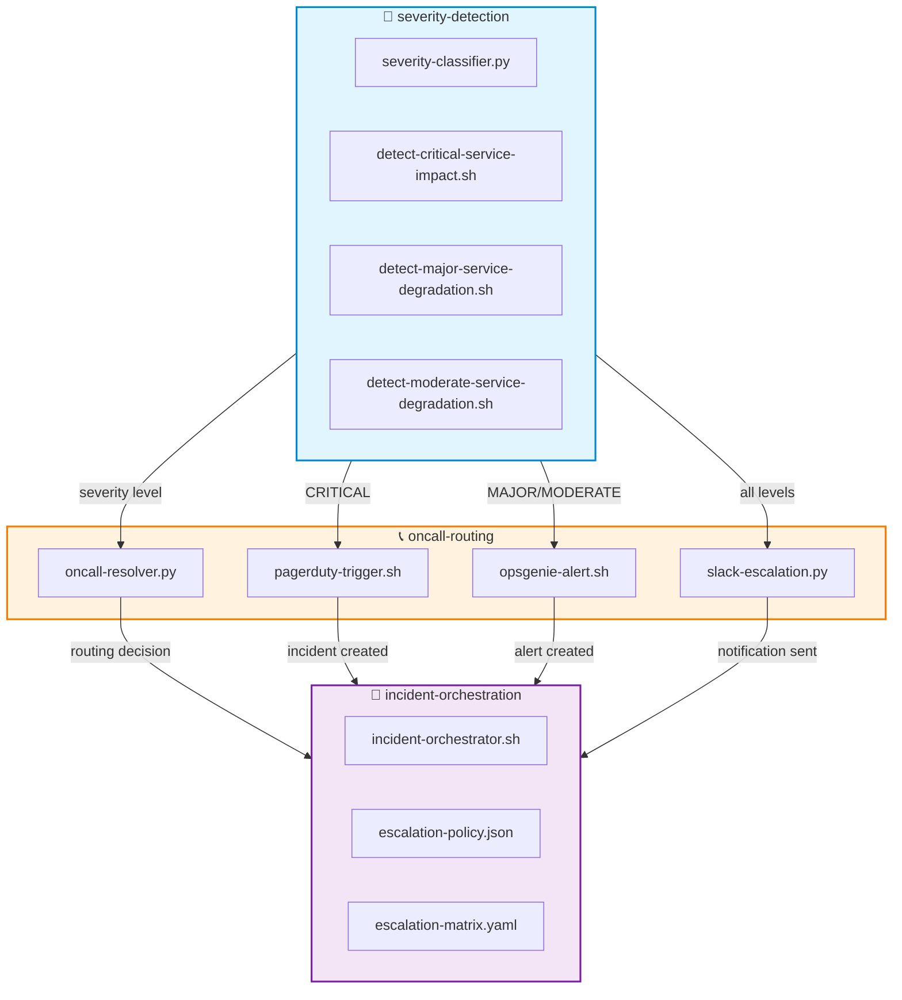

# 📞 oncall-routing — Multi‑Channel Escalation Routing Engine

A capability‑centric module for **automated on‑call escalation**, integrating PagerDuty, OpsGenie, Slack, and internal routing logic.  
Designed for **deterministic**, **multi‑platform**, **enterprise‑grade** incident response pipelines.

---

## 📁 Folder Structure

| File | Purpose | Integration |
|------|---------|-------------|
| **pagerduty-trigger.sh** | Trigger PagerDuty incidents via Events API v2 | 🟣 PagerDuty |
| **opsgenie-alert.sh** | Send OpsGenie alerts with severity‑mapped priority | 🟠 OpsGenie |
| **slack-escalation.py** | Push escalation notifications to Slack channels | 💬 Slack |
| **oncall-resolver.py** | Resolve correct on‑call target based on severity | 🎯 Internal |

---

## 🧠 Architecture Overview


---

## 🔧 Core Capabilities

### **1. 🟣 PagerDuty Routing**
| Feature | Implementation |
|---------|---------------|
| **API** | Events API v2 |
| **Trigger** | Incident creation with routing key |
| **Severity Mapping** | CRITICAL → `critical`<br>MAJOR → `error`<br>MODERATE → `warning` |
| **Payload** | Full event context + metadata |

### **2. 🟠 OpsGenie Routing**
| Feature | Implementation |
|---------|---------------|
| **API** | Alert API v2 |
| **Priority Levels** | P1 (CRITICAL) → P5 (MODERATE) |
| **Details** | Custom field injection |
| **Tags** | Severity, service, team |

### **3. 💬 Slack Escalation**
| Feature | Implementation |
|---------|---------------|
| **Format** | Structured Block Kit messages |
| **Color Coding** | 🔴 CRITICAL<br>🟠 MAJOR<br>🟡 MODERATE |
| **Content** | Event payload + metadata + actions |
| **Channels** | Per-severity channel routing |

### **4. 🎯 On‑Call Resolver**
| Feature | Implementation |
|---------|---------------|
| **Input** | Severity level |
| **Output** | Team name + escalation path |
| **Logic** | Deterministic mapping matrix |
| **Usage** | Consumed by orchestrators |

---

## 🎨 Severity Color Scheme

| Severity | Color | Hex | Usage |
|----------|-------|-----|-------|
| **CRITICAL** | 🔴 Red | `#d32f2f` | PagerDuty P1, OpsGenie P1, Slack danger |
| **MAJOR** | 🟠 Orange | `#f57c00` | PagerDuty error, OpsGenie P2, Slack warning |
| **MODERATE** | 🟡 Yellow | `#fbc02d` | PagerDuty warning, OpsGenie P3, Slack attention |

---

## 🧩 Design Principles

| Principle | Description |
|-----------|-------------|
| **Atomic Capabilities** | One script = one routing action |
| **Multi‑Platform Parity** | PagerDuty, OpsGenie, Slack treated equally |
| **Deterministic Outputs** | Predictable routing decisions |
| **Capability‑Centric Foldering** | Mirrors escalation‑handlers suite |
| **Operational Realism** | Matches real SRE workflows |
| **Extensible** | New targets drop in cleanly |

---

## ▶️ Usage Examples

### **Trigger PagerDuty Incident**
```bash
export EVENT_FILE=event.json
export PD_ROUTING_KEY=xxxx
export SEVERITY=CRITICAL
./pagerduty-trigger.sh
```

### **Send OpsGenie Alert**
```bash
export EVENT_FILE=event.json
export OPSGENIE_API_KEY=yyyy
export SEVERITY=MAJOR
./opsgenie-alert.sh
```

### **Push Slack Escalation**
```bash
export EVENT_FILE=event.json
export SLACK_WEBHOOK=https://hooks.slack.com/...
export SEVERITY=MODERATE
python3 slack-escalation.py
```

### **Resolve On‑Call Target**
```bash
export SEVERITY=CRITICAL
python3 oncall-resolver.py
# Output: team=platform-sre escalation_path=immediate
```

---

## 🔗 Integration Matrix

| Source Module | → | Target Module | Data Flow |
|---------------|---|---------------|-----------|
| `severity-detection/` | → | `oncall-routing/` | Severity level |
| `oncall-routing/` | → | `incident-orchestration/` | Routing decision |
| `incident-orchestration/` | → | `oncall-routing/` | Escalation trigger |
| `auto-remediation/` | → | `oncall-routing/` | Remediation failure → escalate |

---

## 📊 Routing Decision Matrix

| Severity | Team | Response Time | Escalation Path |
|----------|------|---------------|-----------------|
| **CRITICAL** | Platform SRE | < 5 min | Immediate → VP Eng |
| **MAJOR** | Service Team | < 15 min | Team Lead → Manager |
| **MODERATE** | On-Call Eng | < 30 min | Engineer → Lead |

---

## 🚀 Next Steps

- [ ] Add Microsoft Teams integration
- [ ] Implement VictorOps/Splunk routing
- [ ] Create escalation policy DSL
- [ ] Build routing simulator/tester
- [ ] Add metrics export (Prometheus)

---

**Related Modules:**  
[`severity-detection/`](../severity-detection/) • [`incident-orchestration/`](../incident-orchestration/) • [`auto-remediation/`](../auto-remediation/)
