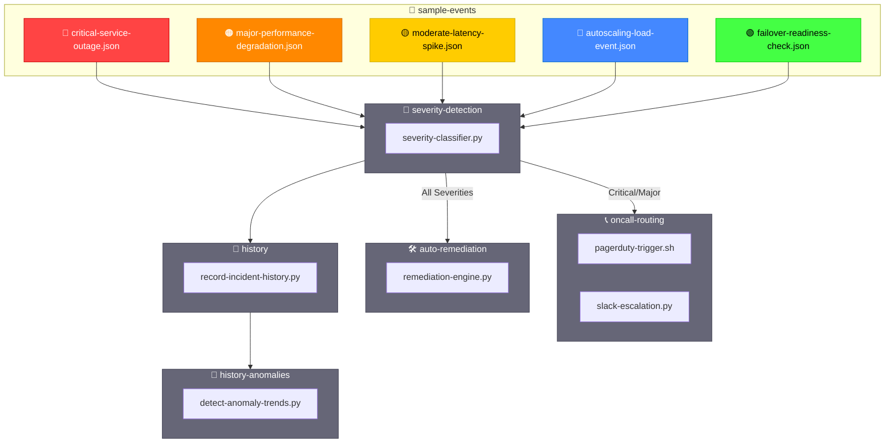

# sample-events — Synthetic Incident Payload Library

A capability‑centric collection of **synthetic incident payloads** used for testing  
severity detection, routing, remediation, orchestration, history tracking, and anomaly analysis.

Designed for **repeatable**, **deterministic**, **multi‑scenario** validation of the entire incident pipeline.

---

## 📁 Folder Structure

| File | Purpose | Severity | Action |
|------|---------|----------|--------|
| **critical-service-outage.json** | Simulates a full service outage requiring failover | 🔴 CRITICAL | Failover |
| **major-performance-degradation.json** | Represents a major degradation requiring scale‑out | 🟠 MAJOR | Scale-out |
| **moderate-latency-spike.json** | Models a moderate latency spike requiring restart | 🟡 MODERATE | Restart |
| **autoscaling-load-event.json** | Triggers scale‑out due to high load, not severity | 🔵 INFO | Scale-out |
| **failover-readiness-check.json** | Tests failover logic without severity triggers | 🟢 TEST | Failover Test |

---

## 🧠 Architecture Overview (Mermaid)


---

## 🔧 Core Capabilities

| Capability | Description | Components |
|------------|-------------|------------|
| **🎯 Scenario‑Driven Testing** | Validate CRITICAL / MAJOR / MODERATE classification | • Classification engine<br>• Test harness<br>• Assertion framework |
| **🔄 Deterministic Payload Design** | Reproducible orchestration behavior | • JSON schemas<br>• Fixed test data<br>• Version control |
| **🚀 Full Pipeline Validation** | End-to-end incident workflow | • Detection → Routing → Remediation<br>• Comms → History → Anomaly |
| **📦 Extensible Scenario Library** | Add scenarios without breaking structure | • Modular design<br>• Plugin architecture<br>• Multi-cloud support |

---

## 🎭 Event Scenarios Matrix

| Scenario | Severity | Trigger Condition | Routing Target | Remediation Action | Expected Outcome |
|----------|----------|-------------------|----------------|-------------------|------------------|
| **Critical Outage** | 🔴 CRITICAL | Service unavailable | PagerDuty + Slack | Automatic failover | < 2min recovery |
| **Performance Degradation** | 🟠 MAJOR | Latency > 1000ms | PagerDuty | Scale-out +50% | Latency < 500ms |
| **Latency Spike** | 🟡 MODERATE | P95 > 500ms | Slack | Service restart | Latency normalized |
| **Autoscaling Event** | 🔵 INFO | CPU > 80% | Monitoring | Scale-out +30% | CPU < 60% |
| **Failover Test** | 🟢 TEST | Manual trigger | None | Test failover | No production impact |

---

## 🔀 Routing Decision Matrix

| Severity | PagerDuty | Slack | Email | SMS | Auto-Remediation |
|----------|-----------|-------|-------|-----|------------------|
| 🔴 CRITICAL | ✅ Immediate | ✅ #incidents | ✅ Leadership | ✅ On-call | ✅ Enabled |
| 🟠 MAJOR | ✅ High Priority | ✅ #incidents | ✅ Team | ❌ | ✅ Enabled |
| 🟡 MODERATE | ❌ | ✅ #alerts | ✅ Team | ❌ | ✅ Enabled |
| 🔵 INFO | ❌ | ✅ #monitoring | ❌ | ❌ | ⚠️ Conditional |
| 🟢 TEST | ❌ | ✅ #testing | ❌ | ❌ | ❌ |

---

## ▶️ Usage Examples

### **Single Event Classification**
```bash
export EVENT_FILE=sample-events/critical-service-outage.json
python3 escalation-handlers/severity-detection/severity-classifier.py
```

### **Full Orchestration Pipeline**
```bash
export EVENT_FILE=sample-events/major-performance-degradation.json
./incident-orchestrator.sh
```

### **Batch Testing All Scenarios**
```bash
for event in sample-events/*.json; do
  echo "Testing: $event"
  export EVENT_FILE="$event"
  ./incident-orchestrator.sh --dry-run
done
```

### **CI/CD Integration**
```bash
# Run in test mode (no external calls)
export TEST_MODE=true
export EVENT_FILE=sample-events/moderate-latency-spike.json
pytest tests/test_incident_pipeline.py
```

---

## 📊 Expected Test Results

| Event File | Classification Time | Routing Targets | Remediation Time | Success Criteria |
|------------|-------------------|-----------------|------------------|------------------|
| critical-service-outage.json | < 100ms | PagerDuty, Slack | < 2min | Failover complete |
| major-performance-degradation.json | < 100ms | PagerDuty, Slack | < 5min | Scaled +50% |
| moderate-latency-spike.json | < 100ms | Slack | < 3min | Service restarted |
| autoscaling-load-event.json | < 100ms | Monitoring | < 2min | Scaled +30% |
| failover-readiness-check.json | < 100ms | None | < 1min | Test passed |

---

## 🎨 Color Coding Legend

| Symbol | Severity | Priority | Response Time | Escalation |
|--------|----------|----------|---------------|------------|
| 🔴 | CRITICAL | P0 | Immediate | Full team + leadership |
| 🟠 | MAJOR | P1 | < 15 min | On-call + team lead |
| 🟡 | MODERATE | P2 | < 1 hour | On-call engineer |
| 🔵 | INFO | P3 | Next business day | Auto-handled |
| 🟢 | TEST | P4 | Non-urgent | Testing team only |

---

## 🔗 Related Components

| Component | Location | Purpose |
|-----------|----------|---------|
| **Severity Classifier** | `escalation-handlers/severity-detection/` | Determines incident severity |
| **Routing Engine** | `escalation-handlers/oncall-routing/` | Routes to appropriate channels |
| **Remediation Engine** | `escalation-handlers/auto-remediation/` | Executes automated fixes |
| **History Tracker** | `escalation-handlers/history/` | Records incident timeline |
| **Anomaly Detector** | `escalation-handlers/history-anomalies/` | Identifies patterns |

---
