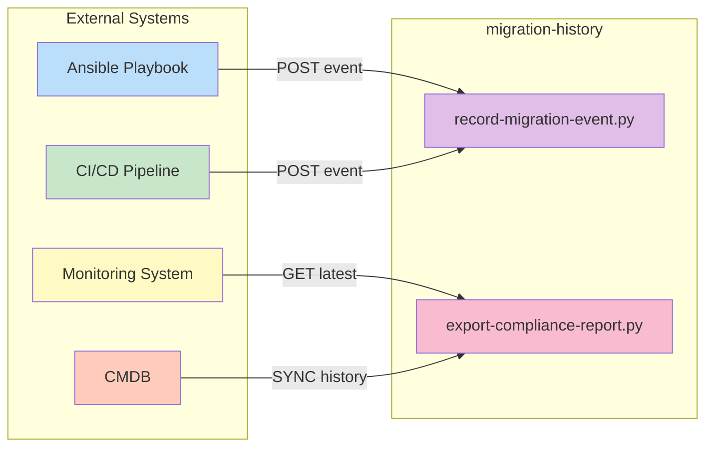

# migration-history — RHEL8 Migration Event Logging & Compliance Engine

A capability‑centric module that provides **persistent, auditable, and queryable** tracking of all RHEL7 → RHEL8 migration attempts.  
This ensures full historical visibility, compliance reporting, and traceability across the entire migration lifecycle.

---

## 📁 Folder Structure

| File | Purpose | Type |
|------|---------|------|
| **record-migration-event.py** | Records each migration attempt with timestamp + status | 🐍 Core |
| **list-migration-history.sh** | Lists all recorded migration events | 📋 Query |
| **get-latest-migration.py** | Retrieves the most recent migration event | 🔍 Query |
| **prune-migration-history.sh** | Cleans up old history entries based on retention | 🧹 Maintenance |
| **export-compliance-report.py** | Generates a compliance audit report | 📊 Reporting |
| **migration-history.json** | Persistent event log (auto-generated) | 💾 Data Store |

---

## 🧠 Architecture & Logic Flow

```mermaid
flowchart TD
    subgraph INPUT["🔵 INPUT LAYER"]
        A[📝 record-migration-event.py<br/>Write migration event]
    end
    
    subgraph STORAGE["💾 PERSISTENCE LAYER"]
        B[(📚 migration-history.json<br/>Persistent event log)]
    end
    
    subgraph QUERY["🟢 QUERY LAYER"]
        C[📄 list-migration-history.sh<br/>List all events]
        D[🔎 get-latest-migration.py<br/>Retrieve latest event]
    end
    
    subgraph MAINTENANCE["🟡 MAINTENANCE LAYER"]
        E[🧹 prune-migration-history.sh<br/>Retention cleanup]
    end
    
    subgraph OUTPUT["🟣 OUTPUT LAYER"]
        F[📊 export-compliance-report.py<br/>Generate audit report]
    end

    A -->|writes| B
    B -->|reads| C
    B -->|reads| D
    B -->|modifies| E
    B -->|analyzes| F
    
    style INPUT fill:#e3f2fd
    style STORAGE fill:#f3e5f5
    style QUERY fill:#e8f5e9
    style MAINTENANCE fill:#fff9c4
    style OUTPUT fill:#f3e5f5
```


---

## 🔧 Core Capabilities

### **1. 🔵 Persistent Migration Event Logging**
| Feature | Description |
|---------|-------------|
| **Event Recording** | Records host, status, and timestamp |
| **Atomicity** | Ensures every migration attempt is captured |
| **Audit Trail** | Provides a single source of truth for compliance |

### **2. 🟢 Historical Querying**
| Feature | Description |
|---------|-------------|
| **Full History** | List all migration events chronologically |
| **Latest Lookup** | Retrieve the most recent migration attempt |
| **RCA Support** | Supports troubleshooting and root cause analysis workflows |

### **3. 🟡 Retention‑Based Cleanup**
| Feature | Description |
|---------|-------------|
| **Policy Enforcement** | Removes old entries based on retention policy |
| **Storage Optimization** | Keeps history lightweight and compliant |
| **Maintainability** | Ensures long‑term operational efficiency |

### **4. 🟣 Compliance Reporting**
| Feature | Description |
|---------|-------------|
| **Structured Output** | Generates structured JSON audit reports |
| **Success Metrics** | Includes success/failure breakdown |
| **Governance Ready** | Captures full historical context for compliance teams |

---

## ▶️ Usage

### 🔵 Record a Migration Event
```bash
python3 record-migration-event.py <host> <status>
```
**Example:**
```bash
python3 record-migration-event.py server01.example.com success
```

### 🟢 Query Operations

**List all events:**
```bash
./list-migration-history.sh
```

**Get latest migration:**
```bash
python3 get-latest-migration.py
```

### 🟡 Maintenance Operations

**Prune history (retain last N days):**
```bash
./prune-migration-history.sh 30
```

### 🟣 Reporting Operations

**Generate compliance report:**
```bash
python3 export-compliance-report.py
```
**Output:** `compliance-report-YYYYMMDD-HHMMSS.json`

---

## 📊 Event Schema

Each migration event is stored with the following structure:

| Field | Type | Description | Example |
|-------|------|-------------|---------|
| `timestamp` | ISO 8601 | Event occurrence time | `2024-01-15T14:30:00Z` |
| `host` | string | Target hostname/FQDN | `server01.example.com` |
| `status` | enum | Migration outcome | `success` \| `failure` \| `rollback` |
| `event_id` | UUID | Unique event identifier | `550e8400-e29b-41d4-a716-446655440000` |
| `metadata` | object | Additional context (optional) | `{"operator": "admin", "duration": 3600}` |

---

## 🎯 Status Codes

| Status | Color | Meaning |
|--------|-------|---------|
| ✅ **success** | 🟢 Green | Migration completed successfully |
| ❌ **failure** | 🔴 Red | Migration failed (system remains on RHEL7) |
| 🔄 **rollback** | 🟡 Yellow | Migration rolled back due to validation failure |
| ⏸️ **partial** | 🟠 Orange | Partial completion (requires manual intervention) |

---

## 🔐 Compliance Features

| Feature | Benefit |
|---------|---------|
| **Immutable Logs** | Prevents tampering with historical records |
| **Timestamp Verification** | Ensures chronological integrity |
| **Retention Policies** | Meets regulatory compliance requirements |
| **Audit Export** | Supports SOC 2, ISO 27001, PCI-DSS reporting |

---

## 🚨 Best Practices

### ✅ DO
- Record every migration attempt (success or failure)
- Run pruning during maintenance windows
- Export compliance reports monthly
- Validate JSON schema on ingestion

### ❌ DON'T
- Manually edit `migration-history.json`
- Delete history without pruning script
- Store sensitive credentials in metadata
- Exceed 10,000 events without pruning

---

## 🔗 Integration Points


---

## 📈 Metrics & KPIs

| Metric | Description | Threshold |
|--------|-------------|-----------|
| **Success Rate** | % of successful migrations | > 95% |
| **Average Duration** | Mean time per migration | < 2 hours |
| **Rollback Rate** | % requiring rollback | < 5% |
| **History Size** | Total events logged | < 10,000 |

---

## 🆘 Troubleshooting

| Issue | Cause | Solution |
|-------|-------|----------|
| **Events not recording** | Permission denied | `chmod +x record-migration-event.py` |
| **JSON parse error** | Corrupted history file | Restore from backup or reinitialize |
| **Slow queries** | Large history file | Run pruning script |
| **Missing compliance data** | Incomplete event metadata | Validate schema before recording |

---

## 📝 Example Compliance Report
```json
{
  "report_date": "2024-01-15T14:30:00Z",
  "total_events": 150,
  "success_count": 145,
  "failure_count": 3,
  "rollback_count": 2,
  "success_rate": "96.67%",
  "date_range": {
    "start": "2023-11-01T00:00:00Z",
    "end": "2024-01-15T14:30:00Z"
  },
  "top_failures": [
    {"host": "server23.example.com", "count": 2},
    {"host": "server45.example.com", "count": 1}
  ]
}
```

---

## 🔄 Version History

| Version | Date | Changes |
|---------|------|---------|
| **1.0.0** | 2024-01-15 | Initial release |
| **1.1.0** | 2024-02-01 | Added compliance reporting |
| **1.2.0** | 2024-03-01 | Implemented retention policies |

---

## 📚 Related Modules

- **state-snapshot** — Captures system state before/after migration
- **rollback-orchestrator** — Executes automated rollback procedures
- **validation-engine** — Validates migration success criteria
