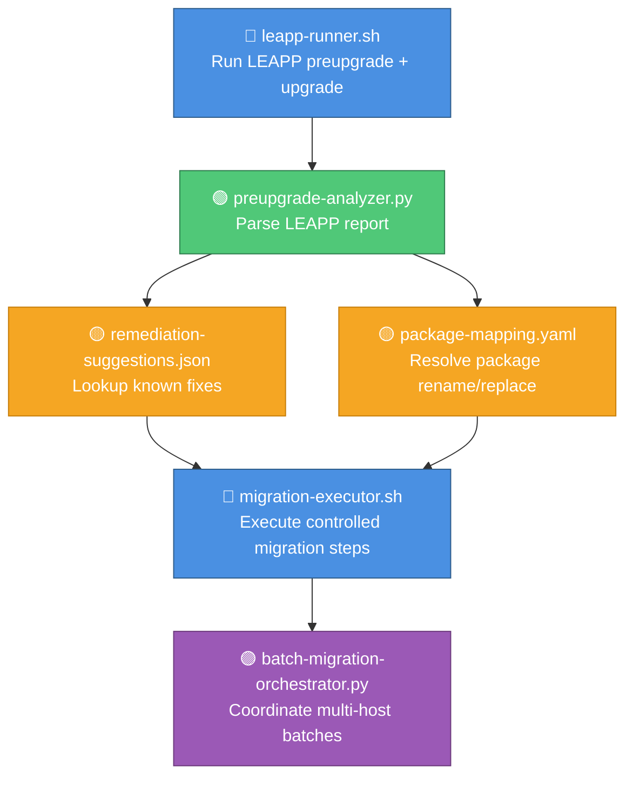

# migration-tooling — RHEL8 Migration Execution Engine

A capability‑centric toolkit that performs **controlled, predictable, and auditable** RHEL7 → RHEL8 migrations across single hosts or large fleets.

This module transforms pre‑migration assessments into **actionable migration steps**, ensuring that every host is upgraded safely, consistently, and with full visibility.

---

## 📁 Folder Structure

| File | Purpose | Type |
|------|---------|------|
| **leapp-runner.sh** | Executes LEAPP preupgrade + upgrade workflow | 🔵 Executor |
| **preupgrade-analyzer.py** | Parses LEAPP preupgrade reports for blockers/inhibitors | 🟢 Analyzer |
| **remediation-suggestions.json** | Known fixes for common LEAPP blockers | 🟡 Knowledge Base |
| **package-mapping.yaml** | RHEL7 → RHEL8 package rename/replace mapping | 🟡 Knowledge Base |
| **migration-executor.sh** | Performs controlled migration steps after LEAPP | 🔵 Executor |
| **batch-migration-orchestrator.py** | Coordinates multi-host migrations in batches | 🟣 Orchestrator |

### Legend
- 🔵 **Executor** — Performs direct migration operations
- 🟢 **Analyzer** — Processes reports and identifies issues
- 🟡 **Knowledge Base** — Static data/mappings
- 🟣 **Orchestrator** — Coordinates multi-host workflows

---

## 🧠 Architecture & Logic Flow


---

## 🔧 Core Capabilities

| Capability | Component | Function | Dependencies |
|------------|-----------|----------|--------------|
| **LEAPP Automation Wrapper** | `leapp-runner.sh` | Runs preupgrade and upgrade phases with standardized JSON output | LEAPP toolkit |
| **Preupgrade Report Analysis** | `preupgrade-analyzer.py` | Extracts blockers, inhibitors, and warnings from LEAPP reports | LEAPP output |
| **Remediation Knowledge Base** | `remediation-suggestions.json` | Maps common blockers to recommended fixes | Community knowledge |
| **Package Mapping Engine** | `package-mapping.yaml` | Handles RHEL7 → RHEL8 package rename/replace logic | RHEL documentation |
| **Controlled Migration Execution** | `migration-executor.sh` | Performs distro-sync, systemd reload, and safe reboot | LEAPP success |
| **Batch Migration Coordination** | `batch-migration-orchestrator.py` | Executes canary-first, multi-host migrations in waves | All components |

---

## 🎯 Migration Workflow Stages


| Stage | Action | Output |
|-------|--------|--------|
| 🔍 **Assessment** | Run LEAPP preupgrade analysis | Blockers, inhibitors, warnings |
| 🛠️ **Remediation** | Apply fixes from knowledge base | Resolved issues, remaining blockers |
| ⚙️ **Execution** | Perform upgrade with LEAPP | RHEL8 system state |
| ✅ **Validation** | Post-migration checks | Service status, package verification |
| 📊 **Reporting** | Generate audit trail | Migration log, metrics |

---

## ▶️ Usage

### Run LEAPP across all hosts
```bash
./leapp-runner.sh hosts.txt
```

### Analyze LEAPP preupgrade report
```bash
python3 preupgrade-analyzer.py preupgrade-report.json
```

### Execute controlled migration
```bash
./migration-executor.sh hosts.txt
```

### Run batch migration
```bash
python3 batch-migration-orchestrator.py hosts.txt 25
```

---

## 📊 Batch Migration Strategy

| Phase | Hosts | Purpose | Rollback |
|-------|-------|---------|----------|
| **Canary** | 1-5% | Validate process on representative sample | Full |
| **Wave 1** | 10-25% | Expand to larger subset | Per-host |
| **Wave 2** | 25-50% | Accelerate rollout | Per-host |
| **Wave 3** | 50-100% | Complete fleet migration | Limited |

**Progression Criteria:** Zero critical failures, <5% non-critical issues, all validation checks passed

---

## 🚨 Issue Classification

| Severity | Symbol | Action | Example |
|----------|--------|--------|---------|
| **Blocker** | 🔴 | Must resolve before migration | Kernel incompatibility |
| **Inhibitor** | 🟠 | Should resolve, can proceed with risk | Deprecated package |
| **Warning** | 🟡 | Informational, monitor post-migration | Configuration change |
| **Info** | 🔵 | No action required | Version change notice |
