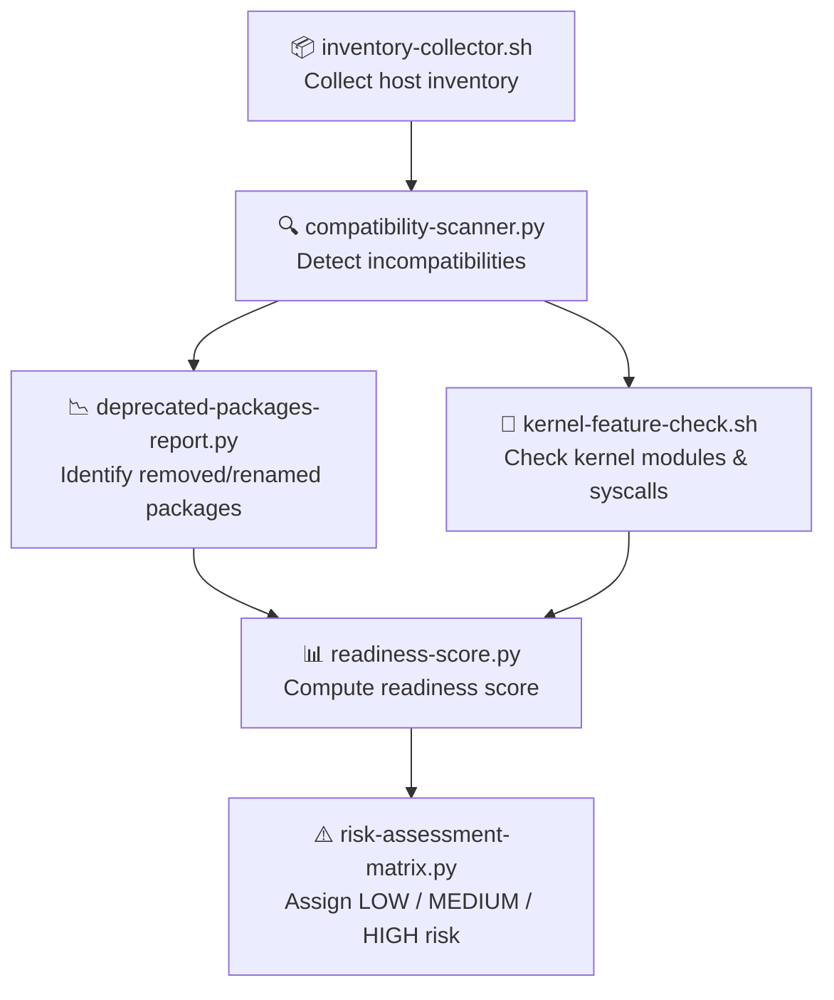

# pre-migration-assessment — RHEL8 Readiness & Risk Evaluation Engine

A capability‑centric assessment suite that evaluates **technical readiness**, **compatibility**, and **migration risk** before any RHEL7 → RHEL8 upgrade is allowed.

This module ensures that every host is **inventory‑verified**, **compatibility‑checked**, **scored**, and **risk‑classified** before entering the migration pipeline.

---

## 📁 Folder Structure

| File | Purpose |
|------|---------|
| **inventory-collector.sh** | Collects OS, kernel, package, and service inventory |
| **compatibility-scanner.py** | Detects RHEL7 → RHEL8 incompatibilities |
| **deprecated-packages-report.py** | Flags removed or renamed packages |
| **kernel-feature-check.sh** | Validates kernel modules & syscall compatibility |
| **readiness-score.py** | Generates readiness score (0–100) |
| **risk-assessment-matrix.py** | Categorizes hosts into LOW / MEDIUM / HIGH migration risk |

---

## 🧠 Architecture & Logic Flow (Mermaid)



---

## 🔧 Core Capabilities

### **1. Inventory Collection**
- Gathers OS version, kernel, installed packages, and running services  
- Provides the baseline dataset for all downstream checks  

### **2. Compatibility Detection**
- Identifies removed packages  
- Flags deprecated kernel modules  
- Detects unsupported services  
- Ensures no hidden blockers enter migration  

### **3. Deprecated Package Mapping**
- Maps RHEL7 → RHEL8 package changes  
- Highlights rename/replace requirements  

### **4. Kernel & Syscall Validation**
- Ensures kernel modules are compatible with RHEL8  
- Detects deprecated or removed syscalls  

### **5. Readiness Scoring**
- Converts technical findings into a 0–100 readiness score  
- Quantifies migration feasibility  

### **6. Risk Classification**
- LOW → Safe to migrate  
- MEDIUM → Requires remediation  
- HIGH → Migration blocked  

---

## ▶️ Usage

Run full pre‑migration assessment:

```
./inventory-collector.sh hosts.txt
python3 compatibility-scanner.py inventory.json
python3 deprecated-packages-report.py packages.json
./kernel-feature-check.sh <host>
python3 readiness-score.py compatibility.json
python3 risk-assessment-matrix.py readiness.json
```

---

