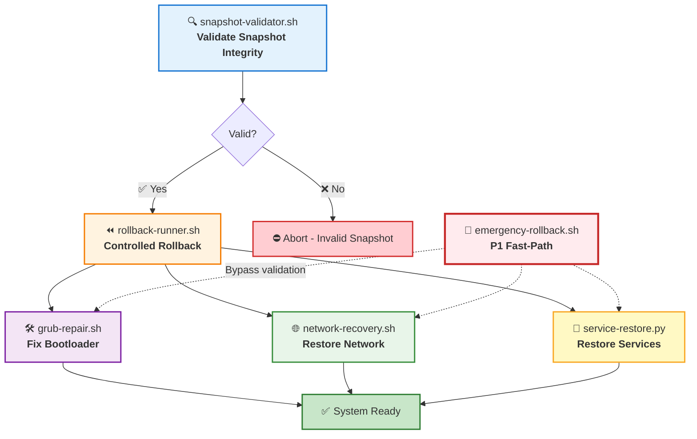
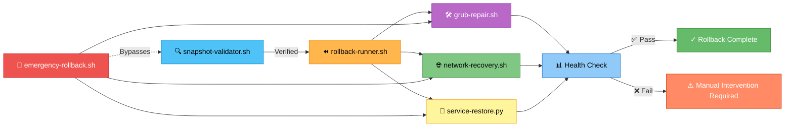

# 🔄 rollback-and-recovery — RHEL8 Migration Rollback & System Recovery Engine

A capability‑centric recovery suite that provides **safe, deterministic, and auditable rollback paths** for failed RHEL7 → RHEL8 migrations.  
This module ensures that any host experiencing **boot failures**, **service regressions**, **network loss**, or **critical blockers** can be restored to a stable pre‑migration state.

---

## 📁 Folder Structure

| **File** | **Purpose** | **Category** |
|----------|-------------|--------------|
| **snapshot-validator.sh** | Validates snapshot integrity before rollback | 🔍 Validation |
| **rollback-runner.sh** | Restores the system to the pre‑migration snapshot | ⏪ Core Rollback |
| **grub-repair.sh** | Repairs GRUB/bootloader issues | 🛠️ Boot Recovery |
| **network-recovery.sh** | Restores network configuration after failure | 🌐 Network Recovery |
| **service-restore.py** | Restores systemd services to pre‑migration state | 🔧 Service Recovery |
| **emergency-rollback.sh** | Fast‑path rollback for P1 migration incidents | 🚨 Emergency Path |

---

## 🧠 Architecture & Logic Flow


---

## 🔧 Core Capabilities

| **Capability** | **Description** | **Key Actions** | **Priority** |
|----------------|-----------------|-----------------|--------------|
| **🔍 Snapshot Validation** | Ensures rollback safety by verifying snapshot integrity | • Check snapshot directory<br>• Verify pre-migration image<br>• Confirm host eligibility | 🟢 Pre-flight |
| **⏪ Controlled Rollback** | Orchestrates full system restoration | • Stop critical services<br>• Restore snapshot<br>• Reboot to known-good state | 🟡 Standard Path |
| **🛠️ GRUB & Bootloader Repair** | Fixes boot-related failures | • Reinstall GRUB<br>• Rebuild config<br>• Fix post-migration boot issues | 🟠 Boot Recovery |
| **🌐 Network Recovery** | Restores network connectivity | • Restore NIC configs<br>• Reload NetworkManager<br>• Re-establish routing/DNS | 🔵 Network Layer |
| **🔧 Service State Restoration** | Returns services to pre-migration state | • Restore systemd presets<br>• Restore service units<br>• Reload systemd daemon | 🟣 Service Layer |
| **🚨 Emergency Rollback** | Immediate recovery for critical failures | • Bypass validation<br>• Execute snapshot restore<br>• Minimal safety checks | 🔴 P1/SEV-1 Only |

---

## ▶️ Usage Examples

### **Standard Workflow**
```bash
# Step 1: Validate snapshot before rollback
./snapshot-validator.sh prod-web-01
# ✅ Snapshot validated successfully

# Step 2: Perform controlled rollback
./rollback-runner.sh prod-web-01
# ⏪ Rolling back to pre-migration state...
# ✅ Rollback complete. System will reboot.

# Step 3 (if needed): Repair specific components
./grub-repair.sh prod-web-01        # Fix boot issues
./network-recovery.sh prod-web-01    # Restore network
python3 service-restore.py prod-web-01  # Restore services
```

### **Emergency Scenario (P1 Incident)**
```bash
# Fast-path rollback - skips validation for speed
./emergency-rollback.sh prod-db-03
# 🚨 EMERGENCY ROLLBACK INITIATED
# ⏪ Restoring snapshot immediately...
# ✅ System restored. Rebooting now.
```

---

## 🎯 Decision Matrix: Which Tool to Use?

| **Scenario** | **Tool** | **Reasoning** |
|--------------|----------|---------------|
| Pre-flight check before rollback | `snapshot-validator.sh` | Verify safety before action |
| Standard failed migration | `rollback-runner.sh` | Controlled, full restoration |
| System won't boot after migration | `grub-repair.sh` | GRUB corruption likely |
| Network unavailable post-migration | `network-recovery.sh` | NIC config issue |
| Services disabled/broken | `service-restore.py` | systemd state corrupted |
| **Production down / SEV-1** | `emergency-rollback.sh` | **Speed > validation** |

---

## 📊 Rollback Success Criteria

| **Check** | **Expected State** | **Validation** |
|-----------|-------------------|----------------|
| 🟢 Boot Status | System boots to login prompt | `systemctl is-system-running` |
| 🟢 Network | Default route & DNS functional | `ping -c3 8.8.8.8` |
| 🟢 Services | Critical services running | `systemctl status <service>` |
| 🟢 RHEL Version | Confirmed RHEL7 kernel | `uname -r` shows `.el7.` |
| 🟢 Snapshot | Pre-migration snapshot retained | Snapshot files exist |

---

## ⚠️ Safety & Guardrails

| **Protection** | **Implementation** | **Override** |
|----------------|-------------------|--------------|
| **Snapshot Verification** | Hash validation before restore | `--force` flag (dangerous) |
| **Pre-rollback Backup** | Creates rollback-of-rollback snapshot | Always enabled |
| **Service Stop** | Graceful shutdown of critical services | 30s timeout → SIGKILL |
| **Boot Validation** | Verifies GRUB config post-repair | Auto-revert on failure |
| **Audit Logging** | All actions logged to `/var/log/rollback.log` | Cannot be disabled |

---

## 🔗 Integration Points


---

## 🎨 Color Legend

| **Color** | **Meaning** | **Components** |
|-----------|-------------|----------------|
| 🔵 **Blue** | Validation & Pre-flight | snapshot-validator.sh |
| 🟠 **Orange** | Core Rollback Operations | rollback-runner.sh |
| 🟣 **Purple** | Boot & GRUB Recovery | grub-repair.sh |
| 🟢 **Green** | Network Recovery | network-recovery.sh |
| 🟡 **Yellow** | Service Restoration | service-restore.py |
| 🔴 **Red** | Emergency Paths | emergency-rollback.sh |

---

## 📝 Notes

- **Always validate snapshots** before rollback unless P1/SEV-1
- **Emergency rollback** bypasses safety checks — use only in production incidents
- **All operations are logged** to `/var/log/rollback.log` for audit compliance
- **Rollback does not delete RHEL8 artifacts** — migration can be re-attempted
- **Network recovery** requires backed-up configs in `/backup/network/`

---

*Last Updated: 2026-01-02 | Maintained by: Platform Engineering*
