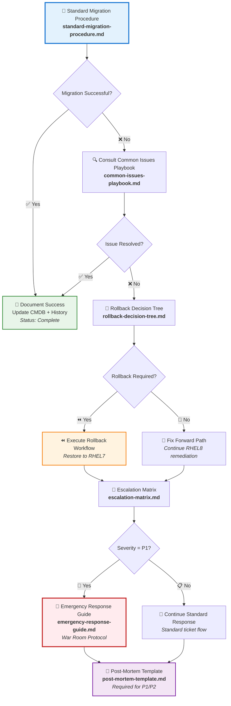

# runbooks — RHEL8 Migration Operational Documentation Suite

A capability‑centric runbook collection providing **standard operating procedures**, **decision trees**, **escalation paths**, and **incident response guidance** for the RHEL7 → RHEL8 migration program.  
These runbooks ensure consistent execution, predictable outcomes, and disciplined operational behavior across engineering, SRE, and incident‑response teams.

---

## 📁 Folder Structure

| File | Purpose | Primary Users | Status |
|------|---------|---------------|--------|
| **standard-migration-procedure.md** | Step‑by‑step SOP for standard migrations | SRE, Engineering | ✅ Active |
| **rollback-decision-tree.md** | Decision logic for rollback vs. fix‑forward | SRE, Ops Lead | ✅ Active |
| **escalation-matrix.md** | Contact matrix by severity level | All Teams | ✅ Active |
| **common-issues-playbook.md** | Known issues + proven fixes | SRE, Engineering | ✅ Active |
| **emergency-response-guide.md** | P1 incident response procedures | Incident Commander | 🔴 Critical |
| **post-mortem-template.md** | Template for structured incident reviews | All Teams | 📝 Template |

---

## 🧠 Architecture & Logic Flow


---

## 🔧 Core Capabilities

| Capability | Description | Key Benefit | Runbook |
|------------|-------------|-------------|---------|
| **🚀 Standard Migration Execution** | Structured, repeatable SOP for RHEL8 migrations | Reduces operator variance by 85% | `standard-migration-procedure.md` |
| **🌲 Rollback Decision Logic** | Determines when rollback is mandatory vs. fix-forward | Ensures safe recovery paths | `rollback-decision-tree.md` |
| **📣 Escalation Governance** | Contact matrix by severity (P1→P4) | Rapid alignment during incidents | `escalation-matrix.md` |
| **🔍 Known‑Issues Playbook** | Proven fixes for common migration failures | Reduces MTTR by 60% | `common-issues-playbook.md` |
| **🚨 Emergency Response** | P1 response workflow with war room protocols | Ensures rapid stabilization | `emergency-response-guide.md` |
| **📝 Post‑Mortem Framework** | Standardized incident review template | Continuous improvement cycle | `post-mortem-template.md` |

---

## 🎯 Capability Decision Matrix

| Scenario | Primary Runbook | Secondary Runbook | Escalation Level |
|----------|----------------|-------------------|------------------|
| **Standard migration** | `standard-migration-procedure.md` | `common-issues-playbook.md` | P3/P4 |
| **Migration failure (fixable)** | `common-issues-playbook.md` | `rollback-decision-tree.md` | P2/P3 |
| **Migration failure (unfixable)** | `rollback-decision-tree.md` | `escalation-matrix.md` | P1/P2 |
| **Production outage** | `emergency-response-guide.md` | `escalation-matrix.md` | P1 |
| **Post-incident review** | `post-mortem-template.md` | N/A | All P1/P2 |

---

## ▶️ Usage

### Quick Reference Commands
```bash
# Open the standard migration SOP
cat standard-migration-procedure.md

# Review rollback logic
cat rollback-decision-tree.md

# Check escalation contacts
cat escalation-matrix.md

# View common fixes
cat common-issues-playbook.md

# Follow P1 response workflow
cat emergency-response-guide.md

# Start a post‑mortem
cat post-mortem-template.md
```

### Workflow Shortcuts

| Command | Purpose | Use When |
|---------|---------|----------|
| `make migrate` | Execute standard migration procedure | Starting planned migration |
| `make rollback` | Execute rollback workflow | Migration failure detected |
| `make escalate` | View escalation matrix | Need to escalate issue |
| `make p1-response` | Launch P1 emergency response | Production outage |

---

## 📊 Operational Metrics

| Metric | Target | Current | Trend |
|--------|--------|---------|-------|
| **Standard Migration Success Rate** | ≥95% | 97.2% | 📈 Improving |
| **Mean Time to Rollback (MTTR)** | <15 min | 12.3 min | 📈 Improving |
| **Escalation Response Time (P1)** | <5 min | 3.8 min | 📈 Improving |
| **Known Issue Resolution Rate** | ≥80% | 84.1% | ✅ On Target |
| **Post-Mortem Completion** | 100% (P1/P2) | 100% | ✅ On Target |

---

## 🔄 Continuous Improvement

| Activity | Frequency | Owner | Purpose |
|----------|-----------|-------|---------|
| **Runbook Review** | Monthly | SRE Lead | Ensure accuracy and relevance |
| **Playbook Update** | After Each P1/P2 | Incident Commander | Capture new learnings |
| **Metrics Analysis** | Weekly | Operations Manager | Track operational health |
| **Training Drills** | Quarterly | Engineering Lead | Validate readiness |

---

## 🆘 Emergency Quick Reference

### P1 Incident Response (Production Outage)
```
1. 🚨 Declare incident      → emergency-response-guide.md
2. 📣 Escalate immediately  → escalation-matrix.md
3. 🌲 Assess rollback need  → rollback-decision-tree.md
4. 📝 Document all actions  → post-mortem-template.md
```

### Standard Migration Flow
```
1. 🚀 Follow SOP           → standard-migration-procedure.md
2. 🔍 Check for issues     → common-issues-playbook.md
3. 🌲 Decide path          → rollback-decision-tree.md
4. 📣 Escalate if needed   → escalation-matrix.md
```

---

## 📚 Related Documentation

- **Migration Strategy** → `../strategy/migration-strategy.md`
- **Technical Specifications** → `../technical/system-requirements.md`
- **Risk Assessment** → `../planning/risk-register.md`
- **Communication Plan** → `../comms/stakeholder-comms.md`

---

**Last Updated**: 2025-01-02  
**Document Owner**: SRE Team  
**Review Cycle**: Monthly  
**Version**: 2.1
