# troubleshooting-flowcharts — RHEL8 Migration Operational Decision Trees

A capability‑centric runbook module providing **visual troubleshooting logic** for the most common RHEL8 migration failure domains:  
**boot failures**, **network regressions**, and **service failures**.  
These ASCII flowcharts serve as fast‑reference operational guides during incident response, enabling consistent, deterministic triage.

---

## 📁 Folder Structure

| File | Purpose | Failure Domain |
|------|---------|----------------|
| **boot-failure-flowchart.txt** | ASCII flowchart for diagnosing boot issues | 🖥️ Boot/Startup |
| **network-regression-flowchart.txt** | Decision tree for network troubleshooting | 🌐 Network/Connectivity |
| **service-failure-flowchart.txt** | Flowchart for restoring failed services | 🔧 Service/Daemon |

---

## 🧠 Architecture & Logic Flow

```mermaid
flowchart TD

    subgraph BOOT["🖥️ BOOT FAILURE DOMAIN"]
        A[Boot Failure<br/>boot-failure-flowchart.txt] --> B{GRUB Visible?}
        B -->|❌ No| C[⚠️ Check BIOS/UEFI Boot Order]
        B -->|✅ Yes| D{Kernel Loads?}
        D -->|❌ No| E[⚠️ Investigate Kernel Panic/Initramfs]
        D -->|✅ Yes| F{Systemd Reached?}
        F -->|❌ No| G[⚠️ Check boot.log/failing units]
        F -->|✅ Yes| H[✅ Login Prompt → Boot Healthy]
    end

    subgraph NETWORK["🌐 NETWORK REGRESSION DOMAIN"]
        I[Network Regression<br/>network-regression-flowchart.txt] --> J{Interface Detected?}
        J -->|❌ No| K[⚠️ Check NIC Drivers]
        J -->|✅ Yes| L{Has IP Address?}
        L -->|❌ No| M[⚠️ Check NetworkManager/ifcfg-*]
        L -->|✅ Yes| N{Ping Gateway?}
        N -->|❌ No| O[⚠️ Fix Routing Table]
        N -->|✅ Yes| P{DNS Resolves?}
        P -->|❌ No| Q[⚠️ Fix resolv.conf/DNS]
        P -->|✅ Yes| R[✅ Network Healthy]
    end

    subgraph SERVICE["🔧 SERVICE FAILURE DOMAIN"]
        S[Service Failure<br/>service-failure-flowchart.txt] --> T{Service Enabled?}
        T -->|❌ No| U[⚠️ Enable Service]
        T -->|✅ Yes| V{Service Starts?}
        V -->|❌ No| W[⚠️ Check systemctl status/config]
        V -->|✅ Yes| X{Stays Active?}
        X -->|❌ No| Y[⚠️ Check Dependencies/SELinux]
        X -->|✅ Yes| Z[✅ Service Healthy]
    end

    style BOOT fill:#ffe6e6,stroke:#cc0000,stroke-width:2px
    style NETWORK fill:#e6f3ff,stroke:#0066cc,stroke-width:2px
    style SERVICE fill:#e6ffe6,stroke:#009900,stroke-width:2px
    style H fill:#90ee90,stroke:#006400,stroke-width:3px
    style R fill:#90ee90,stroke:#006400,stroke-width:3px
    style Z fill:#90ee90,stroke:#006400,stroke-width:3px
```


---

## 🔧 Core Capabilities by Domain

### **🖥️ Boot Failure Diagnostics**

| Stage | Checkpoint | Action |
|-------|-----------|--------|
| **BIOS/UEFI** | GRUB visibility | Verify boot order, disk detection |
| **Bootloader** | Kernel loading | Check kernel panic, initramfs corruption |
| **Init System** | systemd target | Analyze boot.log, failing units |
| **Login** | User prompt | Validate multi-user.target reached |

**Key Commands:**
```bash
journalctl -xb              # Boot logs
systemctl list-dependencies # Target dependencies
dmesg | grep -i error       # Kernel errors
```

---

### **🌐 Network Regression Troubleshooting**

| Layer | Checkpoint | Diagnostic | Resolution |
|-------|-----------|-----------|-----------|
| **L1/L2** | NIC detected | `ip link show` | Driver reload/reinstall |
| **L3** | IP assigned | `ip addr show` | NetworkManager restart |
| **Routing** | Gateway reachable | `ip route` / `ping` | Fix default route |
| **DNS** | Name resolution | `dig` / `nslookup` | Update resolv.conf |
| **Firewall** | Port accessibility | `ss -tulpn` / `firewall-cmd` | Open required ports |

**Key Commands:**
```bash
nmcli device status         # Interface state
ip route get 8.8.8.8        # Routing path
systemd-resolve --status    # DNS configuration
```

---

### **🔧 Service Failure Restoration**

| Phase | Validation | Command | Next Step |
|-------|-----------|---------|-----------|
| **Enablement** | Is enabled? | `systemctl is-enabled` | `systemctl enable` |
| **Startup** | Starts clean? | `systemctl start` | Check config files |
| **Status** | Active/running? | `systemctl status` | Review error messages |
| **Dependencies** | All deps met? | `systemctl list-dependencies` | Start missing deps |
| **SELinux** | No AVCs? | `ausearch -m avc` | Create policy modules |
| **Stability** | Stays up? | `journalctl -fu <service>` | Fix crash loops |

**Key Commands:**
```bash
systemctl daemon-reload     # Reload unit files
journalctl -xe             # Extended error logs
semodule -l               # List SELinux modules
```

---

## ▶️ Quick Reference Usage

### View Flowcharts
```bash
# Boot failure decision tree
cat boot-failure-flowchart.txt

# Network regression diagnostics
cat network-regression-flowchart.txt

# Service restoration workflow
cat service-failure-flowchart.txt
```

### Color-Coded Severity Legend

| Symbol | Meaning | Action Required |
|--------|---------|----------------|
| 🖥️ | Boot domain | System-level recovery |
| 🌐 | Network domain | Connectivity restoration |
| 🔧 | Service domain | Application-level fix |
| ✅ | Success state | Continue monitoring |
| ⚠️ | Intervention needed | Execute remediation |
| ❌ | Failure detected | Escalate to next check |

---

## 📊 Decision Tree Complexity Metrics

| Flowchart | Decision Points | Terminal States | Avg Resolution Depth |
|-----------|----------------|----------------|---------------------|
| **Boot Failure** | 3 | 4 | 2.5 steps |
| **Network Regression** | 4 | 5 | 3.0 steps |
| **Service Failure** | 4 | 4 | 2.8 steps |

---

## 🎯 Operational Best Practices

### During Incident Response

1. **Select Domain** — Identify failure category (boot/network/service)
2. **Follow Tree** — Execute checks in documented order
3. **Document State** — Record outcomes at each decision point
4. **Escalate Smart** — Include flowchart position in handoff notes

### Post-Incident

- Update flowcharts with new failure modes discovered
- Add domain-specific edge cases to decision trees
- Maintain revision history for audit trails
- Integrate lessons learned into team runbooks

---

## 🔗 Integration Points

These flowcharts reference and integrate with:

- **System Logs** → `journalctl`, `dmesg`, `boot.log`
- **Configuration Management** → NetworkManager, systemd units
- **Security Policies** → SELinux, firewalld
- **Monitoring Tools** → systemctl, ip commands, ausearch

---

## 📝 Maintenance Guidelines

| Task | Frequency | Owner |
|------|-----------|-------|
| Validate flowchart accuracy | After each migration | Ops Team |
| Update with new RHEL8 patterns | Quarterly | Platform Team |
| Review decision tree effectiveness | Monthly | Incident Response |
| Archive outdated branches | Annually | Documentation Lead |

---

## 🚀 Advanced Usage

### Programmatic Decision Tree Navigation
```bash
# Example: Automated boot health check
check_grub() { [ -d /boot/grub2 ] && echo "GRUB_OK" || echo "GRUB_MISSING"; }
check_kernel() { dmesg | grep -q "Kernel panic" && echo "PANIC" || echo "KERNEL_OK"; }
check_systemd() { systemctl is-system-running | grep -q running && echo "SYSTEMD_OK" || echo "SYSTEMD_FAILED"; }
```

### Flowchart Automation Hook Points

Each decision node maps to scriptable validation functions for CI/CD integration.

---

**Version:** 2.0  
**Last Updated:** 2026-01-02  
**Maintained By:** RHEL8 Migration Task Force
