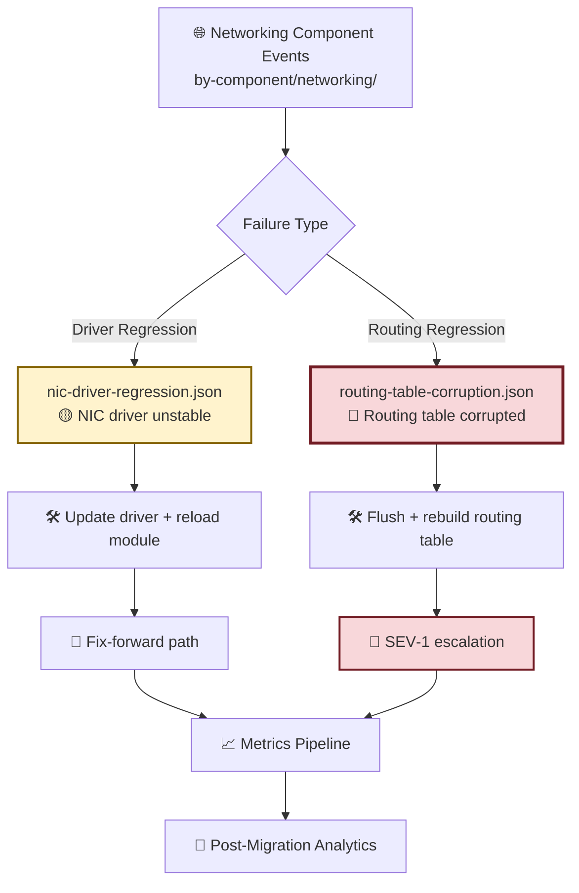

# networking — Sample Migration Events (Network Stack & Connectivity)

This module contains **networking‑related migration failure samples** used for simulation, analytics, integration testing, and incident‑response training.  
Networking regressions are among the most disruptive migration issues, impacting connectivity, routing, and service reachability across the environment.

These samples support:
- Blocker/major severity modeling  
- Network regression testing  
- Escalation‑flow validation  
- Post‑migration analytics and MTTR tracking  

---

## 📁 Folder Structure

| File | Purpose | Severity | Impact |
|------|---------|----------|--------|
| **nic-driver-regression.json** | NIC driver regression causing intermittent connectivity | 🟡 Major | Partial connectivity loss |
| **routing-table-corruption.json** | Routing table corruption causing full network isolation | 🔴 Blocker | Complete network outage |

---

## 🧠 Architecture & Logic Flow (Mermaid)


---

## 🔧 Core Capabilities

| Capability | Description | Color Code |
|------------|-------------|------------|
| **Networking Regression Simulation** | NIC driver instability, routing table corruption, high‑impact connectivity failures | 🟦 Simulation |
| **Escalation & Response Training** | SEV‑1 and SEV‑2 workflows, network troubleshooting and recovery procedures | 🟥 Critical |
| **Analytics & Reporting Integration** | MTTR calculations, blast‑radius analysis, weekly migration reporting | 🟩 Analytics |
| **Testing & Validation Support** | Integration tests, load/stress simulations, early regression detection | 🟨 Testing |

---

## 📊 Event Catalog by Severity

### 🔴 **Blocker Severity Events**
| Event File | Component | Root Cause | MTTR Est. | Rollback Required |
|------------|-----------|------------|-----------|-------------------|
| routing-table-corruption.json | Routing Layer | Table corruption post-migration | 45-90 min | Yes |

### 🟡 **Major Severity Events**
| Event File | Component | Root Cause | MTTR Est. | Rollback Required |
|------------|-----------|------------|-----------|-------------------|
| nic-driver-regression.json | NIC Driver | Incompatible driver version | 20-40 min | Conditional |

---

## 🚨 Response Matrix

| Severity | Alert Threshold | Response Time | On-Call Team | Escalation Path |
|----------|----------------|---------------|--------------|-----------------|
| 🔴 **Blocker** | Immediate | < 5 min | Network Ops + SRE | SEV-1 → VP Eng |
| 🟡 **Major** | < 15 min | < 15 min | Network Ops | SEV-2 → Manager |

---

## 🔍 Troubleshooting Quick Reference

| Symptom | Likely Event | First Action | Diagnostic Command |
|---------|--------------|--------------|-------------------|
| Complete network loss | routing-table-corruption | Check routing table | `ip route show` |
| Intermittent packet loss | nic-driver-regression | Check driver version | `ethtool -i eth0` |
| High latency + drops | nic-driver-regression | Review NIC stats | `ifconfig eth0` |

---

## ▶️ Usage

### View NIC driver regression sample:
```bash
cat nic-driver-regression.json
```

### View routing table corruption sample:
```bash
cat routing-table-corruption.json
```

### Validate event schema:
```bash
jq '.' *.json | grep -E "severity|component|timestamp"
```

---

## 🎯 Key Metrics Tracked

| Metric | Purpose | Target | Alert Threshold |
|--------|---------|--------|-----------------|
| **MTTR** | Mean time to resolution | < 30 min | > 60 min |
| **Blast Radius** | Number of affected hosts | < 5% fleet | > 10% fleet |
| **Rollback Rate** | % of migrations rolled back | < 2% | > 5% |
| **Detection Time** | Time to first alert | < 2 min | > 5 min |

---

## 🔗 Related Documentation

- [Migration Runbook](../../docs/migration-runbook.md)
- [Network Troubleshooting Guide](../../docs/network-troubleshooting.md)
- [Escalation Procedures](../../docs/escalation-procedures.md)
- [Rollback Playbook](../../docs/rollback-playbook.md)

---

## 📝 Notes

- All events include realistic timestamps, error codes, and diagnostic data
- Events are designed for **maximum realism** in testing scenarios
- Sample data should **never** contain production credentials or PII
- Update event samples quarterly to reflect current infrastructure state

---

**Last Updated:** 2026-01-02  
**Maintainer:** Infrastructure Migration Team  
**Review Cycle:** Quarterly
