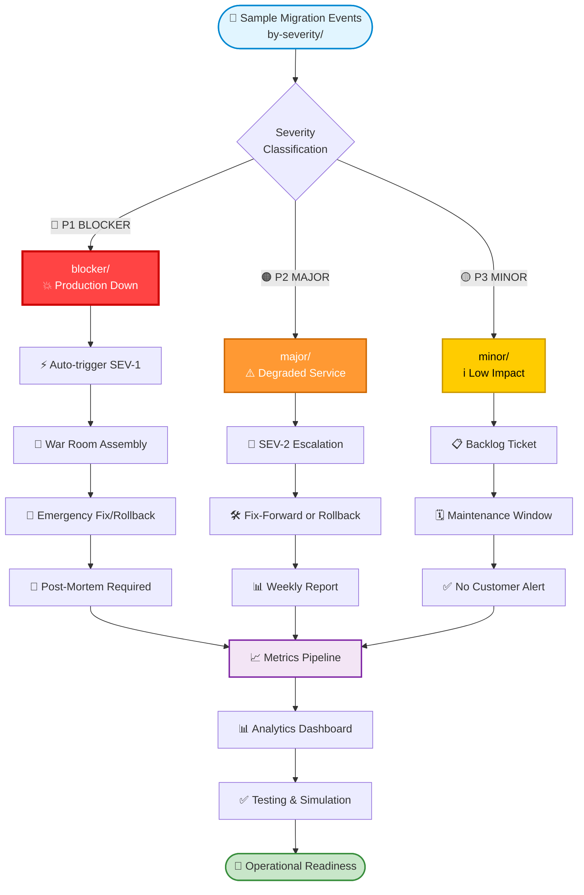

# by-severity — Sample Migration Events Categorized by Operational Impact

This module provides **severity‑classified sample migration events** used across the RHEL8 migration ecosystem for testing, analytics, simulation, and incident‑response training.  
Events are grouped by **operational impact level** — from full outages (P1) to degraded service (P2) to cosmetic issues (P3).

These samples power:
- Integration tests  
- Load tests  
- Canary‑deployment validation  
- Metrics pipelines  
- Escalation‑flow simulations  
- Post‑mortem training  

---

## 📁 Folder Architecture

| Folder | Severity | Impact | Response Time | Escalation | Description |
|--------|----------|--------|---------------|------------|-------------|
| **blocker/** | 🔴 **P1** | **CRITICAL** | ⏱️ Immediate | 🚨 SEV-1 | Full production outage; immediate escalation required |
| **major/** | 🟠 **P2** | **HIGH** | ⏱️ < 4 hours | ⚠️ SEV-2 | Degraded service; partial customer impact |
| **minor/** | 🟡 **P3** | **LOW** | ⏱️ < 24 hours | ℹ️ SEV-3 | Cosmetic or low‑impact issues |

---

## 🎯 Severity Classification Matrix

### 🔴 **P1 — BLOCKER** (Critical)
| Attribute | Details |
|-----------|---------|
| **Impact** | Complete service unavailability |
| **Customer Effect** | 100% of users affected |
| **Business Impact** | Revenue loss, SLA breach |
| **Response** | Immediate war room, 24/7 team mobilization |
| **Communication** | Real-time status page updates |
| **Post-Event** | Mandatory post-mortem within 48 hours |

**Example Events:**
- Database connection pool exhausted
- Authentication service down
- Core API returning 500s across all endpoints

---

### 🟠 **P2 — MAJOR** (High)
| Attribute | Details |
|-----------|---------|
| **Impact** | Degraded performance or partial outage |
| **Customer Effect** | 10-50% of users affected |
| **Business Impact** | Service degradation, potential SLA impact |
| **Response** | Escalate within 1 hour, fix-forward or rollback |
| **Communication** | Status page notice, stakeholder updates |
| **Post-Event** | Incident review within 1 week |

**Example Events:**
- Slow query performance (2-5x baseline)
- Regional service degradation
- Non-critical API endpoints failing

---

### 🟡 **P3 — MINOR** (Low)
| Attribute | Details |
|-----------|---------|
| **Impact** | Cosmetic issues or edge cases |
| **Customer Effect** | < 5% of users affected |
| **Business Impact** | No revenue or SLA impact |
| **Response** | Schedule fix in next maintenance window |
| **Communication** | Internal documentation only |
| **Post-Event** | Optional review in retrospective |

**Example Events:**
- UI alignment issues
- Non-blocking warning logs
- Deprecated API usage (with fallback)

---

## 🧠 Architecture & Logic Flow


---

## 🔧 Core Capabilities by Severity

| Capability | 🔴 P1 Blocker | 🟠 P2 Major | 🟡 P3 Minor |
|------------|--------------|-------------|-------------|
| **Production Impact** | ✅ Full outage | ⚠️ Degraded | ℹ️ Minimal |
| **Auto-Escalation** | ✅ Yes | ⚠️ Conditional | ❌ No |
| **War Room Required** | ✅ Immediate | ⚠️ If unresolved | ❌ No |
| **Post-Mortem** | ✅ Mandatory | ⚠️ Recommended | ❌ Optional |
| **Customer Notification** | ✅ Real-time | ⚠️ Within 1 hour | ❌ Internal only |
| **Testing Priority** | 🔥 Critical | ⚡ High | 📝 Normal |
| **Rollback Authority** | ✅ Automatic | ⚠️ Team decision | ❌ Scheduled |

---

## 🎯 Use Cases by Severity

### **Testing & Validation**
```
🔴 P1: Chaos engineering, disaster recovery drills
🟠 P2: Load testing, canary deployment validation  
🟡 P3: UI regression tests, cosmetic checks
```

### **Training & Simulation**
```
🔴 P1: War room exercises, escalation drills
🟠 P2: Incident response training, triage practice
🟡 P3: Documentation workflows, backlog grooming
```

### **Analytics & Reporting**
```
🔴 P1: MTTR tracking, blast radius analysis
🟠 P2: Success rate calculations, weekly reports
🟡 P3: Technical debt metrics, maintenance logs
```

---

## ▶️ Quick Start

### Navigate to Severity Levels
```bash
# Critical production incidents
cd blocker/

# Degraded service events
cd major/

# Low-impact issues
cd minor/
```

### Example: Running Integration Tests
```bash
# Test P1 escalation flow
./test-runner --severity=p1 --simulate-escalation

# Test P2 degraded service handling
./test-runner --severity=p2 --canary-validation

# Test P3 graceful degradation
./test-runner --severity=p3 --cosmetic-checks
```

---

## 📊 Metrics & KPIs

| Metric | 🔴 P1 Target | 🟠 P2 Target | 🟡 P3 Target |
|--------|-------------|-------------|-------------|
| **MTTD** (Mean Time To Detect) | < 2 min | < 15 min | < 24 hours |
| **MTTR** (Mean Time To Resolve) | < 30 min | < 4 hours | < 5 days |
| **False Positive Rate** | < 1% | < 5% | < 10% |
| **Customer Impact** | 0% tolerance | < 10% | Minimal |

---

## 🚀 Integration Points
```
by-severity/
├── blocker/          → Feeds SEV-1 automation
├── major/            → Feeds canary validation
├── minor/            → Feeds backlog prioritization
│
└── Downstream Systems:
    ├── Monitoring (PagerDuty, Datadog)
    ├── Analytics (Grafana, Splunk)
    ├── Testing (JUnit, Selenium)
    └── Reporting (Weekly migration dashboards)
```

---

## 📚 Related Documentation

- **Escalation Procedures**: See `docs/escalation-matrix.md`
- **Post-Mortem Templates**: See `docs/postmortem-template.md`
- **Testing Guidelines**: See `docs/testing-by-severity.md`
- **Analytics Dashboard**: See `dashboards/migration-health.json`

---

**Last Updated**: 2026-01-02  
**Maintained By**: RHEL8 Migration Team  
**Status**: ✅ Production Ready
