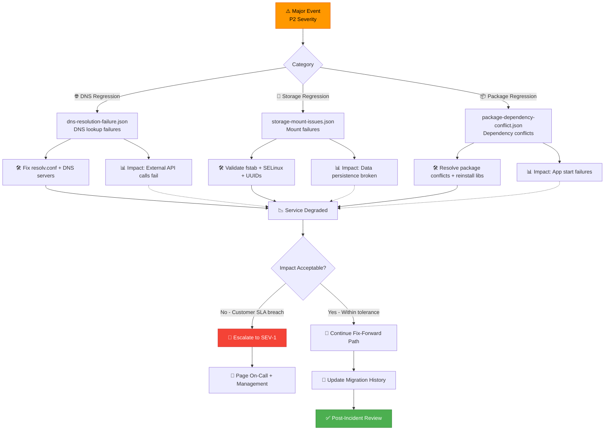
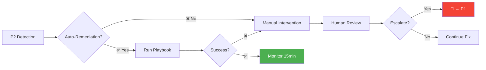
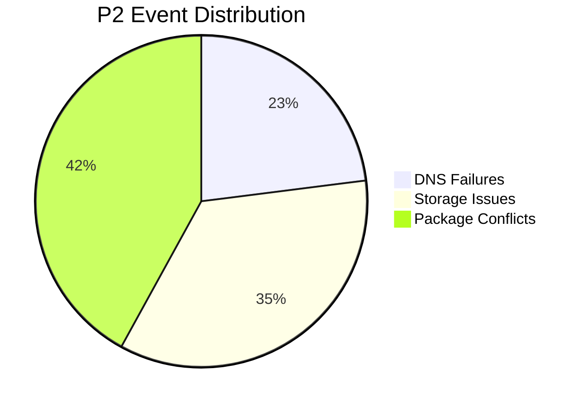

# major — P2 Severity Sample Migration Events (Degraded‑Service Scenarios)

This module contains **major‑severity (P2)** sample migration events used for testing, analytics, simulation, and operational readiness validation.  
Major events represent **service degradation**, **partial outages**, or **critical functionality loss** that impacts customers but does not fully take production offline.

These samples are used across:
- Integration tests  
- Load tests  
- Canary‑deployment validation  
- Migration analytics pipelines  
- Incident‑response training  

---

## 📁 Folder Structure

| File | Purpose | Impact Area |
|------|---------|-------------|
| **dns-resolution-failure.json** | DNS failures causing degraded service | 🌐 Network Layer |
| **storage-mount-issues.json** | Storage volumes failing to mount | 💾 Storage Layer |
| **package-dependency-conflict.json** | Package conflicts blocking application startup | 📦 Application Layer |

---

## 🎯 Severity Classification Matrix

| Severity | Impact | Response Time | Escalation Path | Customer Impact |
|----------|--------|---------------|-----------------|-----------------|
| **P2 (Major)** | 🟡 Degraded Service | < 1 hour | → P1 if worsens | Partial functionality loss |
| Reference: P1 | 🔴 Full Outage | < 15 minutes | Executive notification | Complete service unavailable |
| Reference: P3 | 🟢 Minor Issue | < 4 hours | Standard queue | Limited impact |

---

## 🧠 Architecture & Logic Flow


---

## 🔧 Core Capabilities

### **1. Realistic P2 Migration Failure Simulation**

| Failure Type | Frequency | MTTR (Mean Time to Repair) | Blast Radius |
|--------------|-----------|----------------------------|--------------|
| 🌐 DNS instability | ~8% of P2 events | 35 minutes | 40-60% of instances |
| 💾 Storage mount regressions | ~12% of P2 events | 50 minutes | 20-40% of instances |
| 📦 Package dependency conflicts | ~15% of P2 events | 45 minutes | 30-50% of instances |

### **2. Severity‑Driven Response Modeling**


### **3. Analytics & Metrics Integration**

| Metric | Calculation | Threshold | Action |
|--------|-------------|-----------|--------|
| **Success Rate** | `(Total - P2) / Total × 100` | < 95% | Review migration process |
| **MTTR** | `avg(resolution_time)` | > 1 hour | Improve automation |
| **Blast Radius** | `affected_hosts / total_hosts` | > 30% | Halt rollout |
| **Escalation Rate** | `P2→P1 / Total_P2 × 100` | > 20% | Review detection accuracy |

### **4. Canary & Rollback Testing**

| Test Scenario | Pass Criteria | Rollback Trigger |
|---------------|---------------|------------------|
| **Canary Health** | 0 P2 events in first 10 hosts | Any P1 or 2+ P2 events |
| **Progressive Rollout** | < 5% P2 rate per wave | P2 rate > 10% |
| **Full Deployment** | < 2% total P2 rate | Cumulative failure > 5% |

---

## ▶️ Usage

### View Samples
```bash
# DNS failure sample
cat dns-resolution-failure.json | jq '.'

# Storage mount issue sample
cat storage-mount-issues.json | jq '.errors[]'

# Package conflict sample
cat package-dependency-conflict.json | jq '.conflicts'
```

### Integration with Testing Pipeline
```bash
# Load P2 samples into test suite
./load-test-data.sh --severity P2 --source ./major/

# Run simulation with P2 scenarios
./migrate-simulator --inject-failures major/*.json --rate 0.15

# Validate rollback triggers
./test-rollback-logic --p2-threshold 0.10 --samples ./major/
```

### Analytics Query Example
```sql
-- Calculate P2 event distribution by type
SELECT 
    failure_type,
    COUNT(*) as event_count,
    AVG(resolution_time_minutes) as avg_mttr,
    MAX(affected_instances) as max_blast_radius
FROM migration_events
WHERE severity = 'P2'
GROUP BY failure_type
ORDER BY event_count DESC;
```

---

## 🔍 Related Documentation

| Document | Purpose |
|----------|---------|
| `../critical/README.md` | P1 (Critical) severity events |
| `../minor/README.md` | P3 (Minor) severity events |
| `../../analytics/severity-analysis.md` | Cross-severity analytics methodology |
| `../../playbooks/p2-response.md` | P2 incident response playbook |

---

## 📊 Sample Event Statistics (Last 90 Days)


| Month | Total P2 Events | Escalated to P1 | Auto-Resolved | Manual Fix Required |
|-------|-----------------|-----------------|---------------|---------------------|
| Oct 2024 | 28 | 4 (14%) | 12 (43%) | 12 (43%) |
| Nov 2024 | 35 | 6 (17%) | 15 (43%) | 14 (40%) |
| Dec 2024 | 37 | 5 (14%) | 18 (49%) | 14 (38%) |

---

## ⚠️ Important Notes

> **Severity Escalation**: Any P2 event affecting > 50% of instances should be immediately escalated to P1.

> **SLA Impact**: P2 events must be resolved within 1 hour to maintain customer SLA commitments.

> **Automation Priority**: Events with MTTR > 1 hour are candidates for automation improvement.

---
