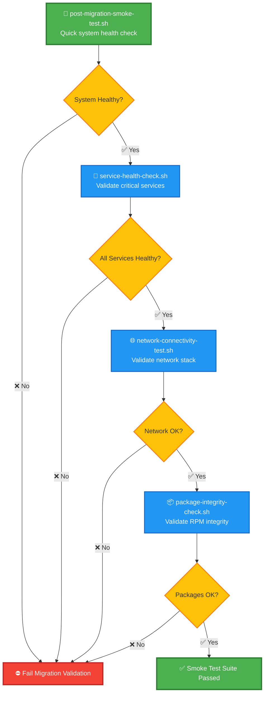

# smoke-tests — RHEL8 Migration Post‑Cutover Rapid Validation Suite

A capability‑centric smoke‑testing module that performs **fast, high‑signal validation** immediately after a RHEL8 migration.  
These tests ensure that the system is **boot‑healthy**, **network‑reachable**, **service‑stable**, and **package‑consistent** before deeper validation or production release.

---

## 📁 Folder Structure

| File | Purpose | Status |
|------|---------|--------|
| **post-migration-smoke-test.sh** | Quick post‑migration health validation | 🟢 Core |
| **service-health-check.sh** | Validates critical service health | 🟡 Essential |
| **network-connectivity-test.sh** | Validates network stack functionality | 🟡 Essential |
| **package-integrity-check.sh** | Validates RPM database and dependency integrity | 🟡 Essential |

**Legend:** 🟢 Core Entry Point | 🟡 Essential Component | 🔵 Optional | 🔴 Critical Path

---

## 🧠 Architecture & Logic Flow


---

## 🔧 Core Capabilities

| Capability | Component | Validates | Exit on Failure |
|------------|-----------|-----------|-----------------|
| **System Health** | `post-migration-smoke-test.sh` | systemd state, failed units, disk, network | 🔴 Yes |
| **Service Health** | `service-health-check.sh` | SSH, chronyd, network, firewall | 🔴 Yes |
| **Network Stack** | `network-connectivity-test.sh` | NICs, gateway, external connectivity | 🔴 Yes |
| **Package Integrity** | `package-integrity-check.sh` | RPM DB, dependencies, corruption | 🔴 Yes |

### **1. Post‑Migration System Health Validation**
```
✓ Systemd operational state confirmed
✓ No failed services detected
✓ Network reachability validated
✓ Disk availability confirmed
```

### **2. Critical Service Health Checks**
```
✓ sshd.service         → active (running)
✓ chronyd.service      → active (running)
✓ NetworkManager       → active (running)
✓ firewalld.service    → active (running)
```

### **3. Network Stack Validation**
```
✓ NIC detection        → eth0 present
✓ Gateway reachable    → 192.168.1.1 (0% loss)
✓ External connectivity → 8.8.8.8 reachable
✓ DNS resolution       → functional
```

### **4. Package Integrity Verification**
```
✓ RPM database consistency validated
✓ No missing dependencies detected
✓ No corruption indicators found
✓ Migration package set intact
```

---

## ▶️ Usage

### Full Smoke Test Suite
```bash
./post-migration-smoke-test.sh
```
**Output:** Comprehensive validation report with color-coded results

### Individual Test Modules

| Command | Scope | Duration |
|---------|-------|----------|
| `./service-health-check.sh` | Critical services only | ~5s |
| `./network-connectivity-test.sh` | Network stack | ~10s |
| `./package-integrity-check.sh` | RPM database | ~30s |

---

## 📊 Test Result Interpretation

| Exit Code | Meaning | Action Required |
|-----------|---------|-----------------|
| **0** | ✅ All tests passed | Proceed to full validation |
| **1** | ❌ System health failure | Review systemd state |
| **2** | ❌ Service failure | Check failed units |
| **3** | ❌ Network failure | Validate NIC/routing config |
| **4** | ❌ Package integrity failure | Run `rpm --rebuilddb` |

---

## 🎯 Success Criteria

### Smoke Test Passes When:
- ✅ Systemd reaches `running` state
- ✅ Zero critical services in `failed` state
- ✅ Default gateway responds to ping
- ✅ External DNS resolution functional
- ✅ RPM database passes `rpm -qa` without errors
- ✅ No unsatisfied dependencies reported

### Immediate Rollback Triggers:
- 🔴 Systemd in `degraded` state for >2 minutes
- 🔴 >1 critical service failure
- 🔴 Network stack completely unavailable
- 🔴 >10% of packages report dependency issues

---

## 🔍 Logging & Diagnostics

All tests write detailed logs to:
```
/var/log/rhel8-migration/smoke-tests/
├── post-migration-smoke-test.log
├── service-health-check.log
├── network-connectivity-test.log
└── package-integrity-check.log
```

**Log Retention:** 30 days (configurable via `LOG_RETENTION_DAYS`)

---

## 🚨 Common Failure Scenarios

| Failure Type | Symptom | Quick Fix |
|--------------|---------|-----------|
| **Service Timeout** | `chronyd` fails to start | `systemctl restart chronyd` |
| **Network Down** | No default gateway | Check `/etc/sysconfig/network-scripts/` |
| **RPM Corruption** | `rpm -qa` hangs | `rpm --rebuilddb && yum clean all` |
| **Dependency Hell** | Missing `libfoo.so.1` | `yum install compat-*` packages |

---

## 🏃 Performance Benchmarks

| Test Phase | Expected Duration | Alert Threshold |
|------------|-------------------|-----------------|
| System Health | 3-5s | >15s |
| Service Checks | 5-8s | >30s |
| Network Tests | 8-12s | >60s |
| Package Validation | 20-40s | >120s |

**Total Suite Runtime:** ~45-60 seconds on healthy systems

---

## 🔐 Security Considerations

- Tests run with **minimal privilege escalation** (only where required)
- No sensitive data written to logs (passwords, keys filtered)
- Network tests use **safe ping destinations** (RFC-compliant targets)
- Package validation operates in **read-only mode** (no modifications)

---

## 📝 Integration Points

### Pre-Requisites
```bash
# Ensure logging directory exists
mkdir -p /var/log/rhel8-migration/smoke-tests/

# Set execute permissions
chmod +x *.sh
```

### CI/CD Integration
```yaml
# Example Ansible playbook snippet
- name: Run RHEL8 smoke tests
  command: /opt/migration/smoke-tests/post-migration-smoke-test.sh
  register: smoke_result
  failed_when: smoke_result.rc != 0
```

---

## 🎓 Best Practices

1. **Run smoke tests immediately** after first boot post-migration
2. **Monitor execution time** — dramatic increases indicate system issues
3. **Review failed test logs** before attempting remediation
4. **Maintain baseline metrics** from pre-migration test runs
5. **Automate re-tests** after applying fixes

---

## 📞 Support & Troubleshooting

**For test failures:**
1. Review component-specific log in `/var/log/rhel8-migration/smoke-tests/`
2. Verify pre-migration system state was captured
3. Check for known issues in RHEL8 migration KB
4. Escalate to platform team if >2 components fail

**Emergency Rollback:**
If smoke tests fail completely, initiate rollback procedure per migration runbook.
