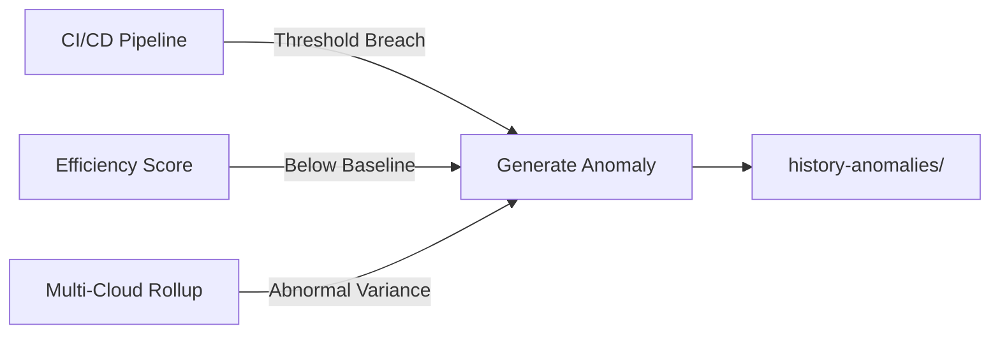

# history/

This directory stores daily or periodic SLA snapshots generated by monitoring scripts.

---

## 📊 Generated By

| Script | Purpose | Output Format |
|--------|---------|---------------|
| `multi-cloud-sla-rollup.sh` | Aggregate multi-cloud SLA metrics | JSON |
| `sla-efficiency-score.py` | Calculate efficiency scores | JSON |
| `sla-alert-thresholds.sh` | Evaluate alert thresholds | JSON |

---

## 📝 Recommended Naming Convention

Use **UTC timestamps** for consistent ordering:
```
YYYY-MM-DDTHH-MM-SSZ-<type>.json
```

### File Types

| Type | Description | Example |
|------|-------------|---------|
| `sla-rollup` | Multi-cloud SLA aggregation | `2026-01-01T00-00-00Z-sla-rollup.json` |
| `efficiency` | Efficiency score snapshot | `2026-01-01T00-00-00Z-efficiency.json` |
| `alerts` | Alert threshold evaluation | `2026-01-01T00-00-00Z-alerts.json` |

---

## 🎯 Purpose

| Purpose | Details |
|---------|---------|
| **Historical Record** | Maintain complete SLA performance history |
| **Trend Analysis** | Enable time-series analysis and ASCII visualization |
| **Anomaly Detection** | Feed data into anomaly detection workflows |
| **Compliance** | Provide audit trail for SLA commitments |

---

## 📂 Example Structure
```
history/
├── 2026-01-01T00-00-00Z-sla-rollup.json
├── 2026-01-01T00-00-00Z-efficiency.json
├── 2026-01-01T00-00-00Z-alerts.json
├── 2026-01-02T00-00-00Z-sla-rollup.json
├── 2026-01-02T00-00-00Z-efficiency.json
└── 2026-01-02T00-00-00Z-alerts.json
```

---

## 🔗 Related Directories

- `../history-anomalies/` - Detected anomalies and outliers
- `../reports/` - Generated SLA reports and visualizations

---

# history-anomalies/

This directory stores **anomaly snapshots** detected from historical SLA data.

---

## 🚨 What Goes Here

| Anomaly Type | Description | Severity |
|--------------|-------------|----------|
| 🔴 **Outlier SLA Scores** | Scores outside normal distribution | High |
| 🟠 **Latency Spikes** | Sudden response time increases | Medium-High |
| 🟡 **Error Rate Surges** | Abnormal increase in failure rates | Medium |
| 🔵 **Uptime Drops** | Availability below threshold | Critical |
| 🟣 **ASCII Diffs** | Visual deviation highlights | Info |

---

## 📝 Recommended Naming Convention
```
YYYY-MM-DDTHH-MM-SSZ-<type>.<ext>
```

### File Types

| Type | Extension | Example |
|------|-----------|---------|
| Anomaly data | `.json` | `2026-01-01T14-30-00Z-anomaly.json` |
| Text diff | `.txt` | `2026-01-01T14-30-00Z-diff.txt` |
| Visual report | `.md` | `2026-01-01T14-30-00Z-report.md` |

---

## 🎯 Example Use Cases


| Trigger | Action | Output |
|---------|--------|--------|
| CI/CD threshold breach | Flag anomaly | `*-anomaly.json` |
| Efficiency drops below baseline | Generate diff | `*-diff.txt` |
| Multi-cloud variance spike | Create report | `*-report.md` |

---

## 📊 Example Anomaly JSON
```json
{
  "timestamp": "2026-01-01T14:30:00Z",
  "type": "latency_spike",
  "severity": "high",
  "affected_service": "api-gateway",
  "baseline_p95_ms": 120,
  "observed_p95_ms": 2400,
  "deviation_percent": 1900,
  "cloud_provider": "aws",
  "region": "us-east-1"
}
```

---

## 📈 Visualization Example
```
Latency Trend (Last 7 Days)
─────────────────────────────────────────
200ms │                              ╭──╮
180ms │                         ╭────╯  ╰─
160ms │                    ╭────╯
140ms │              ╭─────╯
120ms │         ╭────╯
100ms │    ╭────╯
 80ms │────╯
      └─────────────────────────────────────
       Mon Tue Wed Thu Fri Sat Sun
                            ↑
                    ANOMALY DETECTED
```

---

## 📂 Directory Status

> ⚠️ **Note**: This folder is intentionally empty by default.
> 
> Automation scripts populate it as anomalies are detected.

---

## 🔗 Integration Points

| System | Integration |
|--------|-------------|
| **Monitoring** | Automated anomaly detection |
| **Alerting** | Trigger notifications on threshold breach |
| **Reporting** | Include in weekly/monthly SLA reports |
| **ML Pipeline** | Feed data to predictive models |

---

## 🛠️ Maintenance

- **Retention Policy**: Keep last 90 days by default
- **Archival**: Move older anomalies to cold storage
- **Cleanup Script**: Run `cleanup-old-anomalies.sh` monthly
