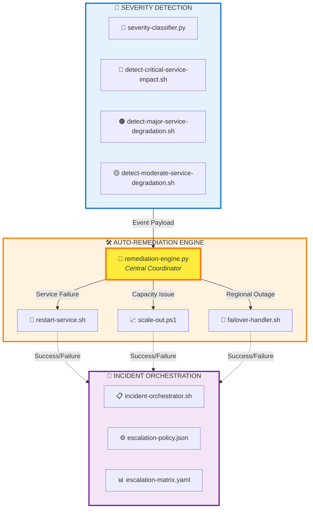
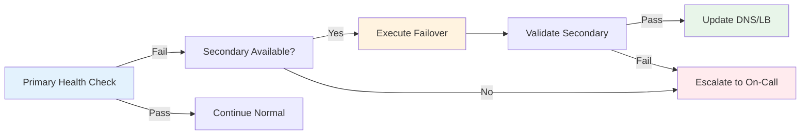
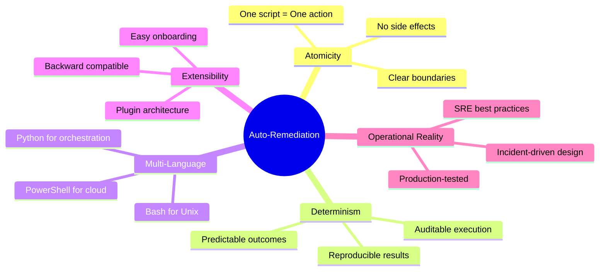
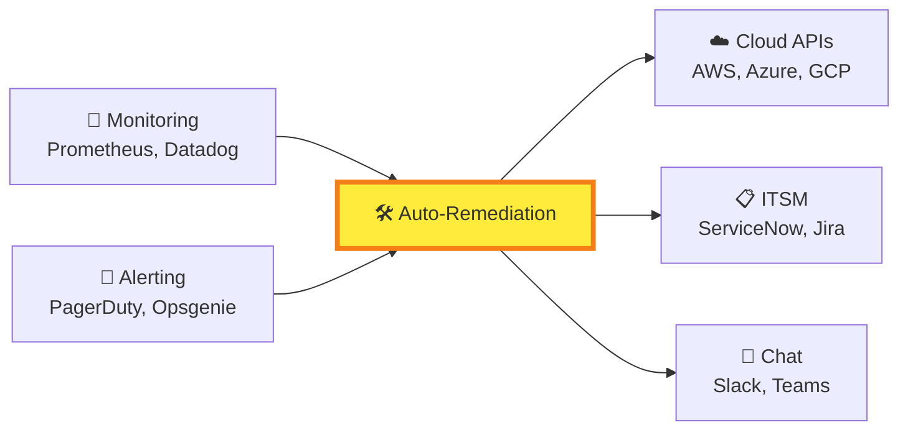

# 🔄 auto-remediation — Automated Recovery & Service Stabilization Engine

<div align="center">

**Capability‑centric module for automated recovery actions**


</div>

A **deterministic**, **multi‑cloud**, **multi‑signal** remediation system for:
- 🔄 Service restarts
- 📈 Scale‑out operations
- 🔀 Failover execution
- 🧠 Centralized remediation logic

---

## 📁 Module Structure

| File | Type | Purpose | Trigger Context |
|------|------|---------|----------------|
| **restart-service.sh** | 🐚 Bash | Restart failing service on target host | Service crash, memory leak, unresponsive process |
| **scale-out.ps1** | 💠 PowerShell | Trigger horizontal scale operations | High load, capacity threshold breach |
| **failover-handler.sh** | 🐚 Bash | Execute failover to secondary region/node | Regional outage, primary node failure |
| **remediation-engine.py** | 🐍 Python | Central orchestration & action selector | All severity levels, event-driven dispatch |

---

## 🎯 Remediation Action Matrix

| Severity | Primary Action | Secondary Action | Fallback | Avg Duration |
|----------|---------------|------------------|----------|--------------|
| 🔴 **CRITICAL** | Failover | Scale-out + Restart | Manual escalation | 30-90s |
| 🟠 **MAJOR** | Scale-out | Restart | Capacity increase | 45-120s |
| 🟡 **MODERATE** | Restart | Scale-out (conditional) | Monitor + Alert | 15-60s |
| 🟢 **MINOR** | Log + Monitor | — | — | N/A |

---

## 🧠 Architecture Flow


---

## 🔧 Core Capabilities

### **1️⃣ Service Restart Automation**

| Feature | Details |
|---------|---------|
| **Scope** | Local & remote host execution |
| **Context** | Event-aware parameter injection |
| **Validation** | Pre/post health checks |
| **Rollback** | Automatic on failure detection |

**Use Cases:**
- 🔴 Process crashes or hangs
- 🟠 Memory leaks causing degradation
- 🟡 Configuration reload requirements

---

### **2️⃣ Scale‑Out Execution**

| Feature | Details |
|---------|---------|
| **Platform** | PowerShell (cross-platform) |
| **Scaling** | Dynamic delta calculation |
| **Integration** | AWS, Azure, GCP, Kubernetes |
| **Safety** | Maximum instance limits enforced |

**Capacity Thresholds:**

| Metric | Warning | Critical | Auto-Scale |
|--------|---------|----------|------------|
| CPU | 70% | 85% | +2 instances |
| Memory | 75% | 90% | +2 instances |
| Queue Depth | 1000 | 5000 | +3 instances |
| Response Time | 2s | 5s | +2 instances |

---

### **3️⃣ Failover Handling**

| Feature | Details |
|---------|---------|
| **Strategy** | Region/node-level failover |
| **Detection** | Health check + latency monitoring |
| **Execution** | DNS update + traffic routing |
| **Validation** | Post-failover synthetic tests |

**Failover Decision Tree:**


---

### **4️⃣ Central Remediation Engine**

**Decision Logic:**

| Input | Analysis | Output |
|-------|----------|--------|
| Event severity | CRITICAL/MAJOR/MODERATE | Action selection |
| Service metadata | Type, dependencies, region | Execution parameters |
| Historical data | Success rate, duration | Confidence score |
| Policies | Business rules, SLAs | Authorization check |

---

## 🧩 Design Principles


---

## ▶️ Usage Examples

### 🔄 Service Restart
```bash
# Basic restart
export SERVICE_NAME=nginx
export HOST=prod-web-01
./restart-service.sh

# With validation
export SERVICE_NAME=api-service
export HEALTH_CHECK_URL=http://localhost:8080/health
export MAX_RETRIES=3
./restart-service.sh
```

### 📈 Scale-Out Operation
```powershell
# Increase capacity by 2 instances
pwsh ./scale-out.ps1 `
  -SERVICE_NAME api-service `
  -SCALE_DELTA 2 `
  -CLOUD_PROVIDER aws `
  -REGION us-east-1

# Auto-calculate delta based on load
pwsh ./scale-out.ps1 `
  -SERVICE_NAME payment-processor `
  -AUTO_CALCULATE `
  -MAX_INSTANCES 10
```

### 🔀 Failover Execution
```bash
# Manual failover trigger
export PRIMARY_REGION=us-east1
export SECONDARY_REGION=us-west1
export FAILOVER_REASON="Primary region degraded"
./failover-handler.sh

# Validate-only mode (dry run)
export DRY_RUN=true
./failover-handler.sh
```

### 🧠 Remediation Engine
```bash
# Event-driven execution
export EVENT_FILE=/var/events/incident-2024-001.json
export SEVERITY=CRITICAL
export DRY_RUN=false
python3 remediation-engine.py

# With custom policy
python3 remediation-engine.py \
  --event-file event.json \
  --severity MAJOR \
  --policy-file custom-policy.yaml \
  --notify slack,pagerduty
```

---

## 📊 Monitoring & Metrics

| Metric | Description | SLI Target |
|--------|-------------|------------|
| **MTTR** | Mean Time To Recovery | < 5 minutes |
| **Success Rate** | Remediation success percentage | > 95% |
| **False Positive** | Unnecessary remediation triggers | < 5% |
| **Automation Coverage** | % of incidents auto-remediated | > 80% |

---

## 🔐 Safety & Compliance

| Control | Implementation |
|---------|----------------|
| **Change Control** | Pre/post state capture |
| **Audit Trail** | All actions logged to SIEM |
| **Approval Gates** | Critical actions require auth token |
| **Rollback Capability** | Automatic revert on validation failure |
| **Rate Limiting** | Max 3 actions per 10-minute window |

---

## 🚀 Integration Points


---

<div align="center">

**Built for reliability engineers who demand precision in chaos**

[Documentation](#) • [API Reference](#) • [Contributing](#) • [Support](#)

</div>
