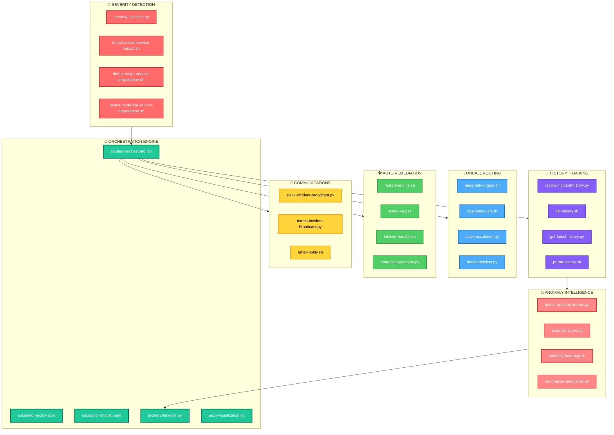

# 🚨 incident-orchestration — Full‑Stack Incident Lifecycle Engine

A **capability‑centric orchestration module** that coordinates the entire incident lifecycle:  
**severity detection** → **routing** → **remediation** → **communication** → **history** → **anomaly intelligence**

Designed for **deterministic**, **multi‑stage**, **enterprise‑grade** SRE automation.

---

## 📁 Folder Structure

| **File** | **Purpose** |
|----------|-------------|
| `incident-orchestrator.sh` | 🎯 Central orchestrator coordinating all stages |
| `escalation-policy.json` | 📋 Defines severity → routing → remediation rules |
| `escalation-matrix.yaml` | 🔀 Defines team escalation paths and fallback logic |
| `incident-timeline.py` | 📅 Generates human‑readable incident timelines |
| `ascii-visualization.txt` | 📊 ASCII diagram of the orchestration pipeline |

---

## 🧠 Architecture Overview


---

## 🔧 Core Capabilities

| **Capability** | **Description** | **Key Files** |
|----------------|-----------------|---------------|
| 🎯 **Central Orchestration** | Executes full incident lifecycle with deterministic stage ordering | `incident-orchestrator.sh` |
| 📋 **Policy‑Driven Escalation** | JSON/YAML-based severity → action mapping with fallback support | `escalation-policy.json`<br>`escalation-matrix.yaml` |
| 📅 **Timeline Generation** | Converts history snapshots into readable timelines for RCA & audits | `incident-timeline.py` |
| 📊 **ASCII Visualization** | Lightweight, terminal‑friendly pipeline diagram | `ascii-visualization.txt` |

---

## 🎨 Stage Color Coding

| **Stage** | **Color** | **Purpose** |
|-----------|-----------|-------------|
| 🔎 **Severity Detection** | 🔴 Red | Classify incident severity and impact |
| 📞 **Oncall Routing** | 🔵 Blue | Route to appropriate on-call teams |
| 🛠️ **Auto Remediation** | 🟢 Green | Execute automated recovery actions |
| 📣 **Communications** | 🟡 Yellow | Broadcast incident status |
| 📜 **History Tracking** | 🟣 Purple | Archive incident data |
| 🚨 **Anomaly Intelligence** | 🟠 Orange | Detect patterns and trends |
| 🧭 **Orchestration** | 🟢 Teal | Coordinate all stages |

---

## 🧩 Design Principles

| **Principle** | **Implementation** |
|---------------|-------------------|
| ⚛️ **Atomic Capabilities** | Each file performs one orchestration function |
| 🎯 **Deterministic Flow** | classify → route → remediate → broadcast → archive |
| 📂 **Capability‑Centric Foldering** | Mirrors the entire escalation suite |
| 🏢 **Operational Realism** | Aligned with real SRE incident workflows |
| 🔌 **Extensible Architecture** | New stages or integrations drop in cleanly |

---

## ▶️ Usage Examples

### 🚀 Run Full Orchestration
```bash
export EVENT_FILE=event.json
./incident-orchestrator.sh
```

### ✅ Validate Configuration
```bash
python3 validate-incident-config.py
```

### 📅 Generate Timeline
```bash
python3 incident-timeline.py --incident-id INC-2024-001
```

### 📊 View ASCII Visualization
```bash
cat ascii-visualization.txt
```

### 🔍 Query Incident History
```bash
./list-history.sh --severity critical --last 7d
```

### 🚨 Detect Anomalies
```bash
python3 detect-anomaly-trends.py --threshold 3-sigma
```

---

## 📊 Incident Flow Matrix

| **Severity** | **Detection** | **Routing** | **Remediation** | **Comms** | **SLA** |
|--------------|---------------|-------------|-----------------|-----------|---------|
| 🔴 **CRITICAL** | < 1 min | PagerDuty + Phone | Immediate failover | All channels | 5 min |
| 🟠 **MAJOR** | < 2 min | PagerDuty + Slack | Auto-scale + restart | Slack + Email | 15 min |
| 🟡 **MODERATE** | < 5 min | Slack | Restart service | Slack | 30 min |
| 🟢 **MINOR** | < 10 min | Email | Log + monitor | Email | 60 min |

---

## 🔗 Integration Points

| **System** | **Integration** | **Purpose** |
|------------|-----------------|-------------|
| 📟 **PagerDuty** | `pagerduty-trigger.sh` | Critical alert routing |
| 🔔 **Opsgenie** | `opsgenie-alert.sh` | Multi-team escalation |
| 💬 **Slack** | `slack-escalation.py` | Real-time team comms |
| 📧 **Email** | `email-notify.sh` | Stakeholder notifications |
| ☁️ **Cloud Providers** | `scale-out.ps1`, `failover-handler.sh` | Auto-remediation |

---

## 📈 Benefits

| **Benefit** | **Impact** |
|-------------|-----------|
| ⚡ **Reduced MTTR** | Automated detection and remediation |
| 🎯 **Deterministic Response** | Policy-driven, repeatable workflows |
| 📊 **Data-Driven Insights** | Anomaly detection and trend analysis |
| 🔄 **Continuous Learning** | Historical analysis improves future response |
| 🛡️ **Enterprise-Grade** | Supports complex escalation matrices |

---

## 🎓 Best Practices

1. **🔒 Version Control** — Keep escalation policies in Git
2. **✅ Validate Before Deploy** — Run config validation in CI/CD
3. **📊 Monitor Orchestrator Health** — Track orchestration success rates
4. **🔄 Regular Drills** — Test escalation paths quarterly
5. **📝 Document Runbooks** — Link remediation scripts to documentation
6. **🚨 Alert Fatigue Prevention** — Tune severity thresholds carefully

---

**Built for SRE teams who demand reliability, speed, and intelligence in incident response** 🚀
