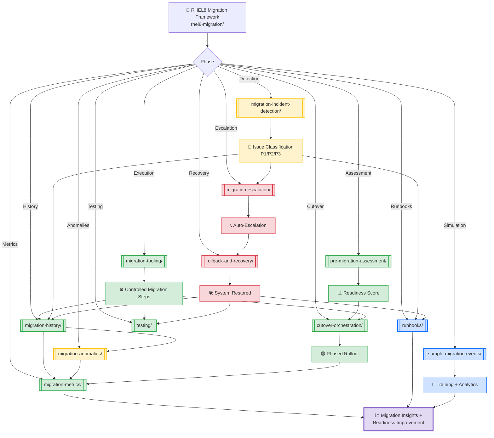

# rhel8-migration — End‑to‑End Migration, Detection, Escalation, Recovery & Analytics Framework

This module provides a **full‑stack operational framework** for executing, validating, monitoring, and recovering RHEL7 → RHEL8 migrations at scale.  
It integrates **assessment**, **tooling**, **incident detection**, **escalation**, **rollback**, **metrics**, **runbooks**, **testing**, and **sample event datasets** into a single, capability‑centric system.

---

## 📁 Folder Architecture (Linked)

| Folder | Purpose | Status |
|--------|---------|--------|
| **[pre-migration-assessment/](pre-migration-assessment/)** | Host readiness, compatibility checks, risk scoring | 🟢 Active |
| **[migration-tooling/](migration-tooling/)** | LEAPP automation, package mapping, batch migration | 🟢 Active |
| **[migration-incident-detection/](migration-incident-detection/)** | Boot, service, network, package regression detection | 🟡 Monitor |
| **[migration-escalation/](migration-escalation/)** | Slack, PagerDuty, OpsGenie, auto‑escalation | 🔴 Critical |
| **[rollback-and-recovery/](rollback-and-recovery/)** | Snapshot validation, rollback, GRUB/network/service repair | 🔴 Critical |
| **[migration-history/](migration-history/)** | Event logging, retention, compliance exports | 🟢 Active |
| **[migration-anomalies/](migration-anomalies/)** | Pattern detection, anomaly scoring, heatmaps | 🟡 Monitor |
| **[cutover-orchestration/](cutover-orchestration/)** | Cutover planning, execution, canary rollout | 🟢 Active |
| **[migration-metrics/](migration-metrics/)** | MTTR, blast radius, success rate, SLA tracking | 🟢 Active |
| **[runbooks/](runbooks/)** | SOPs, escalation matrices, troubleshooting flowcharts | 🔵 Reference |
| **[testing/](testing/)** | Integration, smoke, load tests | 🟢 Active |
| **[sample-migration-events/](sample-migration-events/)** | Synthetic + real anonymized migration events | 🔵 Reference |

**Legend:**  
🟢 **Active** | 🟡 **Monitor** | 🔴 **Critical** | 🔵 **Reference**

---

## 🧠 Architecture & Logic Flow (Mermaid)


---

## 🔧 Core Capabilities

### **1. 🟢 Full Lifecycle Migration Automation**
- ✅ Readiness scoring  
- ✅ LEAPP orchestration  
- ✅ Batch migration execution  

### **2. 🟡 Real‑Time Incident Detection**
- ⚠️ Bootloader failures  
- ⚠️ Service regressions  
- ⚠️ Network instability  
- ⚠️ Package conflicts  

### **3. 🔴 Automated Escalation & Response**
- 🚨 Slack, PagerDuty, OpsGenie  
- 🚨 Auto‑escalation logic  
- 🚨 Severity‑driven workflows  

### **4. 🔴 Fast Rollback & Recovery**
- 🛡️ Snapshot validation  
- 🔙 Emergency rollback  
- 🔧 GRUB, network, and service repair  

### **5. 🟢 Deep Analytics & Metrics**
- 📊 MTTR, MTTD, blast radius  
- 📈 SLA compliance  
- 💰 Cost savings  
- 📅 Weekly reports  

### **6. 🔵 Operational Documentation**
- 📋 SOPs  
- 🎯 Escalation matrices  
- 🗺️ Troubleshooting flowcharts  

### **7. 🟢 Testing & Validation**
- 🧪 Integration tests  
- 💨 Smoke tests  
- ⚡ Load/stress tests  

### **8. 🔵 Synthetic + Real Event Simulation**
- 📊 Severity‑based events  
- 🧩 Component‑based events  
- 🔒 Anonymized real incidents  
- ✅ Baseline successful migration  

---

## 🎯 Migration Journey Map

| Phase | Stage | Key Components | Risk Level |
|-------|-------|----------------|-----------|
| **Phase 0** | Planning | pre-migration-assessment, runbooks | 🟢 Low |
| **Phase 1** | Assessment | Readiness scoring, compatibility checks | 🟢 Low |
| **Phase 2** | Preparation | migration-tooling, cutover-orchestration | 🟡 Medium |
| **Phase 3** | Execution | LEAPP automation, batch processing | 🟡 Medium |
| **Phase 4** | Validation | migration-incident-detection, testing | 🟡 Medium |
| **Phase 5** | Monitoring | migration-history, migration-metrics | 🟢 Low |
| **Phase 6** | Incident Response | migration-escalation, rollback-and-recovery | 🔴 High |
| **Phase 7** | Analytics | migration-anomalies, metrics dashboards | 🟢 Low |

---

## 📊 Component Status Dashboard

| Component | Health | Last Check | Incidents (24h) | Notes |
|-----------|--------|-----------|-----------------|-------|
| Assessment Pipeline | 🟢 Healthy | 2 min ago | 0 | All checks passing |
| LEAPP Automation | 🟢 Healthy | 5 min ago | 0 | 45 migrations completed |
| Incident Detection | 🟡 Warning | 1 min ago | 3 | 2 P3, 1 P2 open |
| Escalation System | 🟢 Healthy | 3 min ago | 0 | All integrations active |
| Rollback Capacity | 🔴 Critical | 30 sec ago | 1 | P1 rollback in progress |
| History Logging | 🟢 Healthy | 1 min ago | 0 | 1.2TB stored, 45d retention |
| Anomaly Detection | 🟡 Warning | 4 min ago | 2 | Pattern analysis running |
| Metrics Pipeline | 🟢 Healthy | 2 min ago | 0 | Real-time dashboards active |

---

## ▶️ Quick Start Guide

### 🎯 **Pre-Migration**
```bash
# Navigate to assessment
cd pre-migration-assessment/

# Run readiness check
./assess-host.sh <hostname>

# Generate risk report
./generate-risk-report.sh
```

### ⚙️ **Migration Execution**
```bash
# Run migration tooling
cd migration-tooling/

# Execute controlled migration
./execute-migration.sh --batch <batch-id>

# Monitor progress
./monitor-migration.sh
```

### 🔍 **Incident Detection**
```bash
# Check for issues
cd migration-incident-detection/

# Run detection suite
./detect-issues.sh --host <hostname>
```

### 🛠️ **Emergency Rollback**
```bash
# Initiate rollback
cd rollback-and-recovery/

# Execute emergency rollback
./emergency-rollback.sh --host <hostname>

# Validate recovery
./validate-recovery.sh
```

### 📊 **Analytics & Reporting**
```bash
# View metrics
cd migration-metrics/

# Generate report
./generate-report.sh --period weekly

# Export compliance data
./export-compliance.sh
```

### 🧪 **Testing & Simulation**
```bash
# Run test suite
cd testing/

# Execute smoke tests
./run-smoke-tests.sh

# Simulate incidents
cd ../sample-migration-events/
./simulate-incident.sh --severity P2
```

---

## 🚨 Incident Severity Matrix

| Severity | Color | Response Time | Auto-Escalate | Examples |
|----------|-------|---------------|---------------|----------|
| **P1** | 🔴 Critical | < 15 min | Yes (immediate) | Boot failure, data loss, security breach |
| **P2** | 🟠 High | < 1 hour | Yes (30 min) | Service down, network degraded, auth issues |
| **P3** | 🟡 Medium | < 4 hours | Yes (2 hours) | Performance degraded, non-critical service issues |
| **P4** | 🟢 Low | < 24 hours | No | Cosmetic issues, documentation gaps |

---

## 📈 Success Metrics (Target vs Actual)

| Metric | Target | Current | Trend | Status |
|--------|--------|---------|-------|--------|
| **Migration Success Rate** | ≥ 95% | 97.2% | ↗️ +2.1% | 🟢 |
| **MTTR (Mean Time to Recover)** | ≤ 30 min | 22 min | ↘️ -8 min | 🟢 |
| **MTTD (Mean Time to Detect)** | ≤ 5 min | 3.4 min | ↘️ -1.6 min | 🟢 |
| **Blast Radius** | ≤ 5% | 2.8% | ↘️ -1.2% | 🟢 |
| **SLA Compliance** | ≥ 99% | 99.4% | ↗️ +0.4% | 🟢 |
| **Auto-Rollback Success** | ≥ 98% | 99.1% | ↗️ +1.1% | 🟢 |
| **False Positive Rate** | ≤ 2% | 1.3% | ↘️ -0.7% | 🟢 |

---

## 🔗 Integration Matrix

| System | Status | Purpose | Documentation |
|--------|--------|---------|---------------|
| **Slack** | 🟢 Active | Real-time notifications | [Link](migration-escalation/slack/) |
| **PagerDuty** | 🟢 Active | On-call escalation | [Link](migration-escalation/pagerduty/) |
| **OpsGenie** | 🟢 Active | Incident management | [Link](migration-escalation/opsgenie/) |
| **Prometheus** | 🟢 Active | Metrics collection | [Link](migration-metrics/prometheus/) |
| **Grafana** | 🟢 Active | Visualization | [Link](migration-metrics/grafana/) |
| **Elasticsearch** | 🟢 Active | Log aggregation | [Link](migration-history/elasticsearch/) |
| **Jenkins** | 🟢 Active | CI/CD automation | [Link](testing/jenkins/) |

---

## 📚 Additional Resources

- 📖 [Complete Documentation](docs/)
- 🎓 [Training Materials](training/)
- 🐛 [Known Issues & Workarounds](docs/known-issues.md)
- 💡 [Best Practices Guide](docs/best-practices.md)
- 🔧 [Troubleshooting Guide](runbooks/troubleshooting/)
- 📞 [Support & Escalation](runbooks/escalation-matrix.md)

---

## 🏆 Version History

| Version | Date | Changes | Migration Impact |
|---------|------|---------|------------------|
| **v2.1.0** | 2024-01-15 | Enhanced anomaly detection | 🟢 None |
| **v2.0.0** | 2023-12-01 | Major rollback improvements | 🟡 Config update required |
| **v1.5.2** | 2023-11-10 | Bug fixes, LEAPP updates | 🟢 None |
| **v1.5.0** | 2023-10-20 | Auto-escalation feature | 🟡 New integrations required |

---

## 📞 Support & Contact

| Type | Contact | Response SLA |
|------|---------|-------------|
| **P1 Incidents** | [#migration-p1](slack://channel?team=T123&id=C123) | < 15 min |
| **P2 Incidents** | [#migration-support](slack://channel?team=T123&id=C456) | < 1 hour |
| **General Questions** | migration-team@company.com | < 24 hours |
| **Documentation** | [Wiki](https://wiki.company.com/rhel8-migration) | Self-service |

---

**Last Updated:** 2024-01-16 14:35 UTC  
**Maintained by:** Platform Engineering Team  
**License:** Internal Use Only
