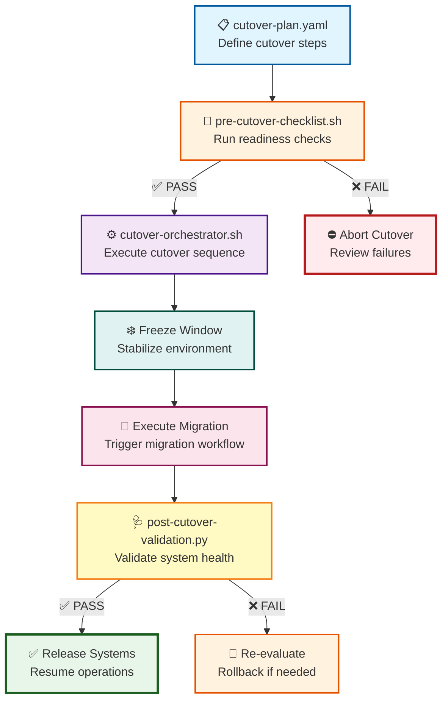

# cutover-orchestration — RHEL8 Migration Cutover Execution & Control Engine

A capability‑centric orchestration module that governs the **end‑to‑end cutover process** for RHEL7 → RHEL8 migrations.  
This engine ensures that cutover is **predictable**, **auditable**, and **safe**, with strict pre‑checks, controlled execution, and post‑cutover validation.

---

## 📁 Folder Structure

| File | Purpose | Type |
|------|---------|------|
| **cutover-plan.yaml** | Defines ordered cutover steps | 📋 Config |
| **cutover-orchestrator.sh** | Executes cutover plan step‑by‑step | ⚙️ Executor |
| **pre-cutover-checklist.sh** | Ensures readiness before cutover | 🚦 Validator |
| **post-cutover-validation.py** | Validates system health after cutover | 🩺 Health Check |
| **ascii-visualization.txt** | ASCII diagram of cutover flow | 📊 Documentation |

---

## 🧠 Architecture & Logic Flow


---

## 🔧 Core Capabilities

| Capability | Description | Status Indicator |
|------------|-------------|------------------|
| **Cutover Plan Definition** | YAML‑based step ordering with deterministic execution | 📋 Config-driven |
| **Pre‑Cutover Validation** | Disk space, network, load checks block unsafe cutovers | 🚦 Safety Gate |
| **Controlled Execution** | Strict order, freeze window, migration trigger | ⚙️ Orchestrated |
| **Post‑Cutover Health** | Systemd, services, network validation with JSON output | 🩺 Automated |
| **Visual Flow** | ASCII diagram for runbooks and SRE handoffs | 📊 Documentation |

---

## 🎯 Execution Phases

### **Phase 1: Pre-Flight Checks** 🚦
```
┌─────────────────────────────────────┐
│ ✓ Disk Space        >= 20GB free   │
│ ✓ Network Access    All hosts up   │
│ ✓ System Load       < 2.0 avg      │
│ ✓ Package Manager   Not locked     │
└─────────────────────────────────────┘
```

### **Phase 2: Cutover Execution** ⚙️
```
┌─────────────────────────────────────┐
│ 1. Enter freeze window              │
│ 2. Snapshot current state           │
│ 3. Execute migration workflow       │
│ 4. Monitor progress                 │
└─────────────────────────────────────┘
```

### **Phase 3: Validation & Release** 🩺
```
┌─────────────────────────────────────┐
│ ✓ Systemd Status     All active     │
│ ✓ Failed Services    None detected  │
│ ✓ Network Tests      All reachable  │
│ ✓ JSON Report        Generated      │
└─────────────────────────────────────┘
```

---

## ▶️ Usage

### Quick Start Commands

| Command | Purpose | Output |
|---------|---------|--------|
| `./pre-cutover-checklist.sh` | Run readiness validation | ✅ PASS/❌ FAIL |
| `./cutover-orchestrator.sh` | Execute cutover plan | 📊 Step-by-step logs |
| `python3 post-cutover-validation.py` | Validate system health | 📄 JSON report |
| `cat ascii-visualization.txt` | View cutover flow | 🎨 ASCII diagram |

### Execution Sequence
```bash
# Step 1: Validate readiness
./pre-cutover-checklist.sh
# Expected: "✅ All checks passed - System ready for cutover"

# Step 2: Execute cutover (if checks pass)
./cutover-orchestrator.sh
# Expected: "⚙️ Executing cutover plan..."

# Step 3: Post-cutover validation
python3 post-cutover-validation.py > cutover-health-report.json
# Expected: JSON with health metrics

# Step 4: Review flow diagram
cat ascii-visualization.txt
```

---

## 🎨 Status Legend

| Symbol | Meaning | Color Context |
|--------|---------|---------------|
| ✅ | Passed / Successful | 🟢 Green |
| ❌ | Failed / Blocked | 🔴 Red |
| ⚠️ | Warning / Review Needed | 🟡 Yellow |
| 📋 | Configuration | 🔵 Blue |
| ⚙️ | Active Execution | 🟣 Purple |
| 🩺 | Health Check | 🟡 Amber |
| 🔄 | Rollback/Retry | 🟠 Orange |

---

## 📊 Decision Matrix

| Check Result | Action | Next Step |
|--------------|--------|-----------|
| ✅ All Pre-Checks Pass | 🚀 Proceed to cutover | Execute orchestrator |
| ❌ Disk Space Low | ⛔ Block cutover | Free space, retry |
| ❌ Network Down | ⛔ Block cutover | Fix network, retry |
| ❌ High System Load | ⛔ Block cutover | Wait, retry later |
| ✅ Cutover Complete | 🩺 Run validation | Check health |
| ❌ Validation Fails | 🔄 Evaluate rollback | Review logs, decide |

---

## 🔒 Safety Guarantees

| Safety Feature | Implementation | Benefit |
|----------------|----------------|---------|
| **Immutable Ordering** | YAML-defined sequence | Predictable execution |
| **Pre-flight Blocks** | Automated checks abort unsafe runs | Prevents failures |
| **Freeze Window** | System stabilization period | Reduces race conditions |
| **Health Validation** | Post-execution verification | Confirms success |
| **Audit Trail** | Structured logging | Full traceability |

---

## 🎯 Success Criteria
```
✅ Pre-cutover: All checks green
✅ Execution:   No step failures
✅ Validation:  100% health metrics pass
✅ Audit:       Complete log trail exists
✅ Rollback:    Path defined and tested
```

---

## 🚀 Next Steps

1. **Review** `cutover-plan.yaml` for your environment
2. **Test** pre-cutover checks in staging
3. **Execute** dry-run with `--dry-run` flag
4. **Monitor** during freeze window
5. **Validate** post-cutover health metrics
