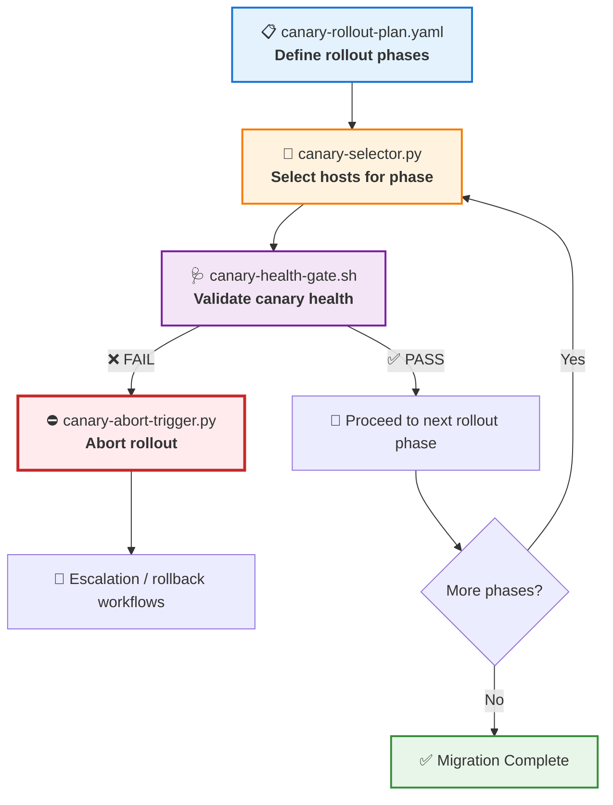
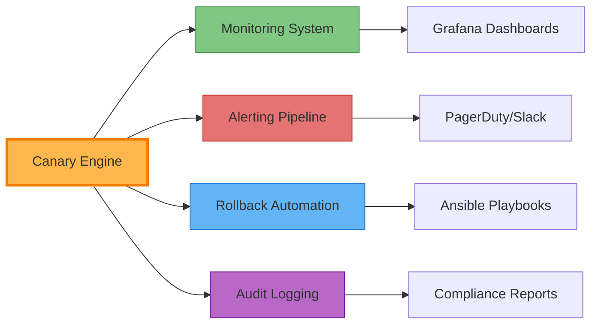

# 🐤 canary-deployment — RHEL8 Migration Canary Rollout & Safety Gate Engine

A capability‑centric orchestration module enabling **gradual, controlled, and risk‑aware rollout** of RHEL8 migrations.  
This engine ensures that migration begins with a small canary set, validates health, and only then expands to larger phases — preventing fleet‑wide impact.

---

## 📁 Folder Structure

| File | Purpose | Status |
|------|---------|--------|
| **canary-selector.py** | Selects canary hosts (10 → 100 → all) | 🟢 Core |
| **canary-health-gate.sh** | Validates canary health before next phase | 🟡 Safety |
| **canary-rollout-plan.yaml** | Defines phased rollout strategy | 🔵 Config |
| **canary-abort-trigger.py** | Auto‑aborts rollout on canary failure | 🔴 Circuit Breaker |

**Legend:** 🟢 Core Logic · 🟡 Validation · 🔵 Configuration · 🔴 Safety Mechanism

---

## 🧠 Architecture & Logic Flow


---

## 🔧 Core Capabilities

| Capability | Description | Risk Mitigation |
|------------|-------------|-----------------|
| **🎯 Canary Host Selection** | Dynamically selects 10, 100, or full fleet | 🟢 Controlled exposure |
| **🩺 Health Gate Enforcement** | Validates systemd health, network reachability | 🟡 Blocks bad rollouts |
| **📋 Rollout Strategy Definition** | YAML‑based phased rollout plan | 🔵 Predictable cutover |
| **⛔ Automatic Rollout Abort** | Evaluates failure % and aborts if threshold exceeded | 🔴 Prevents cascading failures |

---

## 🚦 Rollout Phases

| Phase | Host Count | Validation Threshold | Proceed Condition |
|-------|------------|---------------------|-------------------|
| **Phase 1: Initial Canary** | 10 hosts | 100% health required | Zero failures |
| **Phase 2: Extended Canary** | 100 hosts | ≥90% health required | ≤10% failure rate |
| **Phase 3: Full Fleet** | All remaining | ≥95% health required | Previous phases passed |

---

## 📊 Health Check Matrix

| Check Type | Validation Method | Pass Criteria | Fail Action |
|------------|------------------|---------------|-------------|
| **Systemd Status** | `systemctl is-system-running` | `running` or `degraded` | 🔴 Block rollout |
| **Network Reachability** | `ping -c 3` | ≥2 successful pings | 🔴 Block rollout |
| **Service Health** | Custom service checks | All critical services up | 🔴 Block rollout |
| **Resource Usage** | CPU/Memory thresholds | <80% utilization | 🟡 Warning only |

---

## ▶️ Usage

### Select canary hosts
```bash
python3 canary-selector.py hosts.txt 10
# Output: canary-phase1.txt (10 hosts)
```

### Validate canary health
```bash
./canary-health-gate.sh canary-phase1.txt
# Exit 0 = PASS | Exit 1 = FAIL
```

### Abort rollout if threshold exceeded
```bash
python3 canary-abort-trigger.py results.json 10
# Aborts if >10% failure rate detected
```

### Full rollout workflow
```bash
# Phase 1: Initial canary (10 hosts)
python3 canary-selector.py hosts.txt 10 > phase1.txt
./canary-health-gate.sh phase1.txt && \

# Phase 2: Extended canary (100 hosts)
python3 canary-selector.py hosts.txt 100 > phase2.txt
./canary-health-gate.sh phase2.txt && \

# Phase 3: Full fleet
python3 canary-selector.py hosts.txt all > phase3.txt
./canary-health-gate.sh phase3.txt
```

---

## 🎨 Status Color Coding

| Color | Meaning | Usage |
|-------|---------|-------|
| 🟢 **Green** | Core functionality, healthy state | Primary operations |
| 🟡 **Yellow** | Validation, warning state | Safety checks |
| 🔵 **Blue** | Configuration, informational | Static definitions |
| 🔴 **Red** | Critical failure, abort state | Circuit breakers |
| ⚫ **Black** | Inactive, disabled | Not in use |

---

## 🛡️ Safety Guarantees

- ✅ **Zero‑Impact Failure**: Canary failures never impact production fleet
- ✅ **Automatic Rollback**: Failed phases trigger immediate abort
- ✅ **Phased Expansion**: Each phase validates before proceeding
- ✅ **Threshold Enforcement**: Configurable failure tolerance per phase
- ✅ **Audit Trail**: All decisions logged for post‑mortem analysis

---

## 📈 Success Metrics

| Metric | Target | Measurement |
|--------|--------|-------------|
| **Canary Detection Rate** | 100% of breaking changes | Pre‑production validation |
| **Rollout Safety** | Zero fleet‑wide failures | Abort trigger effectiveness |
| **Time to Detection** | <5 minutes | Health gate response time |
| **False Positive Rate** | <5% | Unnecessary aborts |

---

## 🔗 Integration Points


---

## 📝 Configuration Example
```yaml
# canary-rollout-plan.yaml
rollout_strategy:
  phase_1:
    name: "Initial Canary"
    host_count: 10
    failure_threshold: 0%
    validation_checks:
      - systemd_health
      - network_reachability
      - service_availability
    
  phase_2:
    name: "Extended Canary"
    host_count: 100
    failure_threshold: 10%
    validation_checks:
      - systemd_health
      - network_reachability
      - service_availability
      - resource_usage
    
  phase_3:
    name: "Full Fleet"
    host_count: all
    failure_threshold: 5%
    validation_checks:
      - systemd_health
      - network_reachability

safety_config:
  abort_on_first_failure: true  # Phase 1 only
  health_check_timeout: 300s
  retry_attempts: 3
  escalation_contacts:
    - ops-team@example.com
    - migration-lead@example.com
```

---

## 🎯 Decision Matrix

| Scenario | Canary Health | Decision | Next Action |
|----------|--------------|----------|-------------|
| All canary hosts healthy | 🟢 100% | ✅ PROCEED | Advance to next phase |
| 1-10% canary failures | 🟡 90-99% | ⚠️ REVIEW | Manual approval required |
| 11-20% canary failures | 🟠 80-89% | 🔴 ABORT | Halt and investigate |
| 20%+ canary failures | 🔴 <80% | 🚨 ABORT | Emergency rollback |

---
