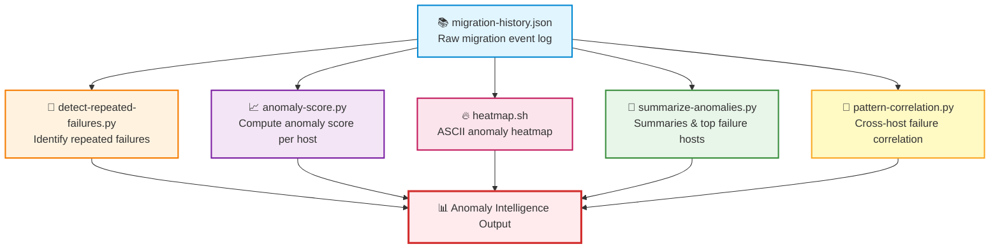

# migration-anomalies — RHEL8 Migration Anomaly Detection & Pattern Intelligence Engine

A capability‑centric analytics module that identifies **repeated failures**, **anomaly patterns**, **cross‑host correlations**, and **migration instability signals** across the entire fleet.  
This engine transforms raw migration history into actionable intelligence for engineering, SRE, and incident‑response teams.

---

## 📁 Folder Structure

| File | Purpose | Output Type |
|------|---------|-------------|
| **detect-repeated-failures.py** | Detects hosts repeatedly failing migration | 🔴 Critical alerts |
| **anomaly-score.py** | Assigns anomaly score per host | 📊 Numerical scores |
| **heatmap.sh** | ASCII heatmap of anomaly intensity | 🔥 Visual heatmap |
| **summarize-anomalies.py** | Summaries of migration anomaly patterns | 📋 Statistical report |
| **pattern-correlation.py** | Correlates failure patterns across hosts | 🔗 Correlation matrix |

---

## 🧠 Architecture & Logic Flow


---

## 🔧 Core Capabilities

| Capability | Description | Key Metrics | Use Case |
|------------|-------------|-------------|----------|
| 🔴 **Repeated Failure Detection** | Identifies hosts failing migration multiple times | Failure count, time-to-repeat | Targeted remediation of unstable hosts |
| 📊 **Anomaly Scoring Engine** | Assigns weighted anomaly scores per host | Normalized score (0-100) | Prioritize investigation resources |
| 🔥 **ASCII Heatmap Visualization** | Terminal‑friendly anomaly visualization | Visual intensity map | Quick triage during migration windows |
| 📋 **Pattern Summarization** | Aggregates migration outcomes | Success/failure ratios, top offenders | Executive reporting & trend analysis |
| 🔗 **Cross‑Host Correlation** | Detects shared failure signatures | Correlation coefficient, common errors | RCA & fleet‑wide mitigation strategies |

---

## 📊 Anomaly Score Calculation
```
Anomaly Score = (Failure Weight × Failures) - (Success Weight × Successes)
                ────────────────────────────────────────────────────────
                              Total Migrations
```

| Factor | Weight | Impact |
|--------|--------|--------|
| 🔴 Failures | **+10** | Heavy penalty for each failure |
| 🟢 Successes | **-2** | Light reward for stability |
| 🔄 Repeated Failures | **+15** | Critical penalty for instability |

**Score Interpretation:**

| Score Range | Status | Action Required |
|-------------|--------|-----------------|
| 🟢 **0-20** | Normal | Monitor only |
| 🟡 **21-50** | Elevated | Review logs |
| 🟠 **51-75** | High | Investigate immediately |
| 🔴 **76-100** | Critical | Immediate remediation |

---

## ▶️ Usage Examples

### 1️⃣ Detect Repeated Failures
```bash
python3 detect-repeated-failures.py
```
**Output:** List of hosts with ≥2 failures, sorted by frequency

---

### 2️⃣ Compute Host Anomaly Score
```bash
python3 anomaly-score.py prod-web-07
```
**Output:** Numerical score + severity classification

---

### 3️⃣ Generate Fleet Heatmap
```bash
./heatmap.sh
```
**Output:** ASCII visualization:
```
🔥🔥🔥 prod-web-07  [Score: 89]
🔥🔥  prod-db-12   [Score: 67]
🔥   prod-app-03  [Score: 45]
✓    prod-cache-01 [Score: 12]
```

---

### 4️⃣ Summarize Anomaly Patterns
```bash
python3 summarize-anomalies.py
```
**Output:**
```
Total Migrations: 1,247
Failures: 89 (7.1%)
Top 5 Failing Hosts:
  1. prod-web-07   (12 failures)
  2. prod-db-12    (8 failures)
  3. prod-app-03   (5 failures)
```

---

### 5️⃣ Correlate Cross-Host Patterns
```bash
python3 pattern-correlation.py
```
**Output:**
```
Correlation Clusters Detected:

Cluster A (Kernel Panic):
  - prod-web-07, prod-web-09, prod-web-11
  - Common Error: kernel_panic_on_boot

Cluster B (Network Timeout):
  - prod-db-12, prod-db-15
  - Common Error: network_timeout_during_migration
```

---

## 🎯 Decision Matrix

| Scenario | Tools to Use | Expected Outcome |
|----------|--------------|------------------|
| 🚨 **Migration window active** | `heatmap.sh` + `detect-repeated-failures.py` | Real-time hotspot identification |
| 🔍 **Post-mortem analysis** | `summarize-anomalies.py` + `pattern-correlation.py` | Root cause & systemic issues |
| 📈 **Trend monitoring** | `anomaly-score.py` (automated cron) | Early warning system |
| 🛠️ **Targeted remediation** | `detect-repeated-failures.py` → filter by host group | Focused troubleshooting |

---

## 🔗 Integration Points

| System | Integration Method | Purpose |
|--------|-------------------|---------|
| **Prometheus** | Export anomaly scores as metrics | Alerting & dashboards |
| **PagerDuty** | Trigger alerts for scores >75 | Incident response |
| **Slack** | Daily summary reports | Team visibility |
| **JIRA** | Auto-create tickets for critical hosts | Issue tracking |
| **ELK Stack** | Stream structured logs | Historical analysis |

---

## 📚 Data Schema Reference

### Input: `migration-history.json`
```json
{
  "host": "prod-web-07",
  "timestamp": "2025-01-02T14:23:11Z",
  "outcome": "failure",
  "error_code": "kernel_panic",
  "duration_sec": 1847,
  "retries": 3
}
```

### Output: Anomaly Score Object
```json
{
  "host": "prod-web-07",
  "anomaly_score": 89,
  "severity": "critical",
  "failure_count": 12,
  "success_count": 2,
  "last_failure": "2025-01-02T14:23:11Z",
  "recommended_action": "immediate_investigation"
}
```

---

## 🚀 Quick Start Checklist

- [ ] Install Python 3.8+ and Bash 4.0+
- [ ] Verify `migration-history.json` exists and is valid JSON
- [ ] Run `./heatmap.sh` to verify setup
- [ ] Schedule `anomaly-score.py` via cron for continuous monitoring
- [ ] Configure alert thresholds in monitoring system
- [ ] Document host remediation procedures
- [ ] Set up weekly correlation analysis reports

---

## 📖 Best Practices

1. **🔄 Run correlation analysis weekly** — Systemic issues emerge over time
2. **🎯 Set score thresholds per environment** — Production = 50, Dev = 75
3. **📊 Archive historical scores** — Enables trend analysis & capacity planning
4. **🚨 Automate critical alerts** — Don't rely on manual monitoring
5. **🔍 Investigate clusters first** — Higher ROI than individual host fixes

---

## 🛡️ Error Handling

| Error Type | Detection | Mitigation |
|------------|-----------|------------|
| **Missing data file** | File existence check | Graceful fallback to empty dataset |
| **Malformed JSON** | JSON validation | Skip corrupt records, log errors |
| **Division by zero** | Pre-flight validation | Handle zero-migration hosts |
| **Memory overflow** | Chunked processing | Stream large datasets |

---

## 📞 Support & Escalation

| Severity | Response Time | Contact |
|----------|---------------|---------|
| 🔴 Critical (Score >90) | 15 minutes | SRE on-call + #migration-critical |
| 🟠 High (Score 76-90) | 1 hour | Migration team lead |
| 🟡 Elevated (Score 51-75) | 4 hours | Shift engineer |
| 🟢 Normal (Score <50) | Next business day | Ticket queue |

---

*Last Updated: 2025-01-02 | Maintained by: Platform Engineering*
