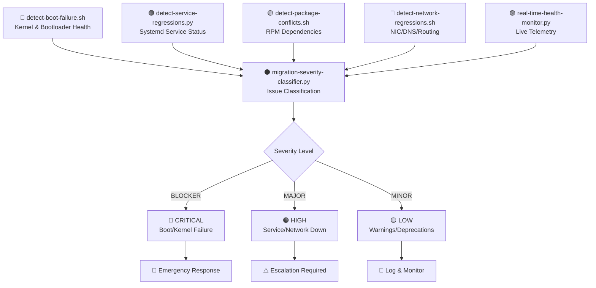
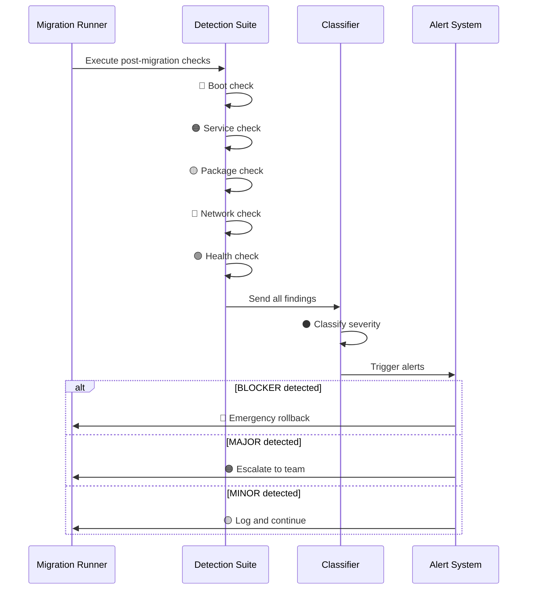

# 🚨 migration-incident-detection — Post‑Migration Failure Intelligence Engine

A capability‑centric detection suite that identifies **boot issues**, **service regressions**, **package conflicts**, **network failures**, and **live health anomalies** immediately after a RHEL7 → RHEL8 migration.

This module ensures that every host is continuously evaluated for **post‑migration stability**, enabling rapid escalation, rollback, or remediation.

---

## 📁 Folder Structure

| File | Purpose | Output |
|------|---------|--------|
| **detect-boot-failure.sh** | Detects kernel/bootloader issues after migration | 🔴 Boot failures |
| **detect-service-regressions.py** | Flags systemd service failures or degraded states | 🟠 Service issues |
| **detect-package-conflicts.sh** | Identifies RPM dependency conflicts | 🟡 Package errors |
| **detect-network-regressions.sh** | Detects NIC, DNS, and routing regressions | 🔵 Network problems |
| **migration-severity-classifier.py** | Classifies issues into BLOCKER / MAJOR / MINOR | ⚫ Severity levels |
| **real-time-health-monitor.py** | Live monitoring during migration window | 🟢 Health metrics |

---

## 🧠 Architecture & Logic Flow


---

## 🔧 Core Capabilities

### 🔴 **1. Boot Integrity Detection**
| Check | Description | Severity |
|-------|-------------|----------|
| Kernel Panic | Detects unbootable kernel states | 🔴 BLOCKER |
| GRUB Failures | Flags bootloader configuration errors | 🔴 BLOCKER |
| Root FS Missing | Identifies hosts unable to mount root filesystem | 🔴 BLOCKER |

### 🟠 **2. Service Regression Detection**
| Check | Description | Severity |
|-------|-------------|----------|
| Failed Units | Monitors systemd for failed services | 🟠 MAJOR |
| Degraded State | Identifies partially functional services | 🟠 MAJOR |
| Critical Services | Tracks database, web, and core services | 🔴 BLOCKER |

### 🟡 **3. Package Conflict Detection**
| Check | Description | Severity |
|-------|-------------|----------|
| Broken Dependencies | Detects unresolved package requirements | 🟠 MAJOR |
| Mismatched Versions | Flags incompatible library versions | 🟡 MINOR |
| Missing Packages | Identifies removed critical packages | 🟠 MAJOR |

### 🔵 **4. Network Regression Detection**
| Check | Description | Severity |
|-------|-------------|----------|
| NIC Status | Validates network interface availability | 🟠 MAJOR |
| DNS Resolution | Checks DNS functionality and nameservers | 🟠 MAJOR |
| Routing Table | Confirms default gateway and route correctness | 🟡 MINOR |

### 🟢 **5. Real‑Time Health Monitoring**
| Metric | Threshold | Alert Level |
|--------|-----------|-------------|
| CPU Load | > 80% sustained | 🟡 MINOR |
| Memory Pressure | > 90% usage | 🟠 MAJOR |
| Service Failures | Any critical service | 🔴 BLOCKER |
| Network Loss | > 5% packet loss | 🟠 MAJOR |

### ⚫ **6. Severity Classification Matrix**

| Severity | Criteria | Examples | Response Time |
|----------|----------|----------|---------------|
| 🔴 **BLOCKER** | System unbootable or critical service failure | Kernel panic, root FS missing, database down | < 15 min |
| 🟠 **MAJOR** | Service degradation or network issues | Service failed, DNS broken, NIC down | < 1 hour |
| 🟡 **MINOR** | Warnings or non-critical issues | Deprecated configs, low-priority warnings | < 24 hours |

---

## ▶️ Usage

### Quick Check (All Hosts)
```bash
./detect-boot-failure.sh hosts.txt
```

### Individual Host Analysis
```bash
# Service health
python3 detect-service-regressions.py <host>

# Package integrity
./detect-package-conflicts.sh <host>

# Network validation
./detect-network-regressions.sh <host>
```

### Severity Classification
```bash
python3 migration-severity-classifier.py incident.json
```

### Live Monitoring
```bash
python3 real-time-health-monitor.py <host>
```

---

## 📊 Output Format

### JSON Structure (Example)
```json
{
  "host": "prod-db-01",
  "timestamp": "2026-01-02T14:30:00Z",
  "incidents": [
    {
      "type": "boot",
      "severity": "BLOCKER",
      "message": "Kernel panic detected",
      "color": "🔴"
    },
    {
      "type": "service",
      "severity": "MAJOR",
      "message": "postgresql.service failed",
      "color": "🟠"
    }
  ]
}
```

---

## 🎯 Detection Coverage Matrix

| Category | Detection Scripts | Color Code | Priority |
|----------|------------------|------------|----------|
| **Boot Issues** | detect-boot-failure.sh | 🔴 Red | P0 |
| **Service Health** | detect-service-regressions.py | 🟠 Orange | P1 |
| **Package State** | detect-package-conflicts.sh | 🟡 Yellow | P2 |
| **Network Stack** | detect-network-regressions.sh | 🔵 Blue | P1 |
| **Live Telemetry** | real-time-health-monitor.py | 🟢 Green | P2 |
| **Classification** | migration-severity-classifier.py | ⚫ Black | P0 |

---

## 🔄 Workflow Integration


---

## 🚀 Quick Start
```bash
# Clone and setup
git clone <repo-url>
cd migration-incident-detection

# Run full detection suite
./run-all-checks.sh hosts.txt

# View color-coded results
cat results.json | jq -C '.'
```

---

## 📈 Success Metrics

| Metric | Target | Color |
|--------|--------|-------|
| Detection Rate | > 99% | 🟢 |
| False Positives | < 5% | 🟢 |
| Response Time (BLOCKER) | < 15 min | 🔴 |
| Response Time (MAJOR) | < 1 hour | 🟠 |
| Response Time (MINOR) | < 24 hours | 🟡 |
