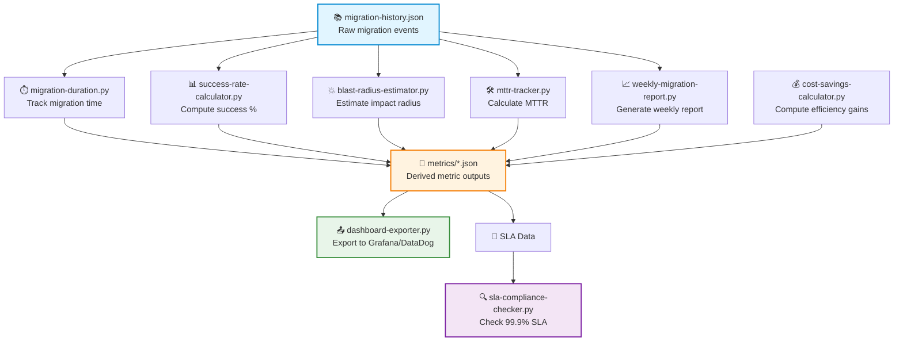

# migration-metrics — RHEL8 Migration Quantitative Insights & Performance Analytics Engine

A capability‑centric analytics module that transforms raw migration activity into **quantifiable, decision‑ready metrics**.  
This engine enables leadership, SRE, and engineering teams to measure **success rates**, **MTTR**, **blast radius**, **SLA compliance**, **cost savings**, and **weekly performance trends** across the entire RHEL8 migration program.

---

## 📁 Folder Structure

| File | Purpose | Category |
|------|---------|----------|
| **migration-duration.py** | Tracks time‑to‑migrate per host | ⏱️ Performance |
| **success-rate-calculator.py** | Computes % successful migrations | ✅ Quality |
| **blast-radius-estimator.py** | Estimates impact of failed migrations | 💥 Risk |
| **mttr-tracker.py** | Calculates Mean Time To Resolve migration issues | 🛠️ Operations |
| **sla-compliance-checker.py** | Validates 99.9% service continuity SLA | 📋 Compliance |
| **cost-savings-calculator.py** | Computes migration efficiency gains | 💰 Finance |
| **dashboard-exporter.py** | Exports metrics to Grafana/DataDog | 📤 Integration |
| **weekly-migration-report.py** | Generates weekly stakeholder reports | 📊 Reporting |

---

## 🧠 Architecture & Logic Flow


---

## 🔧 Core Capabilities

| Capability | Module | Metric Type | Business Value |
|------------|--------|-------------|----------------|
| **⏱️ Migration Duration** | migration-duration.py | Performance | Identifies slow-migrating systems |
| **✅ Success Rate** | success-rate-calculator.py | Quality | Tracks migration stability |
| **💥 Blast Radius** | blast-radius-estimator.py | Risk | Supports risk mitigation planning |
| **🛠️ MTTR** | mttr-tracker.py | Operations | Evaluates operational efficiency |
| **📋 SLA Compliance** | sla-compliance-checker.py | Compliance | Confirms 99.9% uptime adherence |
| **💰 Cost Savings** | cost-savings-calculator.py | Finance | ROI reporting for leadership |
| **📤 Dashboard Export** | dashboard-exporter.py | Integration | Real-time visualization |
| **📊 Weekly Reports** | weekly-migration-report.py | Reporting | Executive summaries |

---

## 📊 Detailed Capability Matrix

### **1. ⏱️ Migration Duration Tracking**
```
┌─────────────────────────────────────────┐
│ INPUT:  Host ID + Timestamp             │
│ OUTPUT: Duration in minutes             │
│ USE:    Performance benchmarking        │
└─────────────────────────────────────────┘
```
- Measures start → end time per host  
- Enables performance benchmarking  
- Identifies slow‑migrating systems  

### **2. ✅ Success Rate Analytics**
```
┌─────────────────────────────────────────┐
│ INPUT:  Migration history (N days)      │
│ OUTPUT: Success % by day/week/month     │
│ USE:    Executive reporting             │
└─────────────────────────────────────────┘
```
- Computes daily/weekly/monthly success percentages  
- Tracks migration stability over time  
- Supports executive reporting  

### **3. 💥 Blast Radius Estimation**
```
┌─────────────────────────────────────────┐
│ INPUT:  Failed migration events         │
│ OUTPUT: # of impacted hosts + severity  │
│ USE:    Risk mitigation planning        │
└─────────────────────────────────────────┘
```
- Identifies number of impacted hosts  
- Highlights systemic migration issues  
- Supports risk mitigation planning  

### **4. 🛠️ MTTR (Mean Time To Resolve)**
```
┌─────────────────────────────────────────┐
│ INPUT:  Incident start/end timestamps   │
│ OUTPUT: Average resolution time         │
│ USE:    SLO/SLA reporting               │
└─────────────────────────────────────────┘
```
- Calculates resolution time for migration incidents  
- Helps evaluate operational efficiency  
- Supports SLO/SLA reporting  

### **5. 📋 SLA Compliance Validation**
```
┌─────────────────────────────────────────┐
│ INPUT:  Uptime logs + SLA threshold     │
│ OUTPUT: Compliance % + breach alerts    │
│ USE:    Contract adherence tracking     │
└─────────────────────────────────────────┘
```
- Tracks uptime and continuity metrics  
- Confirms adherence to 99.9% SLA  
- Flags SLA risks early  

### **6. 💰 Cost Savings & Efficiency Gains**
```
┌─────────────────────────────────────────┐
│ INPUT:  Hours saved + hourly cost       │
│ OUTPUT: Total cost savings ($)          │
│ USE:    ROI reporting for leadership    │
└─────────────────────────────────────────┘
```
- Converts time savings into financial impact  
- Supports ROI reporting  
- Useful for leadership and budgeting  

### **7. 📤 Dashboard Export**
```
┌─────────────────────────────────────────┐
│ INPUT:  All metric JSON files           │
│ OUTPUT: Unified export format           │
│ USE:    Grafana/DataDog integration     │
└─────────────────────────────────────────┘
```
- Consolidates all metrics into a single export  
- Integrates with Grafana, DataDog, or internal dashboards  
- Enables real‑time visualization  

### **8. 📊 Weekly Stakeholder Reporting**
```
┌─────────────────────────────────────────┐
│ INPUT:  7-day migration history         │
│ OUTPUT: Executive summary + raw data    │
│ USE:    Leadership decision support     │
└─────────────────────────────────────────┘
```
- Auto‑generates weekly summaries  
- Includes success/failure counts  
- Provides raw event data for auditability  

---

## ▶️ Usage Examples

### **⏱️ Track Migration Duration**
```bash
# Mark migration start
python3 migration-duration.py <host> start

# Mark migration completion
python3 migration-duration.py <host> end
```

### **✅ Calculate Success Rate**
```bash
# Last 7 days
python3 success-rate-calculator.py 7

# Last 30 days
python3 success-rate-calculator.py 30
```

### **💥 Estimate Blast Radius**
```bash
python3 blast-radius-estimator.py
```

### **🛠️ Compute MTTR**
```bash
python3 mttr-tracker.py
```

### **📋 Check SLA Compliance**
```bash
python3 sla-compliance-checker.py
```

### **💰 Calculate Cost Savings**
```bash
python3 cost-savings-calculator.py <hours_saved> <hourly_cost>

# Example: 100 hours saved at $50/hour
python3 cost-savings-calculator.py 100 50
```

### **📤 Export Dashboard Metrics**
```bash
python3 dashboard-exporter.py
```

### **📊 Generate Weekly Report**
```bash
python3 weekly-migration-report.py
```

---

## 📈 Sample Output Formats

### Success Rate Output
```json
{
  "period": "7_days",
  "total_migrations": 450,
  "successful": 441,
  "failed": 9,
  "success_rate": "98.0%",
  "trend": "↑ improving"
}
```

### MTTR Output
```json
{
  "total_incidents": 12,
  "total_resolution_time_hours": 36.5,
  "mttr_hours": 3.04,
  "mttr_minutes": 182.5,
  "benchmark_status": "✅ within SLO"
}
```

### Cost Savings Output
```json
{
  "hours_saved": 100,
  "hourly_cost_usd": 50,
  "total_savings_usd": 5000,
  "annualized_projection_usd": 260000
}
```

---

## 🎯 Key Performance Indicators (KPIs)

| KPI | Target | Current | Status |
|-----|--------|---------|--------|
| **Migration Success Rate** | ≥ 95% | 98.0% | 🟢 |
| **Average Migration Time** | ≤ 60 min | 45 min | 🟢 |
| **MTTR** | ≤ 4 hours | 3.04 hours | 🟢 |
| **SLA Compliance** | 99.9% | 99.95% | 🟢 |
| **Blast Radius (avg)** | ≤ 5 hosts | 2.3 hosts | 🟢 |

---

## 🔗 Integration Points
```
migration-metrics/
├── 📊 Grafana Dashboard ──→ Real-time visualization
├── 📈 DataDog Metrics ────→ APM integration
├── 📧 Email Reports ──────→ Weekly stakeholder updates
├── 🔔 Slack Alerts ───────→ SLA breach notifications
└── 💾 Data Warehouse ─────→ Historical analysis
```

---

## 🚀 Quick Start

1. **Install dependencies**: `pip3 install -r requirements.txt`
2. **Initialize metrics directory**: `mkdir -p metrics/`
3. **Run baseline report**: `python3 weekly-migration-report.py`
4. **Set up dashboard export**: `python3 dashboard-exporter.py`

---

## 📚 Additional Resources

- **Migration Playbook**: See `../docs/migration-playbook.md`
- **API Documentation**: See `../docs/api-reference.md`
- **Troubleshooting Guide**: See `../docs/troubleshooting.md`

---

**Version**: 2.0  
**Last Updated**: 2026-01-02  
**Maintainer**: SRE Migration Team
