# pre-migration-assessment — RHEL8 Readiness & Risk Evaluation Engine

A capability‑centric assessment suite that evaluates **technical readiness**, **compatibility**, and **migration risk** before any RHEL7 → RHEL8 upgrade is allowed.

This module ensures that every host is **inventory‑verified**, **compatibility‑checked**, **scored**, and **risk‑classified** before entering the migration pipeline.

---

## 📁 Folder Structure

| File | Purpose | Input | Output |
|------|---------|-------|--------|
| **inventory-collector.sh** | Collects OS, kernel, package, and service inventory | `hosts.txt` | `inventory.json` |
| **compatibility-scanner.py** | Detects RHEL7 → RHEL8 incompatibilities | `inventory.json` | `compatibility.json` |
| **deprecated-packages-report.py** | Flags removed or renamed packages | `packages.json` | `deprecated-report.json` |
| **kernel-feature-check.sh** | Validates kernel modules & syscall compatibility | `<hostname>` | `kernel-report.txt` |
| **readiness-score.py** | Generates readiness score (0–100) | `compatibility.json` | `readiness.json` |
| **risk-assessment-matrix.py** | Categorizes hosts into LOW / MEDIUM / HIGH migration risk | `readiness.json` | `risk-matrix.json` |

---

## 🧠 Architecture & Logic Flow

```mermaid
flowchart TD
    A[📦 inventory-collector.sh<br/>Collect host inventory] --> B[🔍 compatibility-scanner.py<br/>Detect incompatibilities]
    
    B --> C[📉 deprecated-packages-report.py<br/>Identify removed/renamed packages]
    B --> D[🧬 kernel-feature-check.sh<br/>Check kernel modules & syscalls]
    
    C --> E[📊 readiness-score.py<br/>Compute readiness score]
    D --> E
    
    E --> F{⚠️ risk-assessment-matrix.py<br/>Risk Classification}
    
    F -->|Score ≥ 80| G[🟢 LOW RISK<br/>Safe to migrate]
    F -->|Score 50-79| H[🟡 MEDIUM RISK<br/>Requires remediation]
    F -->|Score < 50| I[🔴 HIGH RISK<br/>Migration blocked]
    
    style G fill:#d4edda,stroke:#28a745,stroke-width:2px
    style H fill:#fff3cd,stroke:#ffc107,stroke-width:2px
    style I fill:#f8d7da,stroke:#dc3545,stroke-width:2px
```


---

## 🔧 Core Capabilities

| Capability | Description | Criticality |
|------------|-------------|-------------|
| **Inventory Collection** | Gathers OS version, kernel, installed packages, and running services | 🔴 **Critical** |
| **Compatibility Detection** | Identifies removed packages, deprecated kernel modules, and unsupported services | 🔴 **Critical** |
| **Deprecated Package Mapping** | Maps RHEL7 → RHEL8 package changes and highlights rename/replace requirements | 🟡 **High** |
| **Kernel & Syscall Validation** | Ensures kernel modules are compatible with RHEL8 and detects deprecated syscalls | 🔴 **Critical** |
| **Readiness Scoring** | Converts technical findings into a 0–100 readiness score | 🟢 **Standard** |
| **Risk Classification** | Assigns LOW / MEDIUM / HIGH risk categories based on readiness score | 🔴 **Critical** |

---

## 📊 Risk Assessment Matrix

| Risk Level | Score Range | Condition | Action Required |
|------------|-------------|-----------|-----------------|
| 🟢 **LOW** | 80–100 | No blockers, minimal incompatibilities | ✅ Proceed to migration |
| 🟡 **MEDIUM** | 50–79 | Moderate issues, deprecated packages present | ⚠️ Remediate before migration |
| 🔴 **HIGH** | 0–49 | Critical blockers, incompatible kernel modules | ❌ Migration blocked |

---

## 🔍 Compatibility Check Categories

| Category | RHEL7 → RHEL8 Impact | Detection Method |
|----------|----------------------|------------------|
| **Removed Packages** | Package no longer available in RHEL8 | `yum list` comparison against RHEL8 repos |
| **Renamed Packages** | Package exists but under different name | Package mapping database lookup |
| **Deprecated Kernel Modules** | Module removed or replaced | `lsmod` + RHEL8 kernel module list |
| **Unsupported Services** | Service no longer supported in RHEL8 | `systemctl list-units` + compatibility DB |
| **Obsolete Syscalls** | Syscall removed from kernel | Static analysis of binaries |

---

## ▶️ Usage

### **Full Assessment Pipeline**
```bash
# Step 1: Collect inventory from target hosts
./inventory-collector.sh hosts.txt

# Step 2: Scan for compatibility issues
python3 compatibility-scanner.py inventory.json

# Step 3: Generate deprecated packages report
python3 deprecated-packages-report.py packages.json

# Step 4: Validate kernel features (per host)
./kernel-feature-check.sh hostname.example.com

# Step 5: Calculate readiness score
python3 readiness-score.py compatibility.json

# Step 6: Generate risk assessment matrix
python3 risk-assessment-matrix.py readiness.json
```

### **Single-Host Quick Check**
```bash
# Run full assessment for one host
./quick-assess.sh hostname.example.com
```

---

## 📈 Output Examples

### **Readiness Score Output**
```json
{
  "hostname": "webserver01.example.com",
  "readiness_score": 72,
  "risk_level": "MEDIUM",
  "blockers": 2,
  "warnings": 8,
  "recommendations": [
    "Replace deprecated package: python-twisted → python3-twisted",
    "Update kernel module: ip_conntrack → nf_conntrack"
  ]
}
```

### **Risk Matrix Summary**

| Risk Level | Host Count | Percentage |
|------------|-----------|------------|
| 🟢 LOW | 45 | 60% |
| 🟡 MEDIUM | 22 | 29% |
| 🔴 HIGH | 8 | 11% |
| **TOTAL** | **75** | **100%** |

---

## 🎯 Decision Logic

```mermaid
graph TD
    A[Readiness Score Generated] --> B{Score ≥ 80?}
    B -->|Yes| C[🟢 LOW RISK<br/>Auto-approve for migration]
    B -->|No| D{Score ≥ 50?}
    D -->|Yes| E[🟡 MEDIUM RISK<br/>Queue for remediation]
    D -->|No| F[🔴 HIGH RISK<br/>Block migration]
    
    E --> G[Remediation Plan Generated]
    G --> H[Re-run assessment after fixes]
    
    F --> I[Manual review required]
    
    style C fill:#d4edda,stroke:#28a745
    style E fill:#fff3cd,stroke:#ffc107
    style F fill:#f8d7da,stroke:#dc3545
```


---

## 🛡️ Pre-Migration Gates

All hosts must pass these gates before migration:

| Gate | Requirement | Status Check |
|------|-------------|--------------|
| **Inventory Complete** | All package data collected | ✅ Automated |
| **No Critical Blockers** | Zero removed packages in use | ✅ Automated |
| **Kernel Compatible** | All modules supported in RHEL8 | ✅ Automated |
| **Score ≥ 50** | Minimum readiness threshold met | ✅ Automated |
| **Risk ≠ HIGH** | Not classified as high-risk | ✅ Automated |

---

## 🔄 Integration Points

This module feeds data into:

- **rollback-validation** → Uses compatibility data to predict rollback feasibility
- **migration-orchestrator** → Blocks hosts with risk level = HIGH
- **monitoring-dashboards** → Displays readiness metrics in real-time

---

## 📌 Key Principles

- **No host migrates without passing assessment**
- **Risk classification is deterministic and auditable**
- **Readiness scores are reproducible and version-controlled**
- **Blockers are actionable with clear remediation paths**

---
