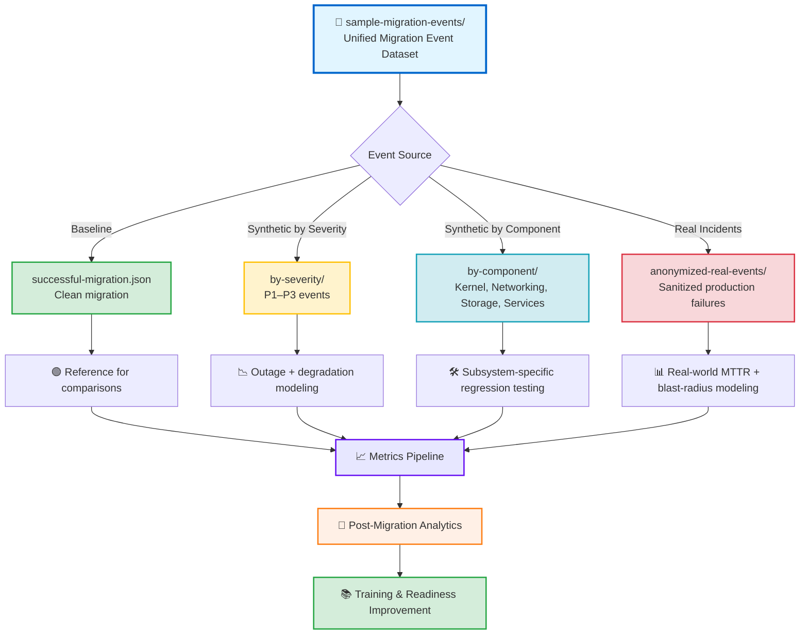

# sample-migration-events — Enhanced Synthetic & Real Migration Event Dataset

This module provides a **unified dataset of synthetic, component‑based, severity‑based, and anonymized real migration incidents** used for simulation, analytics, testing, and incident‑response training during RHEL7 → RHEL8 migrations.

It serves as the **canonical event library** for:
- Canary‑deployment validation  
- Regression testing  
- Escalation‑flow simulation  
- MTTR and blast‑radius analytics  
- SRE and migration‑team training  
- Post‑migration readiness assessments  

The dataset includes:
- **Baseline successful migration events**  
- **Synthetic events grouped by severity**  
- **Synthetic events grouped by component**  
- **Anonymized real‑world incidents**  

---

## 📁 Folder Architecture

| Folder | Purpose | Status |
|--------|---------|--------|
| **successful-migration.json** | Clean baseline event for comparison | 🟢 Reference |
| **by-severity/** | Synthetic events grouped by operational impact (P1–P3) | 🔴 🟡 🟢 Multi-tier |
| **by-component/** | Synthetic events grouped by affected subsystem | 🔧 Component-based |
| **anonymized-real-events/** | Sanitized real production incidents | 📊 Production data |

---

## 🧠 Architecture & Logic Flow (Mermaid)


---

## 🔧 Core Capabilities

### **1. Unified Migration Event Modeling**

| Event Type | Description | Color Code |
|------------|-------------|------------|
| ✅ **Baseline Success** | Clean migration reference | 🟢 Green |
| ⚠️ **Severity-based** | P1–P3 synthetic regressions | 🔴 🟡 🟢 Red/Yellow/Green |
| 🔧 **Component-based** | Subsystem-specific failures | 🔵 Blue |
| 📊 **Real Incidents** | Anonymized production data | 🟣 Purple |

### **2. Escalation & Response Training**

| Severity Level | Response Time | Blast Radius | Color |
|----------------|---------------|--------------|-------|
| **SEV-1 / P1** | < 15 min | Critical outage | 🔴 Red |
| **SEV-2 / P2** | < 1 hour | Degraded performance | 🟡 Yellow |
| **SEV-3 / P3** | < 4 hours | Minor impact | 🟢 Green |

### **3. Component Coverage Matrix**

| Component | Event Types | Test Coverage | Status |
|-----------|-------------|---------------|--------|
| **Kernel** | Boot failures, panics | High | 🟢 Active |
| **Networking** | DNS, firewall, routing | High | 🟢 Active |
| **Storage** | Mount failures, I/O errors | Medium | 🟡 In Progress |
| **Services** | SystemD, daemons | High | 🟢 Active |
| **Security** | SELinux, PAM | Medium | 🟡 In Progress |

### **4. Analytics & Metrics Coverage**

| Metric | Data Source | Calculation | Priority |
|--------|-------------|-------------|----------|
| **MTTR** | All events | Detection → Resolution time | 🔴 Critical |
| **MTTD** | Synthetic + Real | Issue creation → Detection | 🔴 Critical |
| **Blast Radius** | Severity-based | Affected hosts/services | 🟡 High |
| **Success Rate** | All migrations | Successful / Total | 🟢 Medium |

---

## 📊 Event Distribution Overview

| Category | Event Count | Percentage | Visual |
|----------|-------------|------------|--------|
| Successful | 1 baseline | 5% | 🟢 ▓░░░░░░░░░░░░░░░░░░░ |
| P1 Critical | ~5 events | 25% | 🔴 ▓▓▓▓▓░░░░░░░░░░░░░░░ |
| P2 Major | ~8 events | 40% | 🟡 ▓▓▓▓▓▓▓▓░░░░░░░░░░░░ |
| P3 Minor | ~6 events | 30% | 🟢 ▓▓▓▓▓▓░░░░░░░░░░░░░░ |

---

## ▶️ Usage

### Navigate to severity‑based events:
```bash
cd by-severity/
# Files: p1-critical-*.json, p2-major-*.json, p3-minor-*.json
```

### Navigate to component‑based events:
```bash
cd by-component/
# Folders: kernel/, networking/, storage/, services/
```

### Navigate to real anonymized incidents:
```bash
cd anonymized-real-events/
# Files: incident-*.json (sanitized production data)
```

### View the clean migration baseline:
```bash
cat successful-migration.json
```

---

## 🎯 Quick Reference Guide

### Event File Naming Convention

| Pattern | Example | Meaning |
|---------|---------|---------|
| `successful-*.json` | `successful-migration.json` | 🟢 Baseline success |
| `p1-*.json` | `p1-critical-kernel-panic.json` | 🔴 Critical severity |
| `p2-*.json` | `p2-major-network-timeout.json` | 🟡 Major severity |
| `p3-*.json` | `p3-minor-service-warning.json` | 🟢 Minor severity |
| `incident-*.json` | `incident-2024-01-15.json` | 🟣 Real anonymized |

### Color Legend

| Color | Severity | Response | Example Use Case |
|-------|----------|----------|------------------|
| 🔴 Red | Critical/P1 | Immediate escalation | Production outage, kernel panic |
| 🟡 Yellow | Major/P2 | 1-hour response | Performance degradation, service timeout |
| 🟢 Green | Minor/P3 | 4-hour response | Warning logs, minor config drift |
| 🔵 Blue | Component | Varies | Subsystem-specific testing |
| 🟣 Purple | Real Data | Historical | Production incident analysis |

---

## 🚀 Integration Examples

### Load all P1 events for testing:
```bash
find by-severity/ -name "p1-*.json" -exec cat {} \;
```

### Filter component-specific events:
```bash
ls by-component/kernel/*.json
```

### Analyze real incident patterns:
```bash
jq '.severity' anonymized-real-events/*.json | sort | uniq -c
```

---

## 📈 Continuous Improvement

| Activity | Frequency | Owner | Status |
|----------|-----------|-------|--------|
| Add new synthetic events | Monthly | SRE Team | 🟢 Ongoing |
| Sanitize real incidents | Weekly | Security Team | 🟢 Ongoing |
| Update severity thresholds | Quarterly | Migration Team | 🟡 Review needed |
| Validate event coverage | Bi-weekly | QA Team | 🟢 Ongoing |

---

**Last Updated:** 2026-01-02  
**Maintained By:** Platform Migration & SRE Teams  
**Version:** 2.1.0
