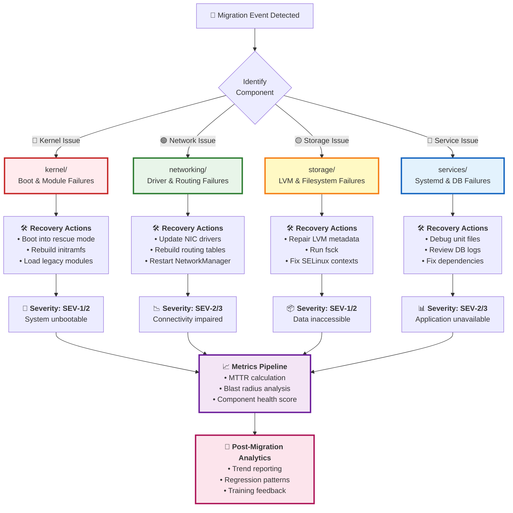
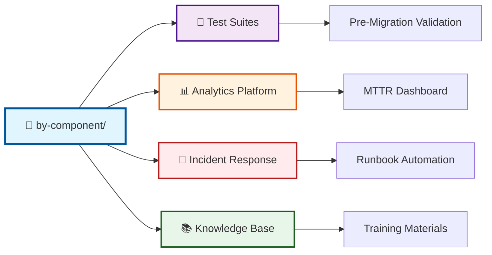

# by-component — Sample Migration Events Categorized by System Component

This module organizes **sample migration events by affected system component**, enabling targeted testing, analytics, and incident‑response simulation.  
Component‑level modeling allows teams to isolate regressions in **kernel**, **networking**, **storage**, and **service‑layer** subsystems — the four pillars most impacted during RHEL7 → RHEL8 migrations.

---

## 🎯 Key Benefits

| Capability | Purpose |
|------------|---------|
| 🔍 **Component‑specific regression testing** | Isolate failures by subsystem |
| 🚨 **Escalation‑flow validation** | Test SEV-1/2/3 response paths |
| 🔄 **Canary and rollback decision modeling** | Validate deployment safety checks |
| 📊 **MTTR and blast‑radius analytics** | Measure incident impact by component |
| 🎓 **Training for system owners and SRE teams** | Build troubleshooting expertise |

---

## 📁 Component Architecture
```
by-component/
├── 🔴 kernel/          ← Bootloader failures, module incompatibilities
├── 🟢 networking/      ← NIC driver regressions, routing corruption
├── 🟡 storage/         ← LVM activation failures, mount errors
└── 🔵 services/        ← Systemd & database startup issues
```

### Component Details

<table>
<thead>
<tr>
<th>Component</th>
<th>Folder</th>
<th>Failure Types</th>
<th>Impact Level</th>
</tr>
</thead>
<tbody>
<tr>
<td>🔴 <strong>Kernel & Boot</strong></td>
<td><code>kernel/</code></td>
<td>Bootloader failures, module incompatibilities, panic scenarios</td>
<td><strong>SEV‑1/2</strong> — System unbootable</td>
</tr>
<tr>
<td>🟢 <strong>Network Stack</strong></td>
<td><code>networking/</code></td>
<td>NIC driver regressions, routing table corruption, DNS failures</td>
<td><strong>SEV‑2/3</strong> — Connectivity degradation</td>
</tr>
<tr>
<td>🟡 <strong>Storage & Filesystems</strong></td>
<td><code>storage/</code></td>
<td>LVM activation failures, mount errors, SELinux context issues</td>
<td><strong>SEV‑1/2</strong> — Data unavailable</td>
</tr>
<tr>
<td>🔵 <strong>Services & Applications</strong></td>
<td><code>services/</code></td>
<td>Systemd unit failures, database startup timeouts, dependency issues</td>
<td><strong>SEV‑2/3</strong> — Application down</td>
</tr>
</tbody>
</table>

---

## 🧠 Architecture & Logic Flow


---

## 🔧 Core Capabilities

<table>
<thead>
<tr>
<th width="30%">Capability</th>
<th>Description</th>
</tr>
</thead>
<tbody>
<tr>
<td><strong>1️⃣ Component‑Level Regression Modeling</strong></td>
<td>
- <strong>Kernel</strong>: Boot failures, module incompatibilities, panic scenarios<br/>
- <strong>Networking</strong>: Driver regressions, routing corruption, DNS failures<br/>
- <strong>Storage</strong>: LVM activation issues, mount errors, SELinux contexts<br/>
- <strong>Services</strong>: Systemd unit failures, DB timeouts, dependency chains
</td>
</tr>
<tr>
<td><strong>2️⃣ Escalation & Response Training</strong></td>
<td>
- Supports <strong>SEV‑1/2/3</strong> escalation workflows<br/>
- Reinforces subsystem‑specific troubleshooting patterns<br/>
- Integrates with rollback and rescue‑mode playbooks<br/>
- Provides realistic failure scenarios for SRE drills
</td>
</tr>
<tr>
<td><strong>3️⃣ Analytics & Reporting Integration</strong></td>
<td>
- Inputs for <strong>MTTR</strong>, <strong>MTTD</strong>, and <strong>blast‑radius</strong> calculations<br/>
- Powers weekly migration health reports<br/>
- Enables trend analysis by subsystem over time<br/>
- Identifies recurring failure patterns for remediation
</td>
</tr>
<tr>
<td><strong>4️⃣ Testing & Validation Support</strong></td>
<td>
- Used in smoke, integration, and load tests<br/>
- Ensures subsystem regressions caught in pre‑prod<br/>
- Enables targeted canary‑deployment validation<br/>
- Supports rollback decision automation
</td>
</tr>
</tbody>
</table>

---

## ▶️ Usage

### Navigate by Component
```bash
# Kernel boot and module issues
cd kernel/

# Network driver and routing issues
cd networking/

# LVM and filesystem issues
cd storage/

# Systemd and database issues
cd services/
```

### Example Workflow
```bash
# 1. Identify component from incident
incident_component="networking"

# 2. Navigate to relevant samples
cd by-component/${incident_component}/

# 3. Review similar failure patterns
ls -la

# 4. Extract recovery playbook
cat recovery_procedure.md

# 5. Feed into analytics pipeline
./analyze_component_failures.sh ${incident_component}
```

---

## 📊 Severity Matrix

| Component | SEV‑1 Scenarios | SEV‑2 Scenarios | SEV‑3 Scenarios |
|-----------|----------------|----------------|----------------|
| 🔴 **Kernel** | System won't boot | Module load failures | Minor driver warnings |
| 🟢 **Networking** | Total network loss | Degraded connectivity | Single NIC down |
| 🟡 **Storage** | Root filesystem unmountable | Data volume unavailable | Performance degradation |
| 🔵 **Services** | Critical DB down | Application tier unavailable | Non‑critical service down |

---

## 🔄 Integration Points


---

## 📈 Success Metrics

- ✅ **95%+ regression detection rate** in pre‑production testing
- ✅ **<30 min MTTR** for component‑specific failures
- ✅ **Zero data loss** incidents during storage migrations
- ✅ **100% SRE training coverage** on component failure patterns

---

*Last updated: 2025‑01‑02 | Component taxonomy v2.1*
