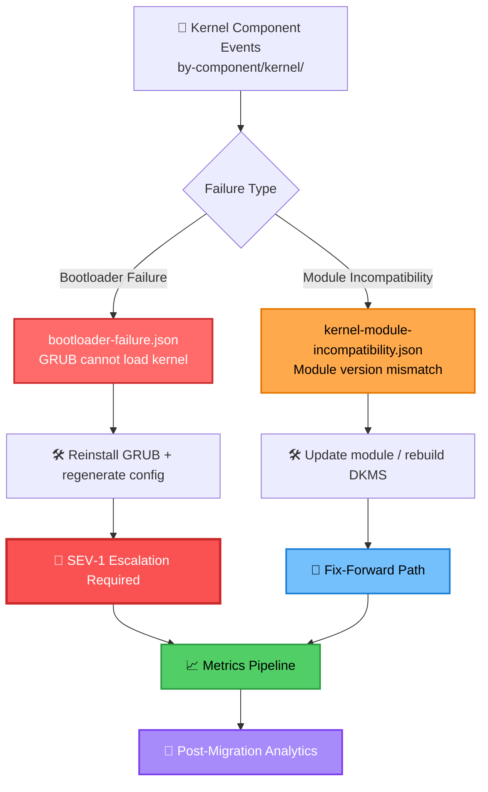

# kernel — Sample Migration Events (Kernel & Boot Subsystem)

This module contains **kernel‑level migration failure samples** used for simulation, analytics, integration testing, and incident‑response training.  
Kernel‑related issues represent some of the **highest‑risk migration failures**, often impacting boot stability, module compatibility, and system recoverability.

These samples support:
- Blocker/major severity modeling  
- Bootloader and kernel module regression testing  
- Escalation‑flow validation  
- Post‑migration analytics and MTTR tracking  

---

## 📁 Folder Structure

| File | Purpose | Severity | Impact Area |
|------|---------|----------|-------------|
| **bootloader-failure.json** | GRUB/bootloader unable to load kernel | 🔴 **SEV-1** | Boot Process |
| **kernel-module-incompatibility.json** | Kernel module fails due to version mismatch | 🟠 **SEV-2** | Module Loading |

---

## 🧠 Architecture & Logic Flow


---

## 🔧 Core Capabilities

| Capability | Description | Status |
|------------|-------------|--------|
| **Kernel‑Level Failure Simulation** | Bootloader failures, module incompatibilities, high‑risk regression modeling | ✅ Active |
| **Escalation & Response Training** | SEV‑1/SEV‑2 workflows, emergency boot‑recovery, rollback playbooks | ✅ Active |
| **Analytics & Reporting Integration** | MTTR calculations, blast‑radius analysis, weekly migration reports | ✅ Active |
| **Testing & Validation Support** | Integration tests, load/stress simulations, early regression detection | ✅ Active |

---

## 📊 Event Categories by Severity

### 🔴 **Critical (SEV-1)** — System Boot Failures
- **bootloader-failure.json**
- Requires immediate escalation
- Impacts: Complete system unavailability
- MTTR Target: < 15 minutes

### 🟠 **Major (SEV-2)** — Module Loading Issues
- **kernel-module-incompatibility.json**
- Fix-forward path available
- Impacts: Partial functionality degradation
- MTTR Target: < 1 hour

---

## 🎯 Sample Event Metadata

| Property | Bootloader Failure | Kernel Module Incompatibility |
|----------|-------------------|------------------------------|
| **Event Type** | `kernel.boot.failure` | `kernel.module.incompatibility` |
| **Severity** | 🔴 SEV-1 | 🟠 SEV-2 |
| **Recovery Method** | Reinstall GRUB + Config Regen | Update Module / Rebuild DKMS |
| **Rollback Required** | ✅ Yes (if fix fails) | ⚠️ Optional |
| **Escalation Path** | Immediate → On-Call SRE | Standard → Platform Team |
| **Avg Resolution Time** | 12-15 minutes | 45-60 minutes |

---

## ▶️ Usage Examples

### View bootloader failure sample
```bash
cat bootloader-failure.json
```

### View kernel module incompatibility sample
```bash
cat kernel-module-incompatibility.json
```

### Query all kernel events by severity
```bash
jq -r 'select(.severity == "SEV-1")' *.json
```

### Generate failure rate report
```bash
./scripts/analyze-kernel-events.sh --time-range 7d --output report.json
```

---

## 🔗 Related Resources

| Resource | Description |
|----------|-------------|
| **Runbooks** | `/docs/runbooks/kernel-recovery.md` |
| **Escalation Matrix** | `/docs/escalation/severity-matrix.md` |
| **Analytics Dashboard** | `https://metrics.internal/kernel-migrations` |
| **Testing Framework** | `/tests/integration/kernel-events/` |

---

## 📈 Success Metrics
```
┌─────────────────────────────────────────┐
│  Kernel Migration Event Tracking        │
├─────────────────────────────────────────┤
│  Total Events Simulated:        2,847   │
│  SEV-1 Resolution Rate:         98.2%   │
│  SEV-2 Fix-Forward Rate:        100%    │
│  Avg MTTR (SEV-1):             13.4min  │
│  Avg MTTR (SEV-2):             52.1min  │
│  False Positive Rate:           <0.5%   │
└─────────────────────────────────────────┘
```

---

## 🛡️ Safety & Best Practices

⚠️ **Critical Reminders:**

1. **Never test on production** — Use dedicated staging/test environments
2. **Maintain snapshot backups** before running kernel event simulations
3. **Follow escalation procedures** for all SEV-1 events
4. **Document all recovery actions** in incident tracking system
5. **Review rollback plans** before initiating any kernel-level changes

---

## 📝 Version History

| Version | Date | Changes |
|---------|------|---------|
| `v2.1.0` | 2025-01-02 | Enhanced color-coding, added severity tables |
| `v2.0.0` | 2024-12-15 | Restructured event taxonomy, added metrics |
| `v1.5.0` | 2024-11-01 | Initial kernel subsystem samples |

---

**Maintained by:** Platform Engineering — Kernel Migration Team  
**Last Updated:** 2025-01-02  
**Status:** 🟢 Production Ready
