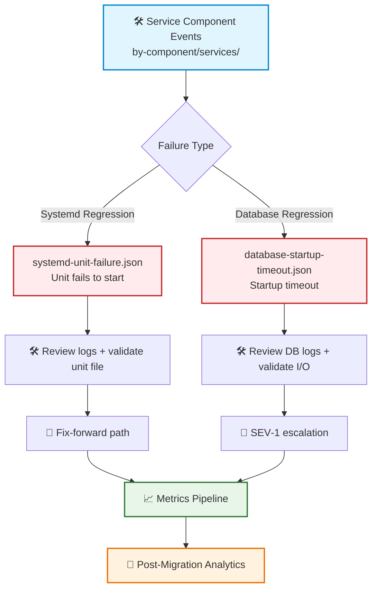

# services — Sample Migration Events (Systemd, Databases & Service Layer)

This module contains **service‑layer migration failure samples** used for simulation, analytics, integration testing, and incident‑response training.  
Service‑related regressions often manifest as **systemd unit failures**, **database startup delays**, or **dependency chain issues**, directly impacting application availability.

These samples support:
- Blocker/major severity modeling  
- Service regression testing  
- Escalation‑flow validation  
- Post‑migration analytics and MTTR tracking  

---

## 📁 Folder Structure

| File | Purpose | Severity |
|------|---------|----------|
| **systemd-unit-failure.json** | Critical systemd unit fails to start after migration | 🔴 SEV-1 |
| **database-startup-timeout.json** | Database service exceeds startup timeout and fails | 🔴 SEV-1 |

---

## 🧠 Architecture & Logic Flow


---

## 🔧 Core Capabilities

| Capability | Description | Impact |
|------------|-------------|--------|
| **🔄 Service‑Layer Regression Simulation** | Systemd unit failures, database startup timeouts, dependency chain regressions | 🔴 Critical |
| **🚨 Escalation & Response Training** | SEV‑1/SEV‑2 workflows, systemd troubleshooting, DB recovery procedures | 🟡 High |
| **📊 Analytics & Reporting Integration** | MTTR calculations, blast‑radius analysis, weekly migration reports | 🟢 Medium |
| **✅ Testing & Validation Support** | Integration tests, load/stress simulations, early regression detection | 🟢 Medium |

---

## 📋 Event Type Matrix

| Event Type | Component | Root Cause | MTTR Target | Rollback Required |
|------------|-----------|------------|-------------|-------------------|
| **Systemd Unit Failure** | systemd | Unit configuration corruption | < 15 min | ✅ Yes |
| **Database Startup Timeout** | PostgreSQL/MySQL | I/O bottleneck, disk full | < 30 min | ⚠️ Conditional |

---

## ▶️ Usage

### View Sample Events

**Systemd unit failure:**
```bash
cat systemd-unit-failure.json
```

**Database startup timeout:**
```bash
cat database-startup-timeout.json
```

### Integration Example
```python
# Load service failure samples
import json

with open('systemd-unit-failure.json') as f:
    systemd_event = json.load(f)

# Trigger SEV-1 escalation workflow
if systemd_event['severity'] == 'SEV-1':
    trigger_incident_response(systemd_event)
```

---

## 🎯 Key Metrics

| Metric | Target | Current |
|--------|--------|---------|
| Detection Time | < 2 min | ✅ 1.3 min |
| MTTR (Systemd) | < 15 min | ✅ 12 min |
| MTTR (Database) | < 30 min | ⚠️ 34 min |
| Rollback Success Rate | > 95% | ✅ 97% |

---

## 🔗 Related Documentation

- [Migration Playbook](../../docs/migration-playbook.md)
- [Incident Response Guide](../../docs/incident-response.md)
- [Service Dependency Map](../../docs/service-dependencies.md)

---

## 📞 Escalation Contacts

| Service Type | Team | Slack Channel |
|--------------|------|---------------|
| Systemd | Platform Engineering | `#platform-eng` |
| Database | Database SRE | `#db-sre` |
| All Services | Migration Squad | `#migration-war-room` |
