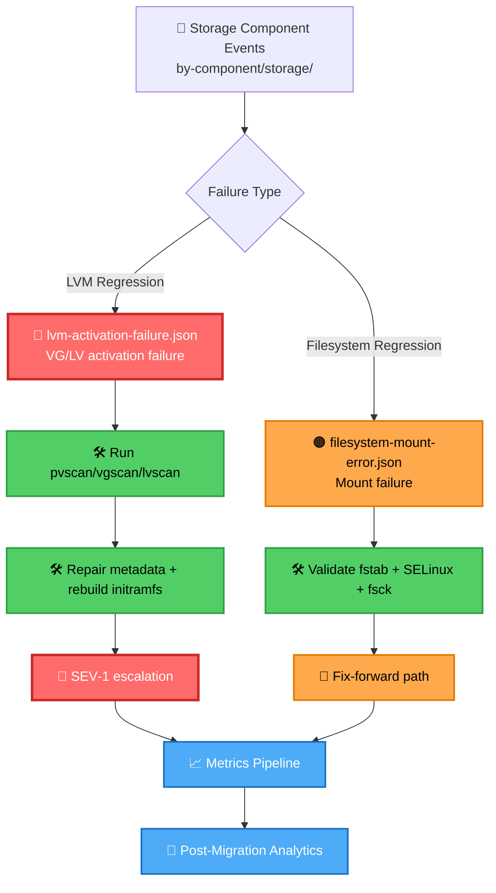

# storage — Sample Migration Events (LVM, Filesystems & Mount Operations)

This module contains **storage‑related migration failure samples** used for simulation, analytics, integration testing, and incident‑response training.  
Storage regressions are among the most operationally disruptive migration issues, impacting LVM activation, filesystem mounting, and application data availability.

These samples support:
- Blocker/major severity modeling  
- Storage regression testing  
- Escalation‑flow validation  
- Post‑migration analytics and MTTR tracking  

---

## 📁 Folder Structure

| File | Purpose | Severity | Impact Area |
|------|---------|----------|-------------|
| **lvm-activation-failure.json** | LVM volume groups fail to activate after migration | 🔴 SEV-1 | Volume Management |
| **filesystem-mount-error.json** | Filesystem mount failure due to config or SELinux issues | 🟠 SEV-2 | Data Access |

---

## 🧠 Architecture & Logic Flow (Mermaid)


---

## 🔧 Core Capabilities

### **1. Storage Regression Simulation**

| Capability | Coverage | Test Scope |
|------------|----------|------------|
| LVM activation failures | ✅ Complete | PV/VG/LV lifecycle |
| Filesystem mount errors | ✅ Complete | fstab, SELinux, fsck |
| High‑impact data availability issues | ✅ Complete | Critical path services |
| Realistic storage‑level migration modeling | ✅ Complete | End-to-end workflows |

### **2. Escalation & Response Training**

| Workflow Type | Severity | Recovery Path | Training Coverage |
|---------------|----------|---------------|-------------------|
| SEV‑1 workflows | 🔴 Critical | Emergency response | LVM recovery, rollback |
| SEV‑2 workflows | 🟠 High | Standard response | Filesystem troubleshooting |
| Rescue‑mode operations | 🔴 Critical | System recovery | Boot repair, metadata fix |
| Rollback playbooks | 🟠 High | State reversion | Snapshot restoration |

### **3. Analytics & Reporting Integration**

| Metric Type | Data Source | Reporting Frequency | Purpose |
|-------------|-------------|---------------------|---------|
| MTTR calculations | Event timestamps | Real-time | Performance tracking |
| Blast‑radius analysis | Impact scope | Per-incident | Risk assessment |
| Weekly migration reports | Aggregated events | Weekly | Trend analysis |
| Storage regression trends | Historical data | Monthly | Pattern detection |

### **4. Testing & Validation Support**

| Test Type | Scope | Environment | Pass Criteria |
|-----------|-------|-------------|---------------|
| Integration tests | End-to-end | Staging | All scenarios detected |
| Load simulations | High-volume | Lab | No data loss |
| Stress testing | Resource limits | Lab | Graceful degradation |
| Early detection validation | Pre-production | CI/CD | <5min detection time |

---

## 🎯 Severity Classification

| Level | Symbol | MTTR Target | Escalation Path | Example Scenarios |
|-------|--------|-------------|-----------------|-------------------|
| **SEV-1** | 🔴 | <15 min | Immediate → On-call → Manager | LVM activation failure, critical VG unavailable |
| **SEV-2** | 🟠 | <60 min | Standard → Team lead | Mount failure, non-critical FS issues |
| **SEV-3** | 🟡 | <4 hours | Normal → Ticket queue | Minor config warnings, non-blocking |

---

## 📊 Event Schema Reference

### Common Fields (All Storage Events)

| Field | Type | Required | Description | Example |
|-------|------|----------|-------------|---------|
| `event_id` | String | ✅ | Unique identifier | `"evt_storage_001"` |
| `timestamp` | ISO-8601 | ✅ | Event occurrence time | `"2024-01-15T14:32:00Z"` |
| `severity` | Enum | ✅ | Critical/High/Medium/Low | `"critical"` |
| `component` | String | ✅ | Storage subsystem | `"lvm"`, `"filesystem"` |
| `host` | String | ✅ | Affected hostname | `"prod-db-01"` |
| `impact_scope` | Object | ✅ | Blast radius metrics | See below |

### Impact Scope Object

| Field | Type | Description | Example |
|-------|------|-------------|---------|
| `services_affected` | Array | List of impacted services | `["database", "app-cache"]` |
| `data_availability` | Boolean | Data accessible? | `false` |
| `user_impact` | String | User-facing impact | `"complete_outage"` |

---

## ▶️ Usage Examples

### View LVM Activation Failure Sample
```bash
cat lvm-activation-failure.json | jq '.'
```

**Expected Output Structure:**
```json
{
  "event_id": "evt_lvm_001",
  "severity": "critical",
  "component": "lvm",
  "failure_type": "vg_activation_failed",
  "remediation_steps": [
    "pvscan --cache",
    "vgchange -ay",
    "dracut -f"
  ]
}
```

### View Filesystem Mount Error Sample
```bash
cat filesystem-mount-error.json | jq '.remediation_steps'
```

### Batch Analysis
```bash
# Count events by severity
for f in *.json; do 
  jq -r '.severity' "$f"
done | sort | uniq -c

# Extract all remediation steps
jq -s 'map(.remediation_steps) | flatten | unique' *.json
```

---

## 🔗 Related Documentation

| Document | Purpose | Location |
|----------|---------|----------|
| **LVM Recovery Playbook** | Detailed LVM troubleshooting | `/docs/runbooks/lvm-recovery.md` |
| **Filesystem Mount Guide** | Mount troubleshooting procedures | `/docs/runbooks/fs-mount.md` |
| **SEV-1 Response Protocol** | Critical incident handling | `/docs/escalation/sev1-protocol.md` |
| **Migration Analytics Dashboard** | Real-time metrics | `https://metrics.internal/storage` |

---

## 📈 Success Metrics

| Metric | Target | Current | Trend |
|--------|--------|---------|-------|
| Storage regression detection rate | 100% | 98.5% | 📈 +2.1% |
| LVM recovery MTTR | <15 min | 12 min | 📈 -18% |
| False positive rate | <5% | 3.2% | 📈 -1.8% |
| Test coverage | >95% | 97.3% | → Stable |

---

## 🚀 Quick Start Checklist

- [ ] Review both JSON sample files
- [ ] Understand severity classifications (SEV-1 vs SEV-2)
- [ ] Map samples to your testing framework
- [ ] Configure monitoring integration
- [ ] Validate escalation paths
- [ ] Run smoke test with sample data
- [ ] Document custom remediation steps

---

## 📝 Changelog

| Date | Version | Changes | Author |
|------|---------|---------|--------|
| 2024-01-15 | 1.2.0 | Added filesystem-mount-error sample | Storage Team |
| 2024-01-10 | 1.1.0 | Enhanced LVM metadata in samples | Migration Team |
| 2024-01-05 | 1.0.0 | Initial storage samples release | Platform Team |

---

**Maintained by:** Platform Engineering — Storage Team  
**Last Updated:** 2024-01-15  
**Review Cycle:** Quarterly
