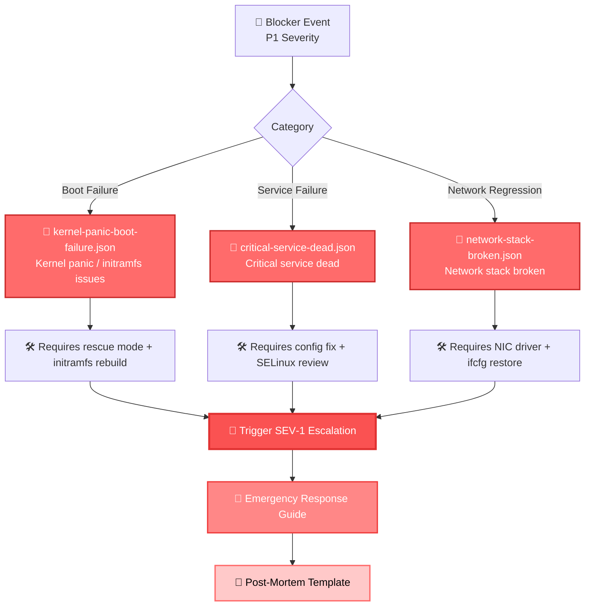

# 🚨 blocker — P1 Severity Sample Migration Events (Production‑Down Scenarios)

This module provides **blocker‑severity (P1)** sample migration events used for testing, analytics, simulation, and incident‑response training.  
Blocker events represent **full production outages**, **critical service failures**, or **network stack collapses** that require immediate escalation and emergency response.

These samples are used across:
- Integration tests  
- Load tests  
- Escalation‑flow validation  
- Post‑mortem templates  
- Migration analytics pipelines  

---

## 📁 Folder Structure

| File | Purpose | Failure Type | Recovery Method |
|------|---------|--------------|-----------------|
| **kernel-panic-boot-failure.json** | Kernel panic during post‑migration boot | 🔴 Boot Failure | Rescue mode + initramfs rebuild |
| **critical-service-dead.json** | Critical production service fails to start | 🔴 Service Failure | Config fix + SELinux review |
| **network-stack-broken.json** | Network stack non‑functional after migration | 🔴 Network Regression | NIC driver + ifcfg restore |

---

## 🧠 Architecture & Logic Flow


---

## 🔧 Core Capabilities

| Capability | Description | Use Cases |
|------------|-------------|-----------|
| **🎯 Realistic P1 Failure Simulation** | Kernel panic, service failures, network collapses | Training, automated testing, chaos engineering |
| **📊 Severity‑Driven Response Modeling** | SEV‑1 escalation flow testing | Emergency response validation, runbook testing |
| **📈 Analytics & Metrics Integration** | Blast‑radius estimation, MTTR calculations | Weekly reports, trend analysis, capacity planning |
| **🔄 Canary & Rollback Testing** | Rollback logic validation under failure | Deployment safety, progressive rollout validation |

---

## 🔍 Event Categories & Response Matrix

| Category | Severity | MTTR Target | Escalation Path | Recovery Complexity |
|----------|----------|-------------|-----------------|---------------------|
| 🔴 **Boot Failure** | P1 - Blocker | < 30 min | Immediate → On-call SRE → Kernel Team | ⚠️⚠️⚠️ High |
| 🔴 **Service Failure** | P1 - Blocker | < 15 min | Immediate → On-call SRE → Service Owner | ⚠️⚠️ Medium |
| 🔴 **Network Regression** | P1 - Blocker | < 20 min | Immediate → On-call SRE → Network Team | ⚠️⚠️⚠️ High |

---

## 🎯 Testing Scenarios

| Scenario | Test Files Used | Expected Outcome | Validation Criteria |
|----------|----------------|------------------|---------------------|
| **Kernel Panic Recovery** | `kernel-panic-boot-failure.json` | Automatic rollback triggered | ✅ System boots into previous kernel |
| **Service Restart Loop** | `critical-service-dead.json` | Alert fired + manual intervention | ✅ SEV-1 ticket created within 2 min |
| **Network Isolation** | `network-stack-broken.json` | Connection monitoring detects failure | ✅ Rollback initiated within 5 min |
| **Multi-Failure Cascade** | All 3 files | Emergency response activated | ✅ Incident commander assigned |

---

## ▶️ Usage Examples

### View Sample Events
```bash
# View kernel panic event
cat kernel-panic-boot-failure.json | jq '.'

# View critical service failure
cat critical-service-dead.json | jq '.error_details'

# View network stack failure
cat network-stack-broken.json | jq '.network_diagnostics'
```

### Test Integration
```bash
# Load blocker events into test pipeline
for event in *.json; do
  echo "Testing: $event"
  ./test-migration-handler.sh --event "$event" --severity P1
done

# Validate escalation flow
./validate-escalation.sh --input blocker/*.json --check-sev1-trigger
```

---

## 📊 Severity Color Coding

| Priority | Color | Symbol | Description |
|----------|-------|--------|-------------|
| **P1 - Blocker** | 🔴 Red | 🚨 | Production down, immediate action required |
| **P2 - Critical** | 🟠 Orange | ⚠️ | Major functionality impaired |
| **P3 - Major** | 🟡 Yellow | ⚡ | Significant impact, workaround available |
| **P4 - Minor** | 🟢 Green | ℹ️ | Low impact, can be scheduled |

---

## 🔗 Related Resources

| Resource | Location | Purpose |
|----------|----------|---------|
| **Emergency Response Guide** | `docs/emergency-response.md` | SEV-1 incident handling procedures |
| **Post-Mortem Template** | `templates/post-mortem.md` | Incident analysis documentation |
| **Escalation Matrix** | `config/escalation-matrix.yaml` | On-call routing configuration |
| **Rollback Playbook** | `docs/rollback-procedures.md` | Step-by-step recovery instructions |

---

## 📞 Emergency Contacts

| Role | Contact | Escalation Time |
|------|---------|-----------------|
| **Primary On-Call SRE** | Slack: `#sre-oncall` | Immediate |
| **Kernel Team Lead** | Email: `kernel-team@company.com` | < 5 minutes |
| **Network Operations** | Phone: `+1-555-NET-OPS` | < 3 minutes |
| **Incident Commander** | Slack: `#incident-command` | Immediate |

---

## 🎓 Training Materials

This module includes training scenarios for:
- New SRE onboarding
- Quarterly disaster recovery drills
- Migration team certification
- Incident response simulations

**Last Updated:** 2025-01-02  
**Maintained By:** Site Reliability Engineering Team
