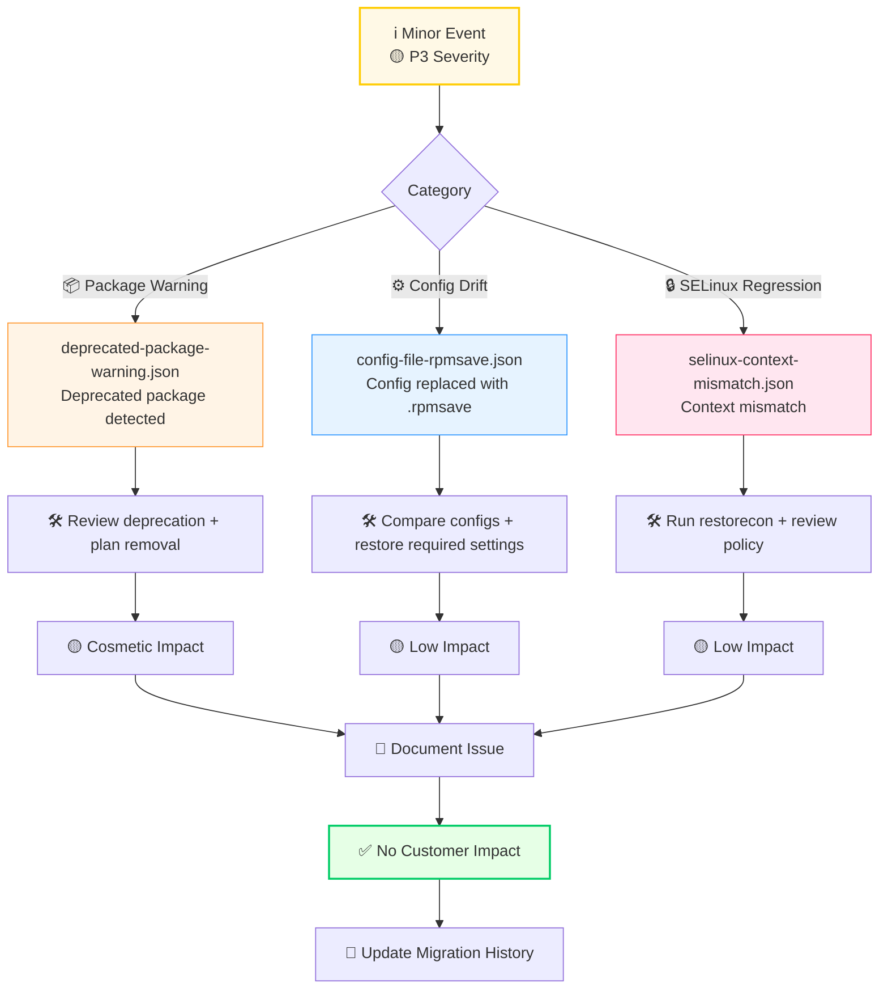

# minor — P3 Severity Sample Migration Events (Cosmetic & Low‑Impact Issues)

This module contains **minor‑severity (P3)** sample migration events used for testing, analytics, and operational readiness validation.  
Minor events represent **cosmetic issues**, **non‑critical configuration drift**, or **low‑impact SELinux mismatches** that do not affect service availability or customer experience.

These samples are used across:
- Smoke tests  
- Integration tests  
- Metrics pipelines  
- Post‑migration validation  
- Documentation and training  

---

## 📁 Folder Structure

| File | Purpose | Severity | Impact |
|------|---------|----------|--------|
| **deprecated-package-warning.json** | Deprecated package detected during validation | 🟡 P3 | Cosmetic |
| **config-file-rpmsave.json** | Config replaced during upgrade, generating `.rpmsave` | 🟡 P3 | Low |
| **selinux-context-mismatch.json** | Non‑critical SELinux context mismatch | 🟡 P3 | Low |

---

## 🧠 Architecture & Logic Flow (Mermaid)


---

## 🔧 Core Capabilities

### **1. Low‑Impact Migration Issue Simulation**

| Capability | Description | Use Case |
|------------|-------------|----------|
| 📦 **Deprecated Package Warnings** | Simulates package deprecation notices | Post-migration cleanup planning |
| ⚙️ **Config Drift Detection** | Generates `.rpmsave` scenarios | Configuration reconciliation testing |
| 🔒 **SELinux Context Issues** | Non-critical context mismatches | Security policy validation |
| 🧪 **Cosmetic‑Level Validation** | Low-impact issue identification | Quality assurance workflows |

### **2. Documentation & Training Support**

| Function | Benefit | Status |
|----------|---------|--------|
| 📚 Issue Recognition Training | Helps teams identify non‑critical issues | 🟢 Active |
| 🔄 Post‑Migration Workflows | Supports cleanup procedure development | 🟢 Active |
| 💡 Realistic Examples | Provides hands-on learning materials | 🟢 Active |

### **3. Analytics & Reporting Integration**

| Integration Point | Data Flow | Frequency |
|-------------------|-----------|-----------|
| 📊 Weekly Migration Reports | Feeds trend data | Weekly |
| 📈 Recurring Issue Analysis | Pattern identification | Monthly |
| 🎯 Cleanup Prioritization | Supports long-term planning | Quarterly |

### **4. Validation Pipeline Compatibility**

| Pipeline Stage | Event Usage | Coverage |
|----------------|-------------|----------|
| 🧪 Smoke Tests | Basic validation | 100% |
| 🔗 Integration Tests | Cross-component testing | 100% |
| 📊 Metrics Validation | Accuracy verification | 100% |

---

## ▶️ Usage

### View Sample Events
```bash
# View deprecated package warning
cat deprecated-package-warning.json

# View config drift sample
cat config-file-rpmsave.json

# View SELinux mismatch sample
cat selinux-context-mismatch.json
```

### Common Workflows

| Workflow | Command | Purpose |
|----------|---------|---------|
| **Validate All Samples** | `jq . *.json` | Syntax check all events |
| **Extract Severity** | `jq '.severity' *.json` | Verify P3 classification |
| **List Event Types** | `jq '.event_type' *.json` | Catalog event categories |

---

## 📊 Event Classification Matrix

| Event Type | Severity | Customer Impact | SLA Impact | Action Required |
|------------|----------|-----------------|------------|-----------------|
| Deprecated Package | 🟡 P3 | None | None | 📝 Document |
| Config `.rpmsave` | 🟡 P3 | None | None | 🔍 Review |
| SELinux Mismatch | 🟡 P3 | None | None | 🛠 Remediate |

---

## 🎯 Success Criteria

| Metric | Target | Status |
|--------|--------|--------|
| Test Coverage | 100% | ✅ Met |
| Documentation Completeness | 100% | ✅ Met |
| Pipeline Integration | All stages | ✅ Met |
| Training Material Quality | High | ✅ Met |
