# testing — RHEL8 Migration Automated Validation Framework

A capability‑centric automated testing suite that validates **correctness**, **stability**, **scalability**, and **operational readiness** of the RHEL7 → RHEL8 migration program.  
This framework ensures that every migration workflow — from smoke tests to integration tests to load tests — behaves predictably before production rollout.

---

## 📁 Folder Architecture

| Folder | Purpose | Test Type | Execution Time |
|--------|---------|-----------|----------------|
| **smoke-tests/** | Fast, high‑signal validation immediately after migration | 🔥 **Critical** | < 5 min |
| **integration-tests/** | End‑to‑end validation of automation workflows | 🔗 **Comprehensive** | 10-30 min |
| **load-tests/** | Scale and stress testing of migration + rollback | 📈 **Performance** | 30+ min |

---

## 🧠 Architecture & Logic Flow

```mermaid
flowchart TD

    A[🧪 testing/<br/>Automated Validation Framework]
    
    A --> B[🔥 smoke-tests/<br/>Rapid post-migration checks]
    A --> C[🔗 integration-tests/<br/>Workflow correctness validation]
    A --> D[📈 load-tests/<br/>Scale & stress validation]

    %% Smoke Tests - Red theme
    B --> B1[post-migration-smoke-test.sh<br/>✓ System health]
    B --> B2[service-health-check.sh<br/>✓ Critical services]
    B --> B3[network-connectivity-test.sh<br/>✓ Network stack]
    B --> B4[package-integrity-check.sh<br/>✓ RPM integrity]

    %% Integration Tests - Blue theme
    C --> C1[test-leapp-wrapper.sh<br/>✓ LEAPP automation]
    C --> C2[test-rollback-procedure.sh<br/>✓ Rollback workflow]
    C --> C3[test-escalation-flow.sh<br/>✓ PagerDuty/Slack]
    C --> C4[test-canary-deployment.sh<br/>✓ Canary logic]
    C --> C5[test-metrics-collection.py<br/>✓ Metrics pipeline]

    %% Load Tests - Green theme
    D --> D1[simulate-migration-load.py<br/>✓ Migration at scale]
    D --> D2[stress-test-rollback.sh<br/>✓ Rollback under load]

    %% Styling
    style A fill:#6366f1,stroke:#4f46e5,color:#fff
    style B fill:#ef4444,stroke:#dc2626,color:#fff
    style C fill:#3b82f6,stroke:#2563eb,color:#fff
    style D fill:#10b981,stroke:#059669,color:#fff
    
    style B1 fill:#fca5a5,stroke:#dc2626,color:#000
    style B2 fill:#fca5a5,stroke:#dc2626,color:#000
    style B3 fill:#fca5a5,stroke:#dc2626,color:#000
    style B4 fill:#fca5a5,stroke:#dc2626,color:#000
    
    style C1 fill:#93c5fd,stroke:#2563eb,color:#000
    style C2 fill:#93c5fd,stroke:#2563eb,color:#000
    style C3 fill:#93c5fd,stroke:#2563eb,color:#000
    style C4 fill:#93c5fd,stroke:#2563eb,color:#000
    style C5 fill:#93c5fd,stroke:#2563eb,color:#000
    
    style D1 fill:#6ee7b7,stroke:#059669,color:#000
    style D2 fill:#6ee7b7,stroke:#059669,color:#000

    %% Final Output
    B --> E[📊 Validation Signals]
    C --> E
    D --> E

    E --> F[✅ Migration Framework Verified]
    
    style E fill:#fbbf24,stroke:#f59e0b,color:#000
    style F fill:#34d399,stroke:#10b981,color:#000
```


---

## 🔧 Core Capabilities

| Category | Capability | Key Outcomes |
|----------|-----------|--------------|
| 🔥 **Smoke Testing** | Fast Validation | • System health confirmation<br>• Service availability check<br>• Network stack validation<br>• Package integrity verification<br>• Rapid go/no‑go signals |
| 🔗 **Integration Testing** | Workflow Validation | • LEAPP automation correctness<br>• Rollback reliability assurance<br>• Escalation integration (PagerDuty/Slack)<br>• Canary deployment logic<br>• Metrics pipeline integrity |
| 📈 **Load Testing** | Scale & Stress | • Large‑scale migration simulation<br>• Rollback concurrency testing<br>• Bottleneck identification<br>• Scalability limit discovery |

---

## 📊 Test Coverage Matrix

| Test Suite | Coverage Areas | Pass Criteria | Priority |
|------------|----------------|---------------|----------|
| **Smoke Tests** | System health, services, networking, packages | All checks pass | 🔴 **P0** |
| **Integration Tests** | LEAPP, rollback, escalation, canary, metrics | Workflows complete successfully | 🟡 **P1** |
| **Load Tests** | Scale simulation, stress conditions | No failures under target load | 🟢 **P2** |

---

## ▶️ Usage

### Quick Start Commands

| Test Type | Command | Example |
|-----------|---------|---------|
| **Smoke Tests** | `cd smoke-tests/`<br>`./post-migration-smoke-test.sh` | Validates immediately after migration |
| **Integration Tests** | `cd integration-tests/`<br>`./test-leapp-wrapper.sh <host>` | `./test-leapp-wrapper.sh prod-web-01` |
| **Load Tests** | `cd load-tests/`<br>`python3 simulate-migration-load.py <hosts> <count>` | `python3 simulate-migration-load.py hosts.txt 50` |

### Full Test Suite Execution
```bash
# Run all tests in sequence
./smoke-tests/post-migration-smoke-test.sh && \
./integration-tests/test-leapp-wrapper.sh $(hostname) && \
python3 ./load-tests/simulate-migration-load.py hosts.txt 10
```

---

## 🎯 Success Metrics

| Metric | Target | Measurement |
|--------|--------|-------------|
| **Smoke Test Duration** | < 5 minutes | Time to complete all smoke checks |
| **Integration Test Pass Rate** | 100% | Workflows completing without errors |
| **Load Test Throughput** | 50+ concurrent migrations | Successful migrations per hour |
| **Rollback Success Rate** | 100% | Clean rollbacks under stress |

---

## 🚨 Failure Handling

| Failure Type | Action | Escalation |
|--------------|--------|------------|
| **Smoke Test Failure** | 🛑 Block migration | Immediate alert |
| **Integration Test Failure** | ⚠️ Review required | Team notification |
| **Load Test Degradation** | 📊 Analyze bottlenecks | Performance review |

---

## 📝 Test Reports

All test results are logged with timestamps and exit codes:
```
✅ PASS: System health check (2.3s)
✅ PASS: Service availability (1.8s)
❌ FAIL: Network connectivity (timeout after 30s)
```

Reports are stored in `./test-results/<timestamp>/` with full debugging context.
