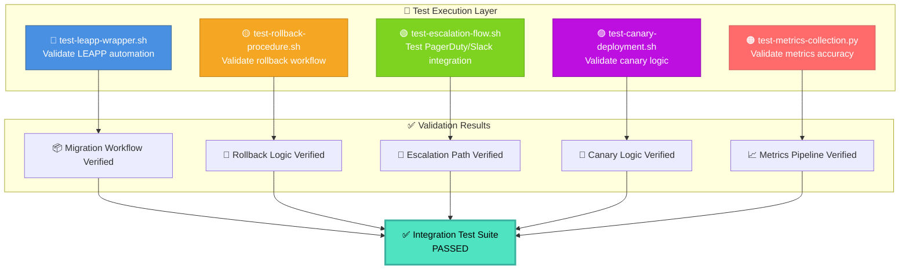

# integration-tests — RHEL8 Migration End‑to‑End Validation Suite

A capability‑centric automated testing module that validates the **core operational workflows** of the RHEL7 → RHEL8 migration program.  
These tests ensure that migration automation, rollback logic, escalation integrations, canary deployment, and metrics collection behave **exactly as expected** before production rollout.

---

## 📁 Folder Structure

| File | Purpose | Status |
|------|---------|:------:|
| **test-leapp-wrapper.sh** | Tests LEAPP automation wrapper end‑to‑end | 🔵 Core |
| **test-rollback-procedure.sh** | Validates rollback automation workflow | 🟡 Critical |
| **test-escalation-flow.sh** | Tests PagerDuty/Slack escalation integration | 🟢 Integration |
| **test-canary-deployment.sh** | Validates canary selection logic | 🟣 Deployment |
| **test-metrics-collection.py** | Ensures metrics files are generated correctly | 🟠 Observability |

**Legend:**  
🔵 Core Migration • 🟡 Safety Critical • 🟢 External Integration • 🟣 Rollout Strategy • 🟠 Monitoring

---

## 🧠 Architecture & Logic Flow


---

## 🔧 Core Capabilities

| Capability | Test Coverage | Risk Level | Dependencies |
|------------|---------------|:----------:|--------------|
| **🔵 LEAPP Wrapper Validation** | Preupgrade + Upgrade execution | 🔴 High | LEAPP, System State |
| **🟡 Rollback Workflow Testing** | Snapshot validation + Restore | 🔴 High | LVM, Bootloader |
| **🟢 Escalation Flow Verification** | Alert routing + Delivery | 🟠 Medium | PagerDuty API, Slack Webhooks |
| **🟣 Canary Deployment Logic** | Host selection determinism | 🟡 Medium | Inventory files |
| **🟠 Metrics Pipeline Validation** | Data format + Completeness | 🟢 Low | File system, JSON schemas |

---

## 📊 Test Coverage Matrix

### **1. 🔵 LEAPP Wrapper Validation**
```
✓ Preupgrade command execution
✓ Upgrade command execution  
✓ Wrapper exit code handling
✓ Log file generation
✓ Error state detection
```

### **2. 🟡 Rollback Workflow Testing**
```
✓ Snapshot existence check
✓ Rollback command execution
✓ System boot verification
✓ Health check post-rollback
✓ State consistency validation
```

### **3. 🟢 Escalation Flow Verification**
```
✓ PagerDuty incident creation
✓ Slack message delivery
✓ Severity level mapping
✓ Retry logic for failures
✓ Integration credential validation
```

### **4. 🟣 Canary Deployment Logic Testing**
```
✓ 10-host wave selection
✓ 100-host wave selection
✓ Deterministic host ordering
✓ No duplicate selection
✓ Inventory parsing accuracy
```

### **5. 🟠 Metrics Pipeline Validation**
```
✓ Required metric files exist
✓ JSON schema compliance
✓ Dashboard data ingestion
✓ Weekly aggregation logic
✓ Timestamp accuracy
```

---

## ▶️ Usage

### Quick Test Execution

| Test Type | Command | Expected Duration |
|-----------|---------|:-----------------:|
| **LEAPP Wrapper** | `./test-leapp-wrapper.sh <host>` | ~5 min |
| **Rollback Procedure** | `./test-rollback-procedure.sh <host>` | ~10 min |
| **Escalation Flow** | `./test-escalation-flow.sh` | ~30 sec |
| **Canary Deployment** | `./test-canary-deployment.sh hosts.txt` | ~15 sec |
| **Metrics Validation** | `python3 test-metrics-collection.py` | ~10 sec |

### Full Suite Execution
```bash
# Run all integration tests in sequence
for test in test-*.sh; do
    echo "▶️  Running: $test"
    ./$test || echo "❌ FAILED: $test"
done

python3 test-metrics-collection.py
```

---

## 🎯 Success Criteria

| Test | Pass Condition | Failure Impact |
|------|----------------|----------------|
| **LEAPP Wrapper** | Exit code 0, logs generated | 🔴 Block migration |
| **Rollback** | System boots to RHEL7 | 🔴 Block migration |
| **Escalation** | Alerts delivered < 60s | 🟡 Manual escalation required |
| **Canary** | Correct host count selected | 🟠 Rollout delay |
| **Metrics** | All JSON files valid | 🟢 Monitoring gap only |

---

## 🚨 Troubleshooting

| Error Pattern | Root Cause | Resolution |
|---------------|------------|------------|
| `LEAPP wrapper timeout` | Slow disk I/O | Check `/var/log/leapp` for bottlenecks |
| `Rollback boot failure` | Corrupted bootloader | Verify GRUB config before test |
| `PagerDuty 401 error` | Invalid API key | Regenerate key in PagerDuty console |
| `Canary host mismatch` | Inventory file stale | Re-sync `hosts.txt` from source |
| `Metrics schema error` | Format change | Update `test-metrics-collection.py` |

---

## 📈 Reporting

All test results are logged to:
```
/var/log/rhel8-migration/integration-tests/
├── leapp-wrapper-<timestamp>.log
├── rollback-<timestamp>.log
├── escalation-<timestamp>.log
├── canary-<timestamp>.log
└── metrics-<timestamp>.log
```

Generate summary report:
```bash
python3 generate-test-report.py /var/log/rhel8-migration/integration-tests/
```

---

## 🔐 Pre-Flight Checklist

- [ ] Test environment isolated from production
- [ ] PagerDuty/Slack test channels configured
- [ ] Snapshot storage has adequate space
- [ ] Test hosts have fresh RHEL7 baseline
- [ ] All API keys/webhooks validated
- [ ] Network connectivity to external services verified

---

## 📚 Related Documentation

- [Migration Runbook](../docs/runbook.md)
- [Rollback Procedures](../docs/rollback.md)
- [Monitoring Setup](../docs/monitoring.md)
- [Incident Response](../docs/incident-response.md)
