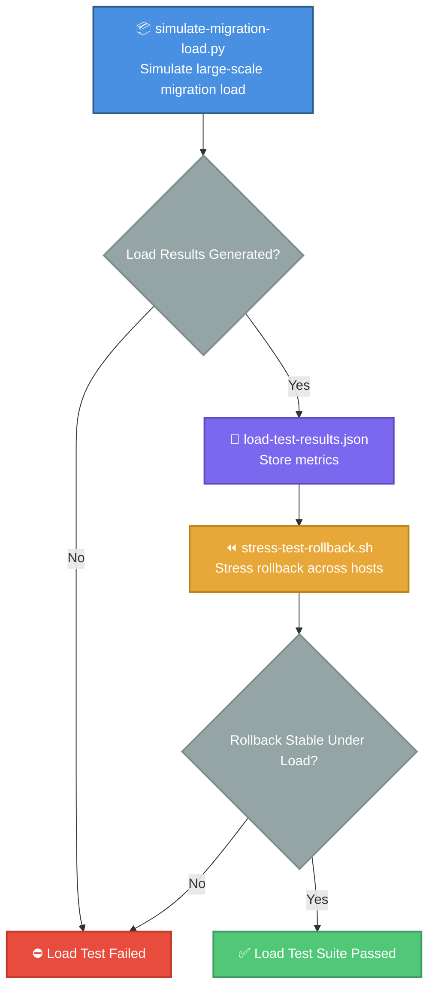

# load-tests — RHEL8 Migration Scale & Stress Validation Engine

A capability‑centric load‑testing module that validates **scalability**, **resilience**, and **rollback stability** under high‑volume migration scenarios.  
These tests ensure that the RHEL8 migration framework behaves predictably when subjected to **large host counts**, **high concurrency**, and **stressful rollback conditions**.

---

## 📁 Folder Structure

| File | Type | Purpose |
|------|------|---------|
| **simulate-migration-load.py** | 🐍 Python | Simulates large‑scale migration load across many hosts |
| **stress-test-rollback.sh** | 🔧 Bash | Stress‑tests rollback workflow under heavy load |

---

## 🧠 Architecture & Logic Flow


---

## 🔧 Core Capabilities

| Capability | Component | Description | Key Metrics |
|------------|-----------|-------------|-------------|
| **Large‑Scale Migration Simulation** | `simulate-migration-load.py` | Generates synthetic migration events across many hosts | • Concurrency levels<br/>• Duration per host<br/>• Success/failure rates<br/>• Resource utilization |
| **Rollback Stress Testing** | `stress-test-rollback.sh` | Executes rollback workflow repeatedly across multiple hosts | • Rollback completion time<br/>• Failure detection<br/>• Concurrency bottlenecks<br/>• Peak load stability |

### **Detailed Capabilities Breakdown**

#### 🎯 Migration Load Simulation
- ✅ Generates synthetic migration events across many hosts  
- ✅ Supports configurable concurrency levels  
- ✅ Produces duration and success/failure metrics  
- ✅ Enables performance modeling and capacity planning  
- ✅ JSON-formatted results for downstream analysis

#### ⏪ Rollback Stress Testing
- ✅ Executes rollback workflow repeatedly across multiple hosts  
- ✅ Identifies rollback bottlenecks under pressure  
- ✅ Surfaces concurrency‑related failures  
- ✅ Ensures rollback reliability during peak load  
- ✅ Validates graceful degradation patterns

---

## ▶️ Usage

### Quick Start Commands

| Action | Command | Parameters |
|--------|---------|------------|
| **Simulate Migration Load** | `python3 simulate-migration-load.py hosts.txt 50` | `hosts.txt`: Host inventory<br/>`50`: Concurrency level |
| **Run Rollback Stress Test** | `./stress-test-rollback.sh hosts.txt` | `hosts.txt`: Host inventory |

### Example Workflows
```bash
# 1️⃣ Run migration load test with 100 concurrent operations
python3 simulate-migration-load.py production-hosts.txt 100

# 2️⃣ Analyze load test results
cat load-test-results.json | jq '.summary'

# 3️⃣ Execute rollback stress test
./stress-test-rollback.sh production-hosts.txt

# 4️⃣ Validate rollback metrics
grep "SUCCESS\|FAILED" rollback-stress-results.log | sort | uniq -c
```

---

## 📊 Output & Metrics

### Load Test Results (`load-test-results.json`)
```json
{
  "test_run_id": "load-2025-01-02-143052",
  "total_hosts": 500,
  "concurrency": 50,
  "summary": {
    "successful_migrations": 487,
    "failed_migrations": 13,
    "avg_duration_seconds": 42.3,
    "p95_duration_seconds": 68.1,
    "p99_duration_seconds": 89.4
  }
}
```

### Result Interpretation

| Metric | Threshold | Status |
|--------|-----------|--------|
| Success Rate | ≥ 95% | 🟢 Pass / 🔴 Fail |
| Avg Duration | ≤ 60s | 🟢 Pass / 🟡 Warning / 🔴 Fail |
| P99 Duration | ≤ 120s | 🟢 Pass / 🟡 Warning / 🔴 Fail |

---

## 🔍 Troubleshooting

| Issue | Possible Cause | Solution |
|-------|---------------|----------|
| High failure rate (>10%) | Resource exhaustion | • Reduce concurrency<br/>• Check system resources<br/>• Review host connectivity |
| Slow migration times | Network latency / disk I/O | • Verify network bandwidth<br/>• Check disk performance<br/>• Review migration payload size |
| Rollback stress failures | Race conditions / locking issues | • Enable debug logging<br/>• Check lock file states<br/>• Review rollback transaction isolation |

---

## 🎯 Best Practices

1. **Start Small**: Begin with low concurrency (10-20) and gradually increase
2. **Monitor Resources**: Watch CPU, memory, and network during tests
3. **Baseline First**: Establish baseline metrics before stress testing
4. **Iterative Testing**: Run multiple iterations to identify intermittent issues
5. **Document Findings**: Capture thresholds and failure patterns for future reference
