# 🚨 Incident Response — Capacity Management  
**cloud-automation/capacity-management/incident-response/**


A unified, capability‑centric incident‑response layer designed to detect, escalate, and resolve failures across cloud and hybrid environments.  
This module integrates **automated escalation**, **migration‑aware detection**, and **recovery workflows** into a single operational surface.

---

## 🔗 Quick Navigation

<table>
<thead>
<tr>
<th>🎯 Area</th>
<th>📂 Module</th>
<th>📝 Description</th>
</tr>
</thead>
<tbody>
<tr style="background-color: #ffebee;">
<td><strong>🟥 Escalation</strong></td>
<td><a href="escalation-handlers/"><code>escalation-handlers/</code></a></td>
<td>Automated alert routing via Slack, PagerDuty, OpsGenie with policy-driven escalation</td>
</tr>
<tr style="background-color: #e3f2fd;">
<td><strong>🟦 Migration IR</strong></td>
<td><a href="rhel8-migration/"><code>rhel8-migration/</code></a></td>
<td>RHEL8 migration incident detection, rollback automation, and analytics framework</td>
</tr>
</tbody>
</table>

---

## 📁 Module Structure

<table>
<thead>
<tr>
<th width="25%">📦 Component</th>
<th width="45%">🎯 Capabilities</th>
<th width="30%">🔗 Integration Points</th>
</tr>
</thead>
<tbody>
<tr>
<td><strong><a href="escalation-handlers/">escalation-handlers/</a></strong></td>
<td>
- Multi-channel alerting<br/>
- Severity-based routing<br/>
- Auto-escalation workflows<br/>
- Policy engine integration
</td>
<td>
✅ Slack API<br/>
✅ PagerDuty<br/>
✅ OpsGenie<br/>
✅ Custom webhooks
</td>
</tr>
<tr>
<td><strong><a href="rhel8-migration/">rhel8-migration/</a></strong></td>
<td>
- Boot/kernel failure detection<br/>
- Network regression checks<br/>
- Service degradation analysis<br/>
- Automated rollback triggers
</td>
<td>
✅ System logs<br/>
✅ Metrics pipelines<br/>
✅ Ansible Tower<br/>
✅ Change management
</td>
</tr>
</tbody>
</table>

---

## 🧠 Architecture & Logic Flow

```mermaid
flowchart TD
    A[🚨 Incident Response Layer<br/>incident-response/] --> B{Subsystem}
    
    %% Escalation Handlers Branch
    B -->|Escalation| C[[🟥 escalation-handlers/]]
    C --> C1[📞 Multi-Channel Alerts]
    C1 --> C2[Slack Notifications]
    C1 --> C3[PagerDuty Incidents]
    C1 --> C4[OpsGenie Alerts]
    C2 --> C5[⚡ Auto-Escalation Engine]
    C3 --> C5
    C4 --> C5
    C5 --> C6{Severity Check}
    C6 -->|P1 Critical| C7[🔴 Immediate Escalation]
    C6 -->|P2 High| C8[🟡 15min Escalation]
    C6 -->|P3 Medium| C9[🟢 60min Escalation]
    
    %% RHEL8 Migration Branch
    B -->|Migration IR| D[[🟦 rhel8-migration/]]
    D --> D1[🔍 Detection Layer]
    D1 --> D2[Boot Failures]
    D1 --> D3[Network Issues]
    D1 --> D4[Service Degradation]
    D1 --> D5[Package Conflicts]
    
    D2 --> D6[🎯 Severity Classifier]
    D3 --> D6
    D4 --> D6
    D5 --> D6
    
    D6 --> D7{Impact Assessment}
    D7 -->|BLOCKER| D8[🔴 P1 - Full Rollback]
    D7 -->|MAJOR| D9[🟡 P2 - Targeted Fix]
    D7 -->|MINOR| D10[🟢 P3 - Log & Monitor]
    
    D8 --> C
    D9 --> C
    D10 --> C
    
    %% Analytics Pipeline
    C7 --> E[📊 Telemetry Collection]
    C8 --> E
    C9 --> E
    D8 --> E
    D9 --> E
    D10 --> E
    
    E --> F[📈 Metrics Dashboard]
    F --> F1[MTTR Analysis]
    F --> F2[Blast Radius Tracking]
    F --> F3[Success Rate Metrics]
    
    F1 --> G[📚 Post-Incident Analytics]
    F2 --> G
    F3 --> G
    
    G --> H[🔄 Continuous Improvement]
    H --> H1[Runbook Updates]
    H --> H2[Policy Refinement]
    H --> H3[Automation Expansion]
    
    style A fill:#2196F3,stroke:#1976D2,stroke-width:3px,color:#fff
    style C fill:#ffcdd2,stroke:#c62828,stroke-width:2px
    style D fill:#bbdefb,stroke:#1565C0,stroke-width:2px
    style E fill:#c8e6c9,stroke:#2e7d32,stroke-width:2px
    style G fill:#fff9c4,stroke:#f57f17,stroke-width:2px
    
    style C7 fill:#ef5350,color:#fff
    style C8 fill:#ffa726,color:#fff
    style C9 fill:#66bb6a,color:#fff
    style D8 fill:#ef5350,color:#fff
    style D9 fill:#ffa726,color:#fff
    style D10 fill:#66bb6a,color:#fff
```


---

## 🔧 Core Capabilities Matrix

<table>
<thead>
<tr>
<th width="20%">🎯 Capability</th>
<th width="35%">📋 Features</th>
<th width="20%">🎚️ Automation Level</th>
<th width="25%">📊 Metrics Tracked</th>
</tr>
</thead>
<tbody>
<tr style="background-color: #fff3e0;">
<td><strong>🔔 Escalation</strong></td>
<td>
- Multi-channel routing<br/>
- Time-based escalation<br/>
- On-call rotation support<br/>
- Policy-driven workflows
</td>
<td><span style="color: #2e7d32;">●●●●●</span> Full Auto</td>
<td>
- Alert latency<br/>
- Ack time<br/>
- Escalation rate
</td>
</tr>
<tr style="background-color: #e8f5e9;">
<td><strong>🔍 Detection</strong></td>
<td>
- Boot failure monitoring<br/>
- Network regression checks<br/>
- Service health validation<br/>
- Package dependency analysis
</td>
<td><span style="color: #2e7d32;">●●●●●</span> Full Auto</td>
<td>
- Detection time<br/>
- False positive rate<br/>
- Coverage %
</td>
</tr>
<tr style="background-color: #fce4ec;">
<td><strong>🎯 Classification</strong></td>
<td>
- Severity scoring (P1/P2/P3)<br/>
- Impact assessment<br/>
- Blast radius calculation<br/>
- SLA mapping
</td>
<td><span style="color: #f57c00;">●●●●○</span> Mostly Auto</td>
<td>
- Classification accuracy<br/>
- Override rate<br/>
- SLA compliance
</td>
</tr>
<tr style="background-color: #e1f5fe;">
<td><strong>🔄 Recovery</strong></td>
<td>
- Automated rollback<br/>
- Canary validation<br/>
- Health checks<br/>
- State verification
</td>
<td><span style="color: #2e7d32;">●●●●●</span> Full Auto</td>
<td>
- MTTR<br/>
- Recovery success rate<br/>
- Rollback frequency
</td>
</tr>
<tr style="background-color: #f3e5f5;">
<td><strong>📊 Analytics</strong></td>
<td>
- Incident trending<br/>
- Root cause correlation<br/>
- Migration success tracking<br/>
- Compliance reporting
</td>
<td><span style="color: #f57c00;">●●●●○</span> Mostly Auto</td>
<td>
- MTTD<br/>
- Pattern detection<br/>
- Audit coverage
</td>
</tr>
</tbody>
</table>

---

## 🎯 Severity Classification Guide

<table>
<thead>
<tr>
<th width="15%">🚦 Level</th>
<th width="25%">📋 Criteria</th>
<th width="20%">⏱️ Response SLA</th>
<th width="20%">👥 Escalation Path</th>
<th width="20%">🔧 Auto-Actions</th>
</tr>
</thead>
<tbody>
<tr style="background-color: #ffebee;">
<td><strong>🔴 P1<br/>BLOCKER</strong></td>
<td>
- System boot failure<br/>
- Critical service down<br/>
- Data loss risk<br/>
- Security breach
</td>
<td><strong>Immediate</strong><br/>5min acknowledge<br/>15min engaged</td>
<td>
Oncall → Manager → VP<br/>
PagerDuty high urgency
</td>
<td>
✅ Auto-rollback<br/>
✅ Incident bridge<br/>
✅ Status page update
</td>
</tr>
<tr style="background-color: #fff3e0;">
<td><strong>🟡 P2<br/>MAJOR</strong></td>
<td>
- Performance degradation<br/>
- Partial service impact<br/>
- Network instability<br/>
- Package conflicts
</td>
<td><strong>15 minutes</strong><br/>15min acknowledge<br/>60min engaged</td>
<td>
Oncall → Team Lead<br/>
Slack + PagerDuty
</td>
<td>
✅ Targeted rollback<br/>
✅ Enhanced monitoring<br/>
⚠️ Manual approval req
</td>
</tr>
<tr style="background-color: #e8f5e9;">
<td><strong>🟢 P3<br/>MINOR</strong></td>
<td>
- Non-critical warnings<br/>
- Cosmetic issues<br/>
- Low-risk anomalies<br/>
- Documentation gaps
</td>
<td><strong>1 hour</strong><br/>60min acknowledge<br/>4hr engaged</td>
<td>
Slack notification<br/>
Email to team
</td>
<td>
✅ Log collection<br/>
✅ Monitoring<br/>
⏸️ No auto-action
</td>
</tr>
</tbody>
</table>

---

## 📊 Key Performance Indicators

<table>
<thead>
<tr>
<th width="25%">📈 Metric</th>
<th width="30%">🎯 Target</th>
<th width="25%">📊 Current Baseline</th>
<th width="20%">🔍 Source</th>
</tr>
</thead>
<tbody>
<tr>
<td><strong>MTTD</strong> (Mean Time to Detect)</td>
<td>< 2 minutes</td>
<td>3.2 minutes</td>
<td>Detection pipeline</td>
</tr>
<tr>
<td><strong>MTTR</strong> (Mean Time to Resolve)</td>
<td>P1: < 15min<br/>P2: < 1hr<br/>P3: < 4hr</td>
<td>P1: 18min<br/>P2: 52min<br/>P3: 2.8hr</td>
<td>Incident tracking</td>
</tr>
<tr>
<td><strong>False Positive Rate</strong></td>
<td>< 5%</td>
<td>7.3%</td>
<td>Classification engine</td>
</tr>
<tr>
<td><strong>Auto-Resolution Rate</strong></td>
<td>> 80%</td>
<td>76%</td>
<td>Recovery workflows</td>
</tr>
<tr>
<td><strong>Escalation Accuracy</strong></td>
<td>> 95%</td>
<td>94.1%</td>
<td>Escalation handlers</td>
</tr>
<tr>
<td><strong>Migration Success Rate</strong></td>
<td>> 98%</td>
<td>97.4%</td>
<td>Migration telemetry</td>
</tr>
</tbody>
</table>

---

## 🚀 Quick Start Guide

### **1️⃣ Setup Escalation Handlers**
```bash
cd escalation-handlers/
./setup-handlers.sh --channels slack,pagerduty,opsgenie
```

### **2️⃣ Configure Migration Monitoring**
```bash
cd rhel8-migration/
./configure-detection.sh --severity-levels P1,P2,P3
```

### **3️⃣ Test End-to-End Flow**
```bash
# Simulate P2 incident
./test-incident.sh --severity P2 --type network-regression

# Verify escalation
./verify-escalation.sh --incident-id IR-2024-001
```

---

## 🔗 Integration Points

<table>
<thead>
<tr>
<th width="25%">🔌 System</th>
<th width="35%">📡 Integration Type</th>
<th width="20%">🔄 Data Flow</th>
<th width="20%">📝 Status</th>
</tr>
</thead>
<tbody>
<tr>
<td><strong>Slack</strong></td>
<td>Webhook API + Bot integration</td>
<td>Outbound alerts</td>
<td>✅ Active</td>
</tr>
<tr>
<td><strong>PagerDuty</strong></td>
<td>Events API v2</td>
<td>Bidirectional sync</td>
<td>✅ Active</td>
</tr>
<tr>
<td><strong>OpsGenie</strong></td>
<td>REST API + Alert API</td>
<td>Outbound alerts</td>
<td>✅ Active</td>
</tr>
<tr>
<td><strong>Prometheus</strong></td>
<td>Alertmanager webhook</td>
<td>Inbound events</td>
<td>✅ Active</td>
</tr>
<tr>
<td><strong>Ansible Tower</strong></td>
<td>Job Templates API</td>
<td>Outbound actions</td>
<td>✅ Active</td>
</tr>
<tr>
<td><strong>CMDB</strong></td>
<td>REST API query</td>
<td>Asset context</td>
<td>🟡 Partial</td>
</tr>
<tr>
<td><strong>Change Management</strong></td>
<td>ServiceNow API</td>
<td>Change correlation</td>
<td>🟡 Partial</td>
</tr>
</tbody>
</table>

---

## 📚 Related Documentation

| 📖 Resource | 🔗 Link |
|-------------|---------|
| **Runbook Library** | `docs/runbooks/` |
| **Escalation Policies** | `docs/policies/escalation.md` |
| **Migration Playbooks** | `docs/migration/rhel8-procedures.md` |
| **API Reference** | `docs/api/incident-response.yaml` |
| **Troubleshooting Guide** | `docs/troubleshooting/incident-response.md` |

---

## 🛠️ Maintenance & Support

**Owner:** Cloud Infrastructure Team  
**Oncall Rotation:** [PagerDuty Schedule](https://example.pagerduty.com/schedules/IR-ONCALL)  
**Slack Channel:** `#incident-response`  
**Repo:** `cloud-automation/capacity-management`

---

## 📄 License & Compliance

- **License:** Internal Use Only  
- **Compliance:** SOC2, ISO 27001 aligned  
- **Audit Logging:** Enabled (90-day retention)  
- **Security Review:** Q4 2024 ✅
