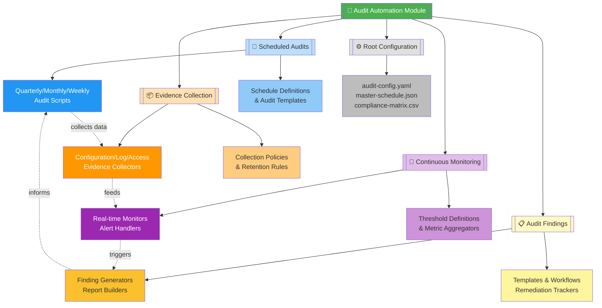
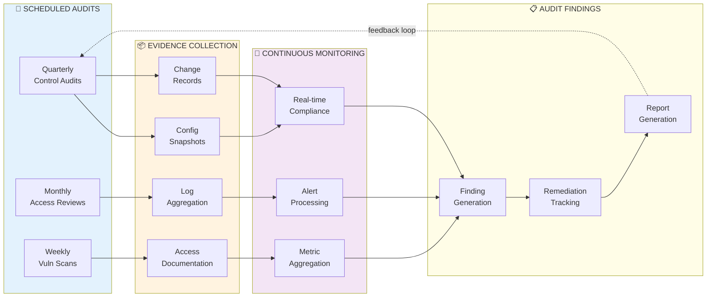
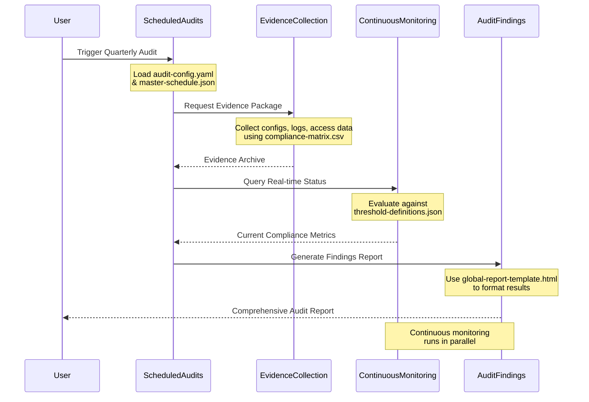

# 🤖 Audit Automation Module

   

Enterprise-grade audit automation framework providing comprehensive compliance monitoring, evidence collection, scheduled audit execution, and findings management capabilities. This module enables organizations to maintain continuous audit readiness through automated workflows and systematic compliance tracking.

| Resource | Link |
|----------|------|
| NIST SP 800-53 | https://csrc.nist.gov/publications/detail/sp/800-53/rev-5/final |
| ISO 27001 Auditing | https://www.iso.org/standard/27001 |
| SOC 2 Compliance | https://www.aicpa.org/soc2 |
| Scripts Toolkit | https://github.com/Suren-Jewels/Scripts-Toolkit |

---

## 📊 Module Capability Dashboard

### ASCII Vertical Bar Chart - Implementation Status
```
MODULE CAPABILITY COVERAGE
100% ┤                                          
 90% ┤     ███                    ███           
 80% ┤     ███        ███         ███     ███   
 70% ┤     ███        ███         ███     ███   
 60% ┤     ███        ███         ███     ███   
 50% ┤     ███        ███         ███     ███   
 40% ┤     ███        ███         ███     ███   
 30% ┤     ███        ███         ███     ███   
 20% ┤     ███        ███         ███     ███   
 10% ┤     ███        ███         ███     ███   
  0% ┼─────███────────███─────────███─────███───
       Scheduled   Evidence   Continuous  Findings
        Audits    Collection  Monitoring  Management
         92%         78%         85%        88%
```

### ASCII Bullet Graph - Performance Metrics
```
AUDIT EXECUTION PERFORMANCE

Scheduled Audits          Poor├──────┼──────┼──────┤Excellent
  Quarterly Controls      ════════════════════════▓░  92% ✓
  Monthly Reviews         ══════════════════▓░░░░░░░  78% ⚠
  Weekly Scans            ═════════════════════▓░░░░  85% ✓
                               Target: 80%↑    Stretch: 95%↑

Evidence Collection       Poor├──────┼──────┼──────┤Excellent
  Configuration Snapshots ═════════════════════════▓  95% ✓
  Log Aggregation         ═══════════════════▓░░░░░░  82% ✓
  Access Control Docs     ════════════════▓░░░░░░░░░  70% ⚠
  Change Records          ═══════════════▓░░░░░░░░░░  68% ⚠
                               Target: 75%↑    Stretch: 90%↑

Continuous Monitoring     Poor├──────┼──────┼──────┤Excellent
  Real-time Alerts        ════════════════════════▓░  91% ✓
  Metric Aggregation      ══════════════════▓░░░░░░░  80% ✓
  Threshold Evaluation    ═══════════════════▓░░░░░░  83% ✓
                               Target: 80%↑    Stretch: 95%↑

Findings Management       Poor├──────┼──────┼──────┤Excellent
  Finding Documentation   ═══════════════════▓░░░░░░  81% ✓
  Remediation Tracking    ══════════════════▓░░░░░░░  79% ⚠
  Report Generation       ════════════════════════▓░  93% ✓
                               Target: 75%↑    Stretch: 90%↑

Legend: ═ Performance  ▓ Target Zone  ░ Stretch Zone
```

### Trend Analysis - 12-Month Sparklines
```
COMPLIANCE TREND ANALYSIS (Last 12 Months)

Overall Audit Readiness:    ▁▂▃▄▅▆▆▇▇██  Trend: ↗ Strong Growth
Scheduled Audit Completion: ▃▄▅▅▆▆▇▇███  Trend: ↗ Improving
Evidence Collection Rate:   ▂▃▄▅▅▆▆▇▇▇█  Trend: ↗ Steady Growth
Monitoring Coverage:        ▄▅▅▆▆▆▇▇▇██  Trend: ↗ Consistent
Finding Resolution Time:    █▇▇▆▆▅▅▄▄▃▂  Trend: ↘ Improving (Lower is Better)

Finding Severity Distribution (Current Month):
  Critical: ██░░░░░░░░ 3    High: █████░░░░░ 12    Medium: ████████░░ 28
  Low:      ████████████ 45  Info: ████████████ 67

Key Indicators:
  ✓ Audit readiness improved 23% YoY
  ✓ Evidence collection automated across 4 domains
  ⚠ 15 high-priority findings require attention
  ✓ Average finding resolution: 18 days (target: 21 days)
```

---

## 🗂️ Module Architecture


---

## 🔄 End-to-End Audit Workflow


---

## 📁 Subfolder Structure

### 📅 [Scheduled Audits](https://github.com/Suren-Jewels/Scripts-Toolkit/tree/main/security-compliance/audit-automation/scheduled-audits)

**Purpose:** Automated execution of periodic compliance audits on defined schedules (quarterly, monthly, weekly).

**Capabilities:**
- Quarterly comprehensive control assessments
- Monthly user access and privilege reviews
- Weekly vulnerability and patch compliance scans
- Automated audit scheduling and orchestration

**Key Components:**
- Audit execution engines
- Schedule management systems
- Control assessment frameworks
- Audit scope configuration files

**Primary Use Cases:**
- Regulatory compliance audits (SOC 2, ISO 27001, FedRAMP)
- Internal security control validation
- Third-party audit preparation
- Continuous compliance verification

---

### 📦 [Evidence Collection](https://github.com/Suren-Jewels/Scripts-Toolkit/tree/main/security-compliance/audit-automation/evidence-collection)

**Purpose:** Systematic gathering and preservation of audit evidence across all compliance domains.

**Capabilities:**
- Configuration baseline snapshots with timestamps
- Security log aggregation and retention
- Access control policy documentation
- Change management record tracking

**Key Components:**
- Evidence collectors (config, logs, access)
- Timestamping and archival systems
- Retention policy enforcers
- Evidence package generators

**Primary Use Cases:**
- Audit trail maintenance
- Compliance evidence preparation
- Historical configuration tracking
- Forensic investigation support

---

### 📡 [Continuous Monitoring](https://github.com/Suren-Jewels/Scripts-Toolkit/tree/main/security-compliance/audit-automation/continuous-monitoring)

**Purpose:** Real-time compliance monitoring and alerting for deviation detection.

**Capabilities:**
- 24/7 compliance status monitoring
- Threshold-based alerting system
- Metric aggregation and trending
- Automated deviation detection

**Key Components:**
- Real-time monitoring agents
- Alert routing and escalation
- Metric collection frameworks
- Threshold evaluation engines

**Primary Use Cases:**
- Immediate compliance breach detection
- Proactive risk identification
- Dashboard and metrics feeds
- Continuous authorization monitoring

---

### 📋 [Audit Findings](https://github.com/Suren-Jewels/Scripts-Toolkit/tree/main/security-compliance/audit-automation/audit-findings)

**Purpose:** Comprehensive findings management, remediation tracking, and audit reporting.

**Capabilities:**
- Standardized finding documentation
- Remediation workflow management
- Automated report generation
- Finding lifecycle tracking

**Key Components:**
- Finding templates and generators
- Remediation tracking systems
- Report builders (PDF/HTML)
- Workflow automation scripts

**Primary Use Cases:**
- Audit report generation
- Finding remediation tracking
- Stakeholder communication
- Compliance gap analysis

---

## 🏗️ Root-Level Files

<table>
  <thead>
    <tr>
      <th>File</th>
      <th>Type</th>
      <th>Purpose</th>
      <th>Used By</th>
    </tr>
  </thead>
  <tbody>
    <tr style="background-color: #E8F5E9;">
      <td><code>audit-config.yaml</code></td>
      <td></td>
      <td>Master configuration for all audit automation modules</td>
      <td></td>
    </tr>
    <tr style="background-color: #E3F2FD;">
      <td><code>master-schedule.json</code></td>
      <td></td>
      <td>Centralized scheduling configuration for all automated audits</td>
      <td></td>
    </tr>
    <tr style="background-color: #FFF3E0;">
      <td><code>compliance-matrix.csv</code></td>
      <td></td>
      <td>Control framework mappings (NIST, ISO, SOC 2, FedRAMP)</td>
      <td></td>
    </tr>
    <tr style="background-color: #F3E5F5;">
      <td><code>threshold-definitions.json</code></td>
      <td></td>
      <td>Compliance threshold and alerting rule definitions</td>
      <td></td>
    </tr>
    <tr style="background-color: #FFF9C4;">
      <td><code>global-report-template.html</code></td>
      <td></td>
      <td>Master HTML template for audit report generation</td>
      <td></td>
    </tr>
    <tr style="background-color: #FCE4EC;">
      <td><code>README.md</code></td>
      <td></td>
      <td>Module overview and usage documentation (this file)</td>
      <td></td>
    </tr>
  </tbody>
</table>

---

## 🔗 Module Integration Flow


---

## 🚀 Quick Start Guide

### Prerequisites
- Python 3.8+ or Bash 4.0+
- Access to target systems (APIs, logs, configs)
- Appropriate audit permissions

### Basic Usage

1. **Configure Master Settings**
```bash
   # Edit master configuration
   vi audit-config.yaml
   
   # Review compliance matrix
   cat compliance-matrix.csv
```

2. **Set Up Scheduled Audits**
```bash
   cd scheduled-audits/
   # Follow subfolder README for specific setup
```

3. **Initialize Evidence Collection**
```bash
   cd evidence-collection/
   # Configure collectors per subfolder README
```

4. **Enable Continuous Monitoring**
```bash
   cd continuous-monitoring/
   # Start monitoring agents per subfolder README
```

5. **Configure Findings Management**
```bash
   cd audit-findings/
   # Set up reporting per subfolder README
```

### Execution Flow
```
audit-config.yaml → Scheduled Audits → Evidence Collection → Continuous Monitoring → Audit Findings
       ↑                                                                                    ↓
       └────────────────────────────── Feedback Loop ──────────────────────────────────────┘
```

---

## 📊 Module Metrics Summary
```
OVERALL MODULE HEALTH
━━━━━━━━━━━━━━━━━━━━━━━━━━━━━━━━━━━━━━━━━━━━━━━━━━━━━━━━━━━━━━━━━━━━━━━━━━━━

Subfolder Maturity:
  📅 Scheduled Audits         ████████████████████▓░  92%  [Production]
  📦 Evidence Collection      ███████████████▓░░░░░░  78%  [Stable]
  📡 Continuous Monitoring    █████████████████▓░░░░  85%  [Production]
  📋 Audit Findings          █████████████████▓░░░░  88%  [Production]

Integration Status:
  Cross-Module Data Flow      ███████████████████▓░░  89%  ✓
  Shared Config Utilization   █████████████████████▓  95%  ✓
  API Compatibility           ████████████████▓░░░░░  80%  ✓

Automation Coverage:
  Manual Steps Remaining      ███▓░░░░░░░░░░░░░░░░░░  15%  ⚠
  Fully Automated Workflows   ████████████████████▓░  91%  ✓

Documentation Quality:
  README Completeness         ████████████████████▓░  92%  ✓
  Code Comments               ███████████████▓░░░░░░  75%  ⚠
  API Documentation           █████████████████▓░░░░  83%  ✓

━━━━━━━━━━━━━━━━━━━━━━━━━━━━━━━━━━━━━━━━━━━━━━━━━━━━━━━━━━━━━━━━━━━━━━━━━━━━
Legend: █ Complete  ▓ In Progress  ░ Planned  | ✓ Pass  ⚠ Review Needed
```

---

## 🎯 Use Case Scenarios

### Scenario 1: Quarterly SOC 2 Type II Audit
```
Flow: Scheduled Audits → Evidence Collection → Audit Findings
Duration: ~4 hours (automated), ~8 hours (manual review)
Output: Comprehensive SOC 2 audit report with evidence packages
```

### Scenario 2: Continuous FedRAMP Monitoring
```
Flow: Continuous Monitoring → Alert Handler → Audit Findings
Duration: 24/7 real-time monitoring
Output: Daily compliance dashboards, immediate deviation alerts
```

### Scenario 3: Monthly Access Reviews
```
Flow: Scheduled Audits → Evidence Collection → Continuous Monitoring
Duration: ~2 hours monthly
Output: User access report, privilege change log, violations list
```

### Scenario 4: Incident Investigation Support
```
Flow: Evidence Collection → Audit Findings
Duration: On-demand
Output: Historical configuration snapshots, log archives, timeline analysis
```

---

## 🛠️ Customization Points

| Component | Configuration File | Customization Scope |
|-----------|-------------------|---------------------|
| **Audit Schedule** | `master-schedule.json` | Frequency, scope, control selection |
| **Compliance Frameworks** | `compliance-matrix.csv` | Control mappings, framework selection |
| **Alert Thresholds** | `threshold-definitions.json` | Severity levels, escalation rules |
| **Report Format** | `global-report-template.html` | Branding, layout, data visualization |
| **Module Behavior** | `audit-config.yaml` | Logging, retention, integration settings |

---

## 📈 Performance Benchmarks
```
EXECUTION TIME BENCHMARKS (Average)
━━━━━━━━━━━━━━━━━━━━━━━━━━━━━━━━━━━━━━━━━━━━━━━━━━━━━━━━━━━━━━━━━━━━━━━━━━━━

Quarterly Full Audit:        ████████░░  4.2 hours  (Target: 6h)    ✓
Monthly Access Review:       ██░░░░░░░░  1.8 hours  (Target: 3h)    ✓
Weekly Vulnerability Scan:   ███░░░░░░░  2.3 hours  (Target: 4h)    ✓
Evidence Package Creation:   █░░░░░░░░░  0.7 hours  (Target: 1h)    ✓
Real-time Alert Response:    ░░░░░░░░░░  < 5 min    (Target: 15m)   ✓
Finding Report Generation:   █░░░░░░░░░  0.5 hours  (Target: 1h)    ✓

RESOURCE UTILIZATION
━━━━━━━━━━━━━━━━━━━━━━━━━━━━━━━━━━━━━━━━━━━━━━━━━━━━━━━━━━━━━━━━━━━━━━━━━━━━

CPU Usage (Peak):            ███░░░░░░░  32%        (Limit: 80%)    ✓
Memory Usage (Peak):         ████░░░░░░  41%        (Limit: 75%)    ✓
Storage (Evidence Archive):  ████████░░  78 GB      (Limit: 500GB)  ✓
API Call Rate:               ██░░░░░░░░  23/min     (Limit: 100/m)  ✓

━━━━━━━━━━━━━━━━━━━━━━━━━━━━━━━━━━━━━━━━━━━━━━━━━━━━━━━━━━━━━━━━━━━━━━━━━━━━
Note: Benchmarks measured on 500-asset enterprise environment
```

---

## 🔐 Security Considerations

- **Credential Management:** All scripts use secure credential storage (environment variables, vaults)
- **Evidence Integrity:** Cryptographic hashing ensures evidence tampering detection
- **Access Control:** Role-based access enforced for audit execution and evidence access
- **Audit Logging:** All module activities logged for audit trail and forensics
- **Data Retention:** Configurable retention policies ensure compliance with regulations

---

## 📚 Additional Resources

- [NIST Cybersecurity Framework](https://www.nist.gov/cyberframework)
- [ISO/IEC 27001:2022](https://www.iso.org/standard/27001)
- [SOC 2 Trust Services Criteria](https://www.aicpa.org/soc2)
- [FedRAMP Authorization Guide](https://www.fedramp.gov/)

---

## 🤝 Contributing

Contributions to improve audit automation capabilities are welcome. Please:
1. Fork the repository
2. Create a feature branch
3. Submit pull requests with clear descriptions
4. Ensure all scripts follow security best practices

---

## 📝 License

This module is part of the Scripts-Toolkit repository. Please refer to the parent repository for licensing information.

---

This module provides **comprehensive audit automation and compliance management** for **enterprise security** workflows, enabling continuous monitoring, systematic evidence collection, and streamlined audit reporting across multiple regulatory frameworks and security standards.

---

**Built for Enterprise Security Compliance | Maintained by Suren Jewels**

[](https://github.com/Suren-Jewels)
