# 🤖 Audit Automation Module

   

Comprehensive audit automation framework for continuous compliance monitoring, evidence collection, scheduled audits, and findings management. Enables organizations to maintain audit readiness through automated evidence gathering, real-time compliance tracking, and systematic audit execution across security controls.

| Resource | Link |
|----------|------|
| NIST SP 800-53 | https://csrc.nist.gov/publications/detail/sp/800-53/rev-5/final |
| ISO 27001 Auditing | https://www.iso.org/standard/27001 |
| SOC 2 Compliance | https://www.aicpa.org/soc2 |
| Scripts Toolkit | https://github.com/Suren-Jewels/Scripts-Toolkit |

---

## 📊 Current Audit Automation Status
```
Overall Audit Readiness           [████████████████████░░░░] 83% (249/300) ✓
Evidence Collection Coverage      [███████████████████████░] 92% (46/50)   ✓
────────────────────────────────────────────────────────────────────────────
Scheduled Audits:
  Quarterly Control Audits        [████████████████████████] 100% (4/4)    ✓
  Monthly Access Reviews          [███████████████████████░] 92% (11/12)   ✓
  Weekly Vulnerability Scans      [██████████████████████░░] 88% (46/52)   ⚠
────────────────────────────────────────────────────────────────────────────
Continuous Monitoring Active      [███████████████████░░░░░] 78% (39/50)   ⚠
────────────────────────────────────────────────────────────────────────────
Evidence Collection:
  Configuration Snapshots         [████████████████████████] 98% (196/200) ✓
  Log Retention Compliance        [███████████████████████░] 95% (38/40)   ✓
  Access Control Evidence         [██████████████████████░░] 89% (89/100)  ⚠
  Change Management Records       [████████████████████░░░░] 82% (164/200) ⚠
────────────────────────────────────────────────────────────────────────────
Monthly Trend:  ▃▄▅▆▆▇█  (Improving)

Finding Severity Distribution:
  Critical: 3  |  High: 12  |  Medium: 28  |  Low: 45  |  Info: 67
```

---

## 🗂️ Module Architecture

```mermaid
graph TD
    Root[[🤖 Audit Automation]]
    
    Root --> Category1[[📅 Scheduled Audits]]
    Root --> Category2[[📦 Evidence Collection]]
    Root --> Category3[[📡 Continuous Monitoring]]
    Root --> Category4[[📋 Audit Findings]]
    
    Category1 --> File1[quarterly-control-audit.py]
    Category1 --> File2[monthly-access-review.sh]
    Category1 --> File3[weekly-vulnerability-scan.py]
    Category1 --> File4[audit-scheduler.py]
    
    Category2 --> File5[config-snapshot-collector.py]
    Category2 --> File6[log-evidence-collector.sh]
    Category2 --> File7[access-control-evidence.py]
    Category2 --> File8[change-mgmt-evidence.py]
    
    Category3 --> File9[realtime-compliance-monitor.py]
    Category3 --> File10[alert-handler.py]
    Category3 --> File11[metric-aggregator.sh]
    Category3 --> File12[threshold-evaluator.py]
    
    Category4 --> Config1[findings-template.json]
    Category4 --> Config2[remediation-tracker.yaml]
    Category4 --> Config3[audit-report-generator.py]
    Category4 --> Config4[finding-workflow.json]
    
    File1 -.references.-> Config1
    File3 -.references.-> Config2
    File9 -.references.-> Config4
    File12 -.references.-> Config4
    
    style Category1 fill:#BBDEFB
    style Category2 fill:#FFE0B2
    style Category3 fill:#E1BEE7
    style Category4 fill:#FFF9C4
    
    style File1 fill:#2196F3,color:#fff
    style File2 fill:#2196F3,color:#fff
    style File3 fill:#2196F3,color:#fff
    style File4 fill:#2196F3,color:#fff
    style File5 fill:#FF9800,color:#fff
    style File6 fill:#FF9800,color:#fff
    style File7 fill:#FF9800,color:#fff
    style File8 fill:#FF9800,color:#fff
    style File9 fill:#9C27B0,color:#fff
    style File10 fill:#9C27B0,color:#fff
    style File11 fill:#9C27B0,color:#fff
    style File12 fill:#9C27B0,color:#fff
    
    style Config1 fill:#FBC02D
    style Config2 fill:#FBC02D
    style Config3 fill:#FBC02D
    style Config4 fill:#FBC02D
```


---

## 🔄 Audit Lifecycle Workflow

```mermaid
flowchart LR
    subgraph INPUTS["📥 INPUTS"]
        I1[Audit Schedule<br/>Quarterly/Monthly]
        I2[Control Baselines<br/>NIST/ISO Standards]
        I3[System Inventory<br/>Assets & Services]
        I4[Compliance Policies<br/>Organization Rules]
    end
    
    subgraph PROCESSING["⚙️ PROCESSING"]
        P1[Schedule Execution<br/>Cron/Scheduler]
        P2[Evidence Gathering<br/>Automated Collection]
        P3[Compliance Analysis<br/>Rule Engine]
        P4[Finding Generation<br/>Assessment Logic]
    end
    
    subgraph OUTPUTS["📤 OUTPUTS"]
        O1[Audit Reports<br/>PDF/HTML]
        O2[Evidence Packages<br/>Timestamped Archives]
        O3[Finding Tickets<br/>JIRA/ServiceNow]
        O4[Compliance Dashboards<br/>Real-time Metrics]
    end
    
    I1 --> P1
    I2 --> P2
    I3 --> P3
    I4 --> P4
    
    P1 --> O1
    P2 --> O2
    P3 --> O3
    P4 --> O4
    
    style INPUTS fill:#E3F2FD
    style PROCESSING fill:#FFF3E0
    style OUTPUTS fill:#E8F5E9
```


---

## ⚙️ Audit Execution Logic Flow


---

## 🔗 System Integration


---

## 📂 File Reference Table

<table>
  <thead>
    <tr>
      <th>File</th>
      <th>Type</th>
      <th>Purpose</th>
      <th>Category</th>
    </tr>
  </thead>
  <tbody>
    <tr style="background-color: #E3F2FD;">
      <td><code>quarterly-control-audit.py</code></td>
      <td></td>
      <td>Executes comprehensive quarterly control assessments across all security domains</td>
      <td></td>
    </tr>
    <tr style="background-color: #E3F2FD;">
      <td><code>monthly-access-review.sh</code></td>
      <td></td>
      <td>Automates monthly user access reviews and privilege validation</td>
      <td></td>
    </tr>
    <tr style="background-color: #E3F2FD;">
      <td><code>weekly-vulnerability-scan.py</code></td>
      <td></td>
      <td>Orchestrates weekly vulnerability scanning and patch compliance verification</td>
      <td></td>
    </tr>
    <tr style="background-color: #E3F2FD;">
      <td><code>audit-scheduler.py</code></td>
      <td></td>
      <td>Central scheduling engine for all automated audit activities</td>
      <td></td>
    </tr>
    <tr style="background-color: #FFF3E0;">
      <td><code>config-snapshot-collector.py</code></td>
      <td></td>
      <td>Captures timestamped configuration snapshots for audit trail</td>
      <td></td>
    </tr>
    <tr style="background-color: #FFF3E0;">
      <td><code>log-evidence-collector.sh</code></td>
      <td></td>
      <td>Aggregates security logs and event data for compliance evidence</td>
      <td></td>
    </tr>
    <tr style="background-color: #FFF3E0;">
      <td><code>access-control-evidence.py</code></td>
      <td></td>
      <td>Documents access control mechanisms and authorization policies</td>
      <td></td>
    </tr>
    <tr style="background-color: #FFF3E0;">
      <td><code>change-mgmt-evidence.py</code></td>
      <td></td>
      <td>Tracks change management records and approval workflows</td>
      <td></td>
    </tr>
    <tr style="background-color: #F3E5F5;">
      <td><code>realtime-compliance-monitor.py</code></td>
      <td></td>
      <td>Provides continuous real-time monitoring of compliance status</td>
      <td></td>
    </tr>
    <tr style="background-color: #F3E5F5;">
      <td><code>alert-handler.py</code></td>
      <td></td>
      <td>Processes and routes compliance alerts to appropriate teams</td>
      <td></td>
    </tr>
    <tr style="background-color: #F3E5F5;">
      <td><code>metric-aggregator.sh</code></td>
      <td></td>
      <td>Aggregates compliance metrics from multiple monitoring sources</td>
      <td></td>
    </tr>
    <tr style="background-color: #F3E5F5;">
      <td><code>threshold-evaluator.py</code></td>
      <td></td>
      <td>Evaluates metrics against compliance thresholds and triggers alerts</td>
      <td></td>
    </tr>
    <tr style="background-color: #FFF9C4;">
      <td><code>findings-template.json</code></td>
      <td></td>
      <td>Standardized template for documenting audit findings</td>
      <td></td>
    </tr>
    <tr style="background-color: #FFF9C4;">
      <td><code>remediation-tracker.yaml</code></td>
      <td></td>
      <td>Configuration for tracking remediation activities and deadlines</td>
      <td></td>
    </tr>
    <tr style="background-color: #FFF9C4;">
      <td><code>audit-report-generator.py</code></td>
      <td></td>
      <td>Generates comprehensive audit reports from collected findings</td>
      <td></td>
    </tr>
    <tr style="background-color: #FFF9C4;">
      <td><code>finding-workflow.json</code></td>
      <td></td>
      <td>Defines workflow stages and approval processes for findings</td>
      <td></td>
    </tr>
  </tbody>
</table>

---

This module provides **automated audit execution and evidence management** for **security compliance** workflows, enabling continuous monitoring, systematic evidence collection, and streamlined audit reporting across enterprise security controls and regulatory frameworks.

---

**Built for Security Compliance Automation | Maintained by Suren Jewels**

[](https://github.com/Suren-Jewels)
