# 🔍 Audit Findings Management Module

   

Comprehensive audit findings lifecycle management system providing automated tracking, risk scoring, remediation planning, and aging analysis for security and compliance audits across enterprise environments.

| Resource | Link |
|----------|------|
| NIST SP 800-53 | https://csrc.nist.gov/publications/detail/sp/800-53/rev-5/final |
| ISO 27001:2022 | https://www.iso.org/standard/27001 |
| Audit Management Best Practices | https://www.isaca.org/resources/isaca-journal/issues/2023/volume-1/audit-finding-management |
| GitHub Repository | https://github.com/Suren-Jewels/Scripts-Toolkit |

---

## 📊 Current Audit Findings Status
```
Overall Findings Closure Rate    [███████████████████░░░░░] 79% (158/200) ✓
Critical Findings Resolution     [████████████████░░░░░░░░] 67% (20/30)   ⚠
────────────────────────────────────────────────────────────────────────────
Risk Distribution:
  Critical (CVSS 9.0-10.0)       [████████████████░░░░░░░░] 67%          ⚠
  High (CVSS 7.0-8.9)            [███████████████████░░░░░] 75%          ⚠
  Medium (CVSS 4.0-6.9)          [████████████████████████] 85%          ✓
  Low (CVSS 0.1-3.9)             [████████████████████████] 92%          ✓
────────────────────────────────────────────────────────────────────────────
Remediation Plan Compliance      [██████████████████░░░░░░] 81%          ✓
────────────────────────────────────────────────────────────────────────────
Aging Analysis:
  Within SLA (<30 days)          [████████████████████████] 88%          ✓
  At Risk (30-60 days)           [███████████████████░░░░░] 78%          ⚠
  Overdue (>60 days)             [█████████████░░░░░░░░░░░] 54%          ❌
────────────────────────────────────────────────────────────────────────────
Monthly Trend:  ▃▄▅▆▆▇█  (Improving)

Severity Distribution:
  Critical: 30  |  High: 55  |  Medium: 70  |  Low: 45  |  Info: 0
```

---

## 🗂️ Module Architecture

```mermaid
graph TD
    Root[[🔍 Audit Findings Management]]
    
    Root --> Tracking[[📋 Findings Tracking]]
    Root --> Scoring[[⚖️ Risk Assessment]]
    Root --> Planning[[🎯 Remediation Planning]]
    Root --> Reporting[[📊 Aging & Reports]]
    Root --> Config[[⚙️ Configuration]]
    
    Tracking --> File1[finding-tracker.py]
    
    Scoring --> File2[risk-scorer.py]
    
    Planning --> File3[remediation-plan-generator.py]
    
    Reporting --> File4[finding-aging-report.sh]
    
    Config --> File5[finding-templates.yaml]
    
    File1 -.references.-> File5
    File2 -.references.-> File5
    File3 -.references.-> File5
    File4 -.references.-> File5
    
    style Tracking fill:#BBDEFB
    style Scoring fill:#FFE0B2
    style Planning fill:#E1BEE7
    style Reporting fill:#C8E6C9
    style Config fill:#FFF9C4
    
    style File1 fill:#2196F3,color:#fff
    style File2 fill:#FF9800,color:#fff
    style File3 fill:#9C27B0,color:#fff
    style File4 fill:#4CAF50,color:#fff
    style File5 fill:#FBC02D
```


---

## 🔄 Audit Findings Lifecycle Workflow

```mermaid
flowchart LR
    subgraph INPUTS["📥 INPUTS"]
        I1[Audit Reports<br/>PDF/XLSX/JSON]
        I2[Vulnerability Scans<br/>NESSUS/OpenVAS]
        I3[Manual Findings<br/>User Entry]
        I4[Compliance Checks<br/>Automated Tools]
    end
    
    subgraph PROCESSING["⚙️ PROCESSING"]
        P1[Finding Tracker<br/>Python Engine]
        P2[Risk Scorer<br/>CVSS Calculator]
        P3[Plan Generator<br/>Template Engine]
        P4[Aging Reporter<br/>Bash Analytics]
    end
    
    subgraph OUTPUTS["📤 OUTPUTS"]
        O1[Tracking Database<br/>SQLite/JSON]
        O2[Risk Scores<br/>CVSS 3.1]
        O3[Remediation Plans<br/>Markdown/HTML]
        O4[Aging Reports<br/>CSV/Dashboard]
    end
    
    I1 --> P1
    I2 --> P2
    I3 --> P3
    I4 --> P4
    
    P1 --> O1
    P2 --> O2
    P3 --> O3
    P4 --> O4
    
    style INPUTS fill:#E3F2FD
    style PROCESSING fill:#FFF3E0
    style OUTPUTS fill:#E8F5E9
```


---

## ⚙️ Finding Processing Logic Flow


---

## 🔗 System Integration


---

## 📂 File Reference Table

<table>
  <thead>
    <tr>
      <th>File</th>
      <th>Type</th>
      <th>Purpose</th>
      <th>Capability</th>
    </tr>
  </thead>
  <tbody>
    <tr style="background-color: #E3F2FD;">
      <td><code>finding-tracker.py</code></td>
      <td></td>
      <td>Centralized tracking system for audit findings with CRUD operations, status management, and lifecycle tracking across multiple audit cycles</td>
      <td></td>
    </tr>
    <tr style="background-color: #FFF3E0;">
      <td><code>risk-scorer.py</code></td>
      <td></td>
      <td>Automated risk scoring engine using CVSS 3.1 methodology with custom weighting for organizational context and compliance requirements</td>
      <td></td>
    </tr>
    <tr style="background-color: #F3E5F5;">
      <td><code>remediation-plan-generator.py</code></td>
      <td></td>
      <td>Template-driven remediation plan generator with automated task assignment, timeline calculation, and resource allocation recommendations</td>
      <td></td>
    </tr>
    <tr style="background-color: #E8F5E9;">
      <td><code>finding-aging-report.sh</code></td>
      <td></td>
      <td>Aging analysis reporter tracking overdue findings, SLA compliance, and remediation timeline adherence with dashboard generation</td>
      <td></td>
    </tr>
    <tr style="background-color: #FFF9C4;">
      <td><code>finding-templates.yaml</code></td>
      <td></td>
      <td>Standardized finding templates with predefined categories, severity classifications, remediation steps, and compliance mapping references</td>
      <td></td>
    </tr>
  </tbody>
</table>

---

This module provides **comprehensive audit findings lifecycle management** for **enterprise security and compliance** workflows, enabling automated tracking, risk-based prioritization, and structured remediation planning across NIST, ISO, FedRAMP, and DoD audit frameworks.

---

**Built for Enterprise Audit & Compliance Management | Maintained by Suren Jewels**

[](https://github.com/Suren-Jewels)
