# 📡 Continuous Monitoring Module

   

Real-time security compliance monitoring and anomaly detection system that continuously tracks configuration drift, aggregates security events, and identifies compliance violations across enterprise infrastructure with automated alerting capabilities.

| Resource | Link |
|----------|------|
| NIST SP 800-137 | [Continuous Monitoring Guidelines](https://csrc.nist.gov/publications/detail/sp/800-137/final) |
| NIST SP 800-53 | [Security Controls (SI-4)](https://csrc.nist.gov/publications/detail/sp/800-53/rev-5/final) |
| CIS Controls | [Continuous Vulnerability Management](https://www.cisecurity.org/controls/continuous-vulnerability-management) |
| GitHub Repository | [Suren-Jewels/Scripts-Toolkit](https://github.com/Suren-Jewels/Scripts-Toolkit) |

---

## 📊 Current Monitoring Status
```
Real-Time Compliance Coverage    [████████████████████░░░░] 83% (25/30) ✓
Security Event Aggregation       [███████████████████████░] 96% (48/50) ✓
────────────────────────────────────────────────────────────────────────────
Anomaly Detection Metrics:
  Behavioral Anomalies Detected  [██████████████████░░░░░░] 78% (156/200) ⚠
  Configuration Drift Incidents  [███████████████████████░] 92% (23/25)   ✓
  Threshold Violations           [████████████████████████] 100% (12/12)  ✓
────────────────────────────────────────────────────────────────────────────
Alert Response Rate              [████████████████████████] 98% (245/250) ✓
────────────────────────────────────────────────────────────────────────────
System Health Indicators:
  Monitoring Agent Uptime        [████████████████████████] 99.8% (24/24) ✓
  Event Processing Latency       [███████████████████████░] 94% (<2s avg) ✓
────────────────────────────────────────────────────────────────────────────
Monthly Trend:  ▃▄▅▆▇█▇█  (Improving)

Risk Distribution:
  Critical: 3  |  High: 8  |  Medium: 15  |  Low: 42  |  Info: 127
```

---

## 🗂️ Module Architecture

```mermaid
graph TD
    Root[[📡 Continuous Monitoring]]
    
    Root --> Category1[[🔍 Real-Time Monitoring]]
    Root --> Category2[[📊 Event Aggregation]]
    Root --> Category3[[🚨 Detection Systems]]
    Root --> Category4[[⚙️ Configuration]]
    
    Category1 --> File1[real-time-compliance-monitor.py]
    
    Category2 --> File2[security-event-aggregator.sh]
    
    Category3 --> File3[anomaly-detector.py]
    Category3 --> File4[drift-detection.sh]
    
    Category4 --> Config1[alert-thresholds.yaml]
    
    File1 -.references.-> Config1
    File3 -.references.-> Config1
    File4 -.references.-> Config1
    
    style Category1 fill:#BBDEFB
    style Category2 fill:#FFE0B2
    style Category3 fill:#E1BEE7
    style Category4 fill:#FFF9C4
    
    style File1 fill:#2196F3,color:#fff
    style File2 fill:#FF9800,color:#fff
    style File3 fill:#9C27B0,color:#fff
    style File4 fill:#9C27B0,color:#fff
    
    style Config1 fill:#FBC02D
```


---

## 🔄 Continuous Monitoring Workflow

```mermaid
flowchart LR
    subgraph INPUTS["📥 INPUTS"]
        I1[System Logs<br/>Syslog/JSON]
        I2[Configuration Files<br/>YAML/XML/JSON]
        I3[Security Events<br/>SIEM/IDS/IPS]
        I4[Baseline Snapshots<br/>Known-Good States]
    end
    
    subgraph PROCESSING["⚙️ PROCESSING"]
        P1[Real-Time Monitor<br/>Python Daemon]
        P2[Event Aggregator<br/>Log Correlation]
        P3[Anomaly Detection<br/>ML/Statistical]
        P4[Drift Detection<br/>State Comparison]
    end
    
    subgraph OUTPUTS["📤 OUTPUTS"]
        O1[Compliance Alerts<br/>JSON/Email/Slack]
        O2[Event Correlation<br/>Timeline/Graph]
        O3[Anomaly Reports<br/>PDF/HTML]
        O4[Drift Analysis<br/>Delta/Remediation]
    end
    
    I1 --> P1
    I2 --> P2
    I3 --> P3
    I4 --> P4
    
    P1 --> O1
    P2 --> O2
    P3 --> O3
    P4 --> O4
    
    style INPUTS fill:#E3F2FD
    style PROCESSING fill:#FFF3E0
    style OUTPUTS fill:#E8F5E9
```


---

## ⚙️ Monitoring Engine Logic Flow

```mermaid
flowchart TD
    Start([Start Monitoring Cycle]) --> Step1[Load Alert Thresholds & Baselines]
    Step1 --> Step2[Initialize Monitoring Agents]
    
    Step2 --> Loop{For Each System/Service}
    
    Loop -->|Next Target| Decision1{Baseline Exists?}
    
    Decision1 -->|No| Action1[❌ Create Initial Baseline]
    Decision1 -->|Yes| Decision2{State Changed?}
    
    Decision2 -->|No| Action3[✓ Record Normal State]
    Decision2 -->|Yes| Decision3{Within Threshold?}
    
    Decision3 -->|No| Action2[⚠️ Generate Drift Alert]
    Decision3 -->|Yes| Action4[✓ Log Minor Change]
    
    Action1 --> Collect[Aggregate Monitoring Data]
    Action2 --> Collect
    Action3 --> Collect
    Action4 --> Collect
    
    Collect --> Correlate[Correlate Security Events]
    Correlate --> Analyze[Run Anomaly Detection]
    
    Analyze --> MoreTargets{More Targets?}
    
    MoreTargets -->|Yes| Loop
    MoreTargets -->|No| Generate[Generate Consolidated Report]
    
    Generate --> Calculate[Calculate Risk Scores & Trends]
    Calculate --> Alert{Critical Issues?}
    
    Alert -->|Yes| Notify[📧 Send Immediate Alerts]
    Alert -->|No| Archive[📁 Archive to Dashboard]
    
    Notify --> Output
    Archive --> Output([📄 Output Monitoring Results])
    
    style Start fill:#4CAF50,color:#fff
    style Output fill:#4CAF50,color:#fff
    style Action3 fill:#4CAF50,color:#fff
    style Action4 fill:#4CAF50,color:#fff
    style Action2 fill:#FF9800,color:#fff
    style Action1 fill:#F44336,color:#fff
    style Decision1 fill:#2196F3,color:#fff
    style Decision2 fill:#2196F3,color:#fff
    style Decision3 fill:#2196F3,color:#fff
    style MoreTargets fill:#2196F3,color:#fff
    style Alert fill:#2196F3,color:#fff
```


---

## 🔗 System Integration


---

## 📂 File Reference Table

<table>
  <thead>
    <tr>
      <th>File</th>
      <th>Type</th>
      <th>Purpose</th>
      <th>Category</th>
    </tr>
  </thead>
  <tbody>
    <tr style="background-color: #E3F2FD;">
      <td><code>real-time-compliance-monitor.py</code></td>
      <td></td>
      <td>Continuous compliance state monitoring with real-time violation detection and alerting</td>
      <td></td>
    </tr>
    <tr style="background-color: #FFF3E0;">
      <td><code>security-event-aggregator.sh</code></td>
      <td></td>
      <td>Correlates and aggregates security events from multiple sources for threat intelligence</td>
      <td></td>
    </tr>
    <tr style="background-color: #F3E5F5;">
      <td><code>anomaly-detector.py</code></td>
      <td></td>
      <td>Machine learning-based anomaly detection for identifying compliance deviations and security threats</td>
      <td></td>
    </tr>
    <tr style="background-color: #F3E5F5;">
      <td><code>drift-detection.sh</code></td>
      <td></td>
      <td>Detects configuration drift by comparing current system state against approved baselines</td>
      <td></td>
    </tr>
    <tr style="background-color: #FFF9C4;">
      <td><code>alert-thresholds.yaml</code></td>
      <td></td>
      <td>Defines alerting thresholds, severity levels, notification rules, and escalation policies</td>
      <td></td>
    </tr>
  </tbody>
</table>

---

This module provides **real-time security compliance monitoring** for **enterprise infrastructure** workflows, enabling automated drift detection, intelligent anomaly identification, and proactive threat response across distributed systems with centralized alerting and correlation capabilities.

---

**Built for Security Operations & Compliance | Maintained by Suren Jewels**

[](https://github.com/Suren-Jewels)
