# 📦 Evidence Collection Automation Module

   

Automated evidence collection system for compliance audits, security assessments, and regulatory reporting. Aggregates logs, configurations, access records, change management data, and vulnerability scans with retention policy enforcement.

| Resource | Link |
|----------|------|
| NIST SP 800-53 | https://csrc.nist.gov/publications/detail/sp/800-53/rev-5/final |
| ISO 27001:2022 | https://www.iso.org/standard/27001 |
| SOC 2 Trust Services | https://us.aicpa.org/interestareas/frc/assuranceadvisoryservices/sorhome |
| GitHub Repository | https://github.com/Suren-Jewels/Scripts-Toolkit |

---

## 📊 Current Evidence Collection Status
```
Evidence Collection Coverage     [████████████████████░░░░] 85% (17/20) ✓
Automated Retrieval Rate         [███████████████████████░] 95% (19/20) ✓
────────────────────────────────────────────────────────────────────────────
Log Sources:
  System Logs                    [████████████████████████] 100%         ✓
  Application Logs               [███████████████████░░░░░] 80%          ⚠
  Security Logs                  [████████████████████████] 100%         ✓
────────────────────────────────────────────────────────────────────────────
Configuration Snapshots          [███████████████████████░] 92% (23/25) ✓
────────────────────────────────────────────────────────────────────────────
Access & Change Records:
  Access Logs                    [████████████████████████] 98%          ✓
  Change Management Records      [██████████████████░░░░░░] 75%          ⚠
────────────────────────────────────────────────────────────────────────────
Vulnerability Scan Collection    [████████████████████████] 100%         ✓
────────────────────────────────────────────────────────────────────────────
Retention Policy Compliance      [███████████████████████░] 94%          ✓
────────────────────────────────────────────────────────────────────────────
Monthly Trend:  ▃▅▆▆▇▇█  (Improving)

Collection Status Distribution:
  Automated: 19  |  Manual: 1  |  Pending: 0  |  Failed: 0  |  Skipped: 0
```

---

## 🗂️ Module Architecture

```mermaid
graph TD
    Root[[📦 Evidence Collection]]
    
    Root --> Category1[[📋 Log Collection]]
    Root --> Category2[[⚙️ Configuration Capture]]
    Root --> Category3[[🔐 Access & Change Tracking]]
    Root --> Category4[[🛡️ Vulnerability Management]]
    Root --> Category5[[📑 Retention Policy]]
    
    Category1 --> File1[collect-logs.sh]
    
    Category2 --> File2[collect-configs.py]
    
    Category3 --> File3[collect-access-logs.ps1]
    Category3 --> File4[collect-change-records.py]
    
    Category4 --> File5[collect-vulnerability-scans.sh]
    
    Category5 --> Config1[evidence-retention-policy.yaml]
    
    File1 -.references.-> Config1
    File2 -.references.-> Config1
    File3 -.references.-> Config1
    File4 -.references.-> Config1
    File5 -.references.-> Config1
    
    style Category1 fill:#BBDEFB
    style Category2 fill:#FFE0B2
    style Category3 fill:#E1BEE7
    style Category4 fill:#C8E6C9
    style Category5 fill:#FFF9C4
    
    style File1 fill:#2196F3,color:#fff
    style File2 fill:#FF9800,color:#fff
    style File3 fill:#9C27B0,color:#fff
    style File4 fill:#9C27B0,color:#fff
    style File5 fill:#4CAF50,color:#fff
    
    style Config1 fill:#FBC02D
```


---

## 🔄 Evidence Collection Workflow

```mermaid
flowchart LR
    subgraph INPUTS["📥 INPUTS"]
        I1[System Logs<br/>Syslog/Windows Events]
        I2[Configuration Files<br/>YAML/JSON/INI]
        I3[Access Records<br/>Authentication Logs]
        I4[Vulnerability Reports<br/>Scanner Outputs]
    end
    
    subgraph PROCESSING["⚙️ PROCESSING"]
        P1[Log Aggregation<br/>Bash/Syslog]
        P2[Config Snapshot<br/>Python Parser]
        P3[Access Log Parser<br/>PowerShell]
        P4[Scan Result Collector<br/>Bash/Python]
    end
    
    subgraph OUTPUTS["📤 OUTPUTS"]
        O1[Centralized Logs<br/>JSON/CSV]
        O2[Config Snapshots<br/>Timestamped Archives]
        O3[Access Reports<br/>Structured Data]
        O4[Vulnerability Evidence<br/>Standardized Format]
    end
    
    I1 --> P1
    I2 --> P2
    I3 --> P3
    I4 --> P4
    
    P1 --> O1
    P2 --> O2
    P3 --> O3
    P4 --> O4
    
    style INPUTS fill:#E3F2FD
    style PROCESSING fill:#FFF3E0
    style OUTPUTS fill:#E8F5E9
```


---

## ⚙️ Collection Process Logic Flow

```mermaid
flowchart TD
    Start([Start Collection]) --> Step1[Load Retention Policy]
    Step1 --> Step2[Initialize Evidence Repository]
    
    Step2 --> Loop{For Each Evidence Type}
    
    Loop -->|Next Type| Decision1{Source Available?}
    
    Decision1 -->|No| Action1[❌ Log Missing Source]
    Decision1 -->|Yes| Decision2{Credentials Valid?}
    
    Decision2 -->|No| Action2[⚠️ Authentication Failed]
    Decision2 -->|Yes| Action3[✓ Collect Evidence]
    
    Action3 --> Validate{Data Valid?}
    
    Validate -->|No| Action4[⚠️ Mark Incomplete]
    Validate -->|Yes| Action5[✓ Store Evidence]
    
    Action1 --> Collect[Aggregate Results]
    Action2 --> Collect
    Action4 --> Collect
    Action5 --> Collect
    
    Collect --> MoreTypes{More Evidence Types?}
    
    MoreTypes -->|Yes| Loop
    MoreTypes -->|No| Generate[Generate Collection Report]
    
    Generate --> Retention[Apply Retention Rules]
    Retention --> Calculate[Calculate Metrics]
    Calculate --> Output([📄 Evidence Package])
    
    style Start fill:#4CAF50,color:#fff
    style Output fill:#4CAF50,color:#fff
    style Action3 fill:#4CAF50,color:#fff
    style Action5 fill:#4CAF50,color:#fff
    style Action2 fill:#FF9800,color:#fff
    style Action4 fill:#FF9800,color:#fff
    style Action1 fill:#F44336,color:#fff
    style Decision1 fill:#2196F3,color:#fff
    style Decision2 fill:#2196F3,color:#fff
    style Validate fill:#2196F3,color:#fff
    style MoreTypes fill:#2196F3,color:#fff
```


---

## 🔗 System Integration


---

## 📂 File Reference Table

<table>
  <thead>
    <tr>
      <th>File</th>
      <th>Type</th>
      <th>Purpose</th>
      <th>Evidence Category</th>
    </tr>
  </thead>
  <tbody>
    <tr style="background-color: #E3F2FD;">
      <td><code>collect-logs.sh</code></td>
      <td></td>
      <td>Centralized log collection from system, application, and security sources</td>
      <td></td>
    </tr>
    <tr style="background-color: #FFF3E0;">
      <td><code>collect-configs.py</code></td>
      <td></td>
      <td>System configuration snapshots with timestamping and version tracking</td>
      <td></td>
    </tr>
    <tr style="background-color: #F3E5F5;">
      <td><code>collect-access-logs.ps1</code></td>
      <td></td>
      <td>Access log aggregation from authentication systems and directory services</td>
      <td></td>
    </tr>
    <tr style="background-color: #F3E5F5;">
      <td><code>collect-change-records.py</code></td>
      <td></td>
      <td>Change management evidence collection from ticketing and version control systems</td>
      <td></td>
    </tr>
    <tr style="background-color: #E8F5E9;">
      <td><code>collect-vulnerability-scans.sh</code></td>
      <td></td>
      <td>Vulnerability scan result collection and standardization from security scanners</td>
      <td></td>
    </tr>
    <tr style="background-color: #FFF9C4;">
      <td><code>evidence-retention-policy.yaml</code></td>
      <td></td>
      <td>Evidence retention rules defining storage duration, archival, and purge policies</td>
      <td></td>
    </tr>
  </tbody>
</table>

---

This module provides **automated evidence collection** for **compliance audit** workflows, enabling centralized log aggregation, configuration tracking, and vulnerability management across multi-platform environments.

---

**Built for Security Compliance & Audit Automation | Maintained by Suren Jewels**

[](https://github.com/Suren-Jewels)
