# 📅 Scheduled Audit Automation Module

   

**Comprehensive scheduled audit automation framework providing continuous compliance monitoring, periodic security assessments, and control effectiveness reviews across daily, weekly, monthly, and quarterly cycles.**

| Resource | Link |
|----------|------|
| NIST Cybersecurity Framework | https://www.nist.gov/cyberframework |
| Continuous Monitoring Guide | https://csrc.nist.gov/publications/detail/sp/800-137/final |
| Audit Scheduling Best Practices | https://www.isaca.org/resources/isaca-journal |
| GitHub Repository | https://github.com/Suren-Jewels/Scripts-Toolkit |

---

## 📊 Current Audit Compliance Status
```
Daily Compliance Scan          [████████████████████████] 100% (7/7)   ✓
Weekly Security Audit          [███████████████████████░] 96%  (24/25) ✓
────────────────────────────────────────────────────────────────────────────
Monthly Reviews:
  Access Control Review        [███████████████████████░] 95%  (19/20) ✓
  Permission Audit             [██████████████████████░░] 92%  (23/25) ✓
  Configuration Drift          [████████████████████████] 98%  (49/50) ✓
────────────────────────────────────────────────────────────────────────────
Quarterly Control Assessment   [██████████████████████░░] 89%  (89/100) ⚠
────────────────────────────────────────────────────────────────────────────
Control Categories:
  Technical Controls           [███████████████████████░] 94%  (47/50) ✓
  Administrative Controls      [█████████████████████░░░] 88%  (44/50) ⚠
────────────────────────────────────────────────────────────────────────────
Monthly Trend:  ▅▆▆▇▇▇█  (Improving)

Risk Distribution:
  Critical: 2  |  High: 8  |  Medium: 15  |  Low: 28  |  Info: 47
```

---

## 🗂️ Module Architecture

```mermaid
graph TD
    Root[[📅 Scheduled Audit Automation]]
    
    Root --> Category1[[⏰ Daily Operations]]
    Root --> Category2[[📆 Weekly Assessments]]
    Root --> Category3[[📊 Monthly Reviews]]
    Root --> Category4[[📈 Quarterly Audits]]
    Root --> Category5[[⚙️ Configuration]]
    
    Category1 --> File1[daily-compliance-scan.sh]
    
    Category2 --> File2[weekly-security-audit.py]
    
    Category3 --> File3[monthly-access-review.ps1]
    
    Category4 --> File4[quarterly-control-assessment.py]
    
    Category5 --> Config1[audit-schedule.yaml]
    
    File1 -.references.-> Config1
    File2 -.references.-> Config1
    File3 -.references.-> Config1
    File4 -.references.-> Config1
    
    style Category1 fill:#BBDEFB
    style Category2 fill:#FFE0B2
    style Category3 fill:#E1BEE7
    style Category4 fill:#C8E6C9
    style Category5 fill:#FFF9C4
    
    style File1 fill:#2196F3,color:#fff
    style File2 fill:#FF9800,color:#fff
    style File3 fill:#9C27B0,color:#fff
    style File4 fill:#4CAF50,color:#fff
    
    style Config1 fill:#FBC02D
```


---

## 🔄 Scheduled Audit Workflow

```mermaid
flowchart LR
    subgraph INPUTS["📥 INPUTS"]
        I1[System Logs<br/>Syslog/EventLog]
        I2[Configuration Files<br/>YAML/JSON/XML]
        I3[User Access Data<br/>LDAP/AD/IAM]
        I4[Control Baselines<br/>NIST/CIS/ISO]
    end
    
    subgraph PROCESSING["⚙️ PROCESSING"]
        P1[Daily Scanning<br/>Bash Script]
        P2[Weekly Analysis<br/>Python Engine]
        P3[Monthly Review<br/>PowerShell]
        P4[Quarterly Assessment<br/>Python Framework]
    end
    
    subgraph OUTPUTS["📤 OUTPUTS"]
        O1[Compliance Reports<br/>JSON/HTML]
        O2[Security Findings<br/>CSV/PDF]
        O3[Access Matrices<br/>Excel/CSV]
        O4[Control Scorecards<br/>PDF/Dashboard]
    end
    
    I1 --> P1
    I2 --> P2
    I3 --> P3
    I4 --> P4
    
    P1 --> O1
    P2 --> O2
    P3 --> O3
    P4 --> O4
    
    style INPUTS fill:#E3F2FD
    style PROCESSING fill:#FFF3E0
    style OUTPUTS fill:#E8F5E9
```


---

## ⚙️ Audit Execution Logic Flow

```mermaid
flowchart TD
    Start([Start Scheduled Audit]) --> Step1[Load Schedule Configuration]
    Step1 --> Step2[Determine Audit Frequency]
    
    Step2 --> Loop{For Each Audit Task}
    
    Loop -->|Next Task| Decision1{Execution Time Met?}
    
    Decision1 -->|No| Action1[⏭️ Skip to Next Task]
    Decision1 -->|Yes| Decision2{Prerequisites Satisfied?}
    
    Decision2 -->|No| Action2[⚠️ Log Warning & Queue Retry]
    Decision2 -->|Yes| Execute[Execute Audit Script]
    
    Execute --> Decision3{Execution Successful?}
    
    Decision3 -->|No| Action3[❌ Log Failure & Alert]
    Decision3 -->|Yes| Action4[✓ Process Results]
    
    Action1 --> Collect[Update Audit Registry]
    Action2 --> Collect
    Action3 --> Collect
    Action4 --> Collect
    
    Collect --> MoreTasks{More Tasks?}
    
    MoreTasks -->|Yes| Loop
    MoreTasks -->|No| Generate[Generate Consolidated Report]
    
    Generate --> Calculate[Calculate Compliance Metrics]
    Calculate --> Notify[Send Notifications]
    Notify --> Output([📄 Archive Results])
    
    style Start fill:#4CAF50,color:#fff
    style Output fill:#4CAF50,color:#fff
    style Action4 fill:#4CAF50,color:#fff
    style Action2 fill:#FF9800,color:#fff
    style Action3 fill:#F44336,color:#fff
    style Decision1 fill:#2196F3,color:#fff
    style Decision2 fill:#2196F3,color:#fff
    style Decision3 fill:#2196F3,color:#fff
    style MoreTasks fill:#2196F3,color:#fff
```


---

## 🔗 System Integration


---

## 📂 File Reference Table

<table>
  <thead>
    <tr>
      <th>File</th>
      <th>Type</th>
      <th>Purpose</th>
      <th>Frequency</th>
    </tr>
  </thead>
  <tbody>
    <tr style="background-color: #E3F2FD;">
      <td><code>daily-compliance-scan.sh</code></td>
      <td></td>
      <td>Automated daily compliance checks against security baselines, configuration standards, and access controls</td>
      <td></td>
    </tr>
    <tr style="background-color: #FFF3E0;">
      <td><code>weekly-security-audit.py</code></td>
      <td></td>
      <td>Comprehensive weekly security assessment including vulnerability scanning, log analysis, and threat detection</td>
      <td></td>
    </tr>
    <tr style="background-color: #F3E5F5;">
      <td><code>monthly-access-review.ps1</code></td>
      <td></td>
      <td>Monthly user access and permission review for Active Directory, cloud services, and critical systems</td>
      <td></td>
    </tr>
    <tr style="background-color: #E8F5E9;">
      <td><code>quarterly-control-assessment.py</code></td>
      <td></td>
      <td>Quarterly control effectiveness review measuring implementation maturity and compliance posture</td>
      <td></td>
    </tr>
    <tr style="background-color: #FFF9C4;">
      <td><code>audit-schedule.yaml</code></td>
      <td></td>
      <td>Central audit schedule configuration defining execution times, dependencies, thresholds, and notification rules</td>
      <td></td>
    </tr>
  </tbody>
</table>

---

This module provides **automated scheduled audit execution** for **continuous compliance monitoring** workflows, enabling proactive security posture management, systematic control validation, and risk-based compliance reporting across multi-frequency audit cycles.

---

**Built for Security & Compliance Automation | Maintained by Suren Jewels**

[](https://github.com/Suren-Jewels)
