# 📊 Compliance Dashboard Templates Module

    

Enterprise-grade compliance dashboard templates for Grafana and Tableau, providing executive-level visibility into security posture, control implementation, and regulatory compliance status across multi-cloud and hybrid environments.

| Resource | Link |
|----------|------|
| Grafana Documentation | https://grafana.com/docs/ |
| Tableau Developer Guide | https://help.tableau.com/current/api/rest_api/en-us/REST/rest_api.htm |
| Compliance Frameworks | https://csrc.nist.gov/projects/risk-management/sp800-53-controls/release-search |
| Project Repository | https://github.com/Suren-Jewels/Scripts-Toolkit |

---

## 📊 Current Dashboard Coverage Status
```
Grafana Template Coverage          [████████████████████████] 100% (8/8)   ✓
Tableau Workbook Coverage           [███████████████████████░] 95%  (7/8)   ✓
────────────────────────────────────────────────────────────────────────────
Security Control Families:
  Access Control (AC)               [████████████████████████] 100%         ✓
  Audit & Accountability (AU)       [████████████████████████] 100%         ✓
  Incident Response (IR)            [███████████████████████░] 95%          ✓
────────────────────────────────────────────────────────────────────────────
Data Model Validation               [████████████████████████] 100%         ✓
────────────────────────────────────────────────────────────────────────────
Platform Integration:
  Prometheus/InfluxDB               [████████████████████████] 100%         ✓
  Splunk/Elasticsearch              [███████████████████████░] 95%          ✓
────────────────────────────────────────────────────────────────────────────
Monthly Trend:  ▁▂▃▅▆▇█  (Improving)

Compliance Level Distribution:
  FedRAMP High: 12  |  IL5: 8  |  IL4: 15  |  Moderate: 24  |  Low: 31
```

---

## 🗂️ Module Architecture

```mermaid
graph TD
    Root[[📊 Dashboard Templates Module]]
    
    Root --> Category1[[📈 Grafana Dashboards]]
    Root --> Category2[[🎨 Tableau Workbooks]]
    Root --> Category3[[🔧 Utility Scripts]]
    Root --> Category4[[⚙️ Configuration Files]]
    
    Category1 --> File1[grafana-compliance-dashboard.json]
    
    Category2 --> File2[tableau-compliance-workbook.twb]
    
    Category3 --> File3[generate_dashboard_catalog.py]
    Category3 --> File4[package_dashboard_templates.py]
    Category3 --> File5[validate_dashboard_templates.py]
    
    Category4 --> Config1[DataModelSchema.json]
    Category4 --> Config2[ReportLayout.json]
    Category4 --> Config3[Connections.json]
    
    File1 -.references.-> Config1
    File1 -.references.-> Config3
    File2 -.references.-> Config1
    File2 -.references.-> Config2
    File2 -.references.-> Config3
    File3 -.references.-> Config1
    File4 -.references.-> Config1
    File5 -.references.-> Config1
    
    style Category1 fill:#BBDEFB
    style Category2 fill:#FFE0B2
    style Category3 fill:#E1BEE7
    style Category4 fill:#FFF9C4
    
    style File1 fill:#2196F3,color:#fff
    style File2 fill:#FF9800,color:#fff
    style File3 fill:#9C27B0,color:#fff
    style File4 fill:#9C27B0,color:#fff
    style File5 fill:#9C27B0,color:#fff
    
    style Config1 fill:#FBC02D
    style Config2 fill:#FBC02D
    style Config3 fill:#FBC02D
```


---

## 🔄 Dashboard Generation Workflow

```mermaid
flowchart LR
    subgraph INPUTS["📥 INPUTS"]
        I1[Compliance Data<br/>JSON/CSV/API]
        I2[Control Mappings<br/>NIST/FedRAMP/IL]
        I3[Asset Inventory<br/>CMDB/Cloud APIs]
        I4[Audit Logs<br/>SIEM/Log Aggregators]
    end
    
    subgraph PROCESSING["⚙️ PROCESSING"]
        P1[Data Normalization<br/>Python/Pandas]
        P2[Control Scoring<br/>Weighted Algorithms]
        P3[Visualization Build<br/>Grafana/Tableau]
        P4[Report Generation<br/>PDF/Excel Export]
    end
    
    subgraph OUTPUTS["📤 OUTPUTS"]
        O1[Executive Dashboard<br/>HTML/Interactive]
        O2[Compliance Reports<br/>PDF/Excel]
        O3[Remediation Lists<br/>CSV/JSON]
        O4[Trend Analytics<br/>Time-Series Graphs]
    end
    
    I1 --> P1
    I2 --> P2
    I3 --> P3
    I4 --> P4
    
    P1 --> O1
    P2 --> O2
    P3 --> O3
    P4 --> O4
    
    style INPUTS fill:#E3F2FD
    style PROCESSING fill:#FFF3E0
    style OUTPUTS fill:#E8F5E9
```


---

## ⚙️ Dashboard Validation Logic Flow

```mermaid
flowchart TD
    Start([Start Validation Process]) --> Step1[Load Dashboard Templates]
    Step1 --> Step2[Load DataModelSchema.json]
    
    Step2 --> Loop{For Each Dashboard}
    
    Loop -->|Next Dashboard| Decision1{Valid JSON Structure?}
    
    Decision1 -->|No| Action1[❌ Log Syntax Error]
    Decision1 -->|Yes| Decision2{Schema Compliance?}
    
    Decision2 -->|No| Action2[⚠️ Log Schema Warning]
    Decision2 -->|Yes| Decision3{Data Sources Connected?}
    
    Decision3 -->|No| Action3[⚠️ Log Connection Issue]
    Decision3 -->|Yes| Action4[✓ Mark Dashboard Valid]
    
    Action1 --> Collect[Collect Validation Results]
    Action2 --> Collect
    Action3 --> Collect
    Action4 --> Collect
    
    Collect --> MoreItems{More Dashboards?}
    
    MoreItems -->|Yes| Loop
    MoreItems -->|No| Generate[Generate Validation Report]
    
    Generate --> Calculate[Calculate Pass/Fail Metrics]
    Calculate --> Output([📄 Output Validation Summary])
    
    style Start fill:#4CAF50,color:#fff
    style Output fill:#4CAF50,color:#fff
    style Action4 fill:#4CAF50,color:#fff
    style Action2 fill:#FF9800,color:#fff
    style Action3 fill:#FF9800,color:#fff
    style Action1 fill:#F44336,color:#fff
    style Decision1 fill:#2196F3,color:#fff
    style Decision2 fill:#2196F3,color:#fff
    style Decision3 fill:#2196F3,color:#fff
    style MoreItems fill:#2196F3,color:#fff
```


---

## 🔗 System Integration


---

## 📂 File Reference Table

<table>
  <thead>
    <tr>
      <th>File</th>
      <th>Type</th>
      <th>Purpose</th>
      <th>Validation Status</th>
    </tr>
  </thead>
  <tbody>
    <tr style="background-color: #E3F2FD;">
      <td><code>grafana-compliance-dashboard.json</code></td>
      <td></td>
      <td>Pre-configured Grafana dashboard with compliance panels, control implementation metrics, audit trails, and executive KPI summaries</td>
      <td></td>
    </tr>
    <tr style="background-color: #FFF9C4;">
      <td><code>tableau-compliance-workbook.twb</code></td>
      <td></td>
      <td>Interactive Tableau workbook with drill-down compliance views, trend analysis, and executive reporting dashboards</td>
      <td></td>
    </tr>
    <tr style="background-color: #F3E5F5;">
      <td><code>generate_dashboard_catalog.py</code></td>
      <td></td>
      <td>Generates comprehensive catalog of available dashboards with metadata, data sources, and deployment instructions</td>
      <td></td>
    </tr>
    <tr style="background-color: #F3E5F5;">
      <td><code>package_dashboard_templates.py</code></td>
      <td></td>
      <td>Packages dashboard templates with dependencies into distributable archives for multi-environment deployment</td>
      <td></td>
    </tr>
    <tr style="background-color: #F3E5F5;">
      <td><code>validate_dashboard_templates.py</code></td>
      <td></td>
      <td>Validates dashboard JSON structure, schema compliance, data source connectivity, and query performance</td>
      <td></td>
    </tr>
    <tr style="background-color: #E8F5E9;">
      <td><code>DataModelSchema.json</code></td>
      <td></td>
      <td>Unified data model schema defining compliance metrics structure, field types, relationships, and validation rules</td>
      <td></td>
    </tr>
    <tr style="background-color: #E8F5E9;">
      <td><code>ReportLayout.json</code></td>
      <td></td>
      <td>Report layout configuration defining dashboard panel positioning, sizing, colors, and executive presentation templates</td>
      <td></td>
    </tr>
    <tr style="background-color: #E8F5E9;">
      <td><code>Connections.json</code></td>
      <td></td>
      <td>Data source connection strings and authentication parameters for Prometheus, Splunk, Elasticsearch, and cloud APIs</td>
      <td></td>
    </tr>
  </tbody>
</table>

---

## Summary

This module provides **enterprise-grade compliance visualization** for **FedRAMP, IL4-IL5, and NIST 800-53** workflows, enabling real-time executive reporting, automated control monitoring, and multi-platform analytics across Grafana and Tableau environments.

---

**Built for Government & Enterprise Compliance Reporting | Maintained by Suren Jewels**

[](https://github.com/Suren-Jewels)
