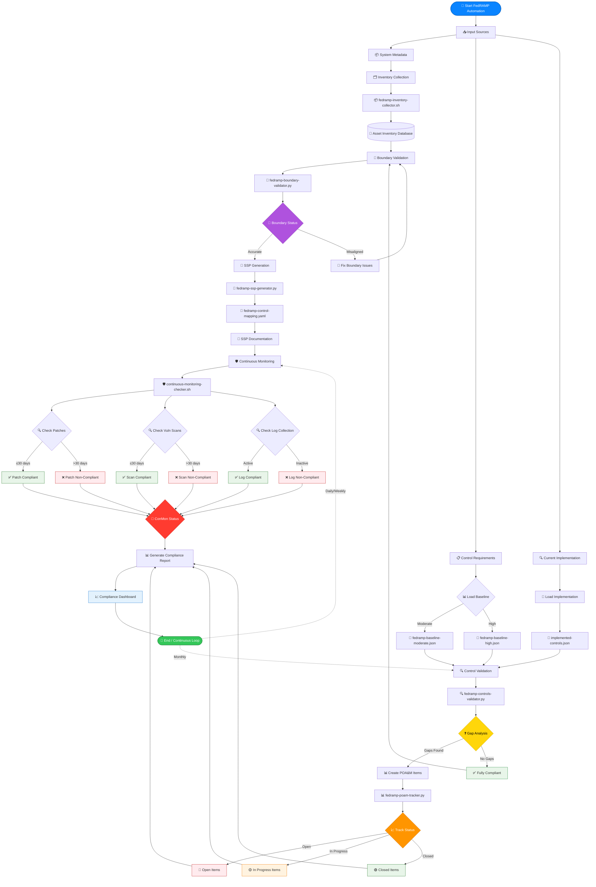
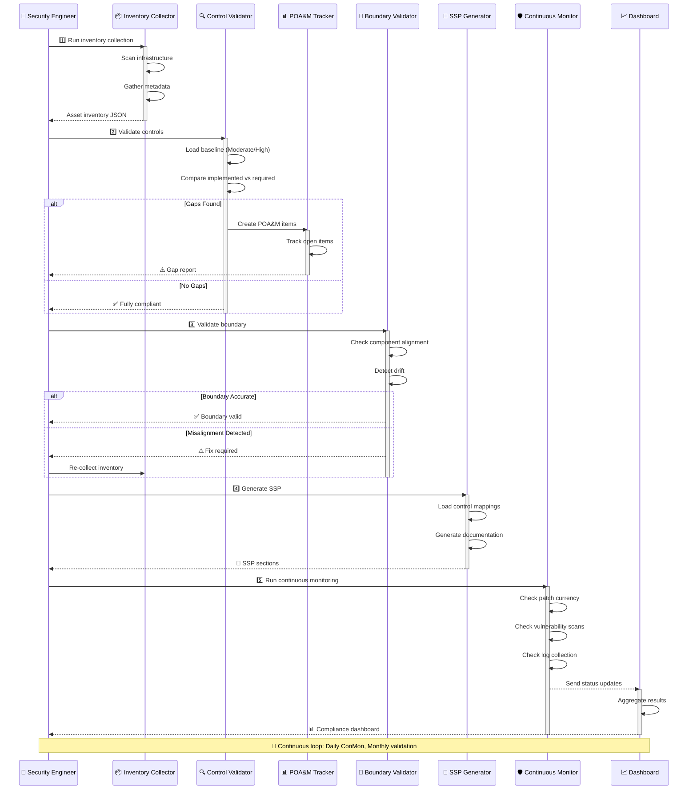
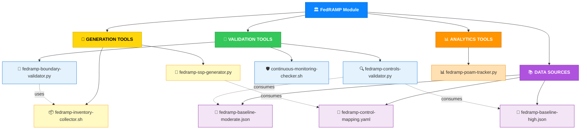

# 🏛️ FedRAMP Compliance Automation Module

  
  
  


A modular, capability‑centric automation suite for **FedRAMP Moderate/High** compliance workflows.  
This module provides **validators**, **generators**, **collectors**, and **continuous monitoring tooling** designed for repeatable, auditable, and scalable compliance operations.

---

## 🔗 Quick Links

| Resource | URL |
|----------|-----|
| 📋 **FedRAMP Baselines** | https://www.fedramp.gov |
| 📖 **NIST 800‑53 Controls** | https://csrc.nist.gov |
| 💻 **Suren Jewels GitHub** | https://github.com/Suren-Jewels |
| 🔧 **FixWare Security Engineering** | Internal Module |

---

## 🔄 Module Logic Flow


---

## 🎯 Operational Logic Explanation


---

## 🧩 Capability Matrix

<table>
<thead>
<tr>
<th>🎯 Capability</th>
<th>📝 Description</th>
<th>🎨 Status</th>
<th>🔄 Automation Level</th>
</tr>
</thead>
<tbody>
<tr style="background-color: #E3F2FD;">
<td><strong>1. Control Validation</strong></td>
<td>Validate implemented controls against FedRAMP Moderate/High baselines<br/>• Detect missing/misaligned controls<br/>• Integration with baseline JSON files</td>
<td><code>✅ Active</code></td>
<td><code>🟢 Full</code></td>
</tr>
<tr style="background-color: #F3E5F5;">
<td><strong>2. SSP Generation</strong></td>
<td>Auto‑generate SSP sections using metadata + control mappings<br/>• Consistent documentation<br/>• Consumes YAML mappings</td>
<td><code>✅ Active</code></td>
<td><code>🟢 Full</code></td>
</tr>
<tr style="background-color: #FFF3E0;">
<td><strong>3. POA&M Analytics</strong></td>
<td>Summaries of open, in‑progress, and closed POA&M items<br/>• Compliance readiness scoring<br/>• Risk trend analysis</td>
<td><code>✅ Active</code></td>
<td><code>🟡 Partial</code></td>
</tr>
<tr style="background-color: #E8F5E9;">
<td><strong>4. Continuous Monitoring</strong></td>
<td>Patch currency validation<br/>• Vulnerability scan recency<br/>• Log collection verification</td>
<td><code>✅ Active</code></td>
<td><code>🟢 Full</code></td>
</tr>
<tr style="background-color: #FCE4EC;">
<td><strong>5. Boundary Validation</strong></td>
<td>Detect missing/extraneous components<br/>• Authorization boundary accuracy<br/>• Component drift detection</td>
<td><code>✅ Active</code></td>
<td><code>🟢 Full</code></td>
</tr>
<tr style="background-color: #F1F8E9;">
<td><strong>6. Inventory Collection</strong></td>
<td>Collect system metadata<br/>• Machine‑readable JSON output<br/>• Asset discovery automation</td>
<td><code>✅ Active</code></td>
<td><code>🟢 Full</code></td>
</tr>
</tbody>
</table>

---

## 🗂️ Architecture Visualization


---

## 📂 Component Reference

<table>
<thead>
<tr>
<th>🎯 Component</th>
<th>📝 Purpose</th>
<th>🎨 Type</th>
<th>🔗 Dependencies</th>
</tr>
</thead>
<tbody>
<tr style="background-color: #E3F2FD;">
<td><code>fedramp-controls-validator.py</code></td>
<td>Validates implemented controls against baselines</td>
<td><strong>🔍 Validator</strong></td>
<td>baseline-*.json</td>
</tr>
<tr style="background-color: #F3E5F5;">
<td><code>fedramp-ssp-generator.py</code></td>
<td>Generates SSP sections using metadata + mappings</td>
<td><strong>📘 Generator</strong></td>
<td>control-mapping.yaml</td>
</tr>
<tr style="background-color: #FFF3E0;">
<td><code>fedramp-poam-tracker.py</code></td>
<td>Summarizes POA&M status and trends</td>
<td><strong>📊 Analytics</strong></td>
<td>None</td>
</tr>
<tr style="background-color: #E8F5E9;">
<td><code>continuous-monitoring-checker.sh</code></td>
<td>Validates ConMon requirements</td>
<td><strong>🛡️ Monitor</strong></td>
<td>None</td>
</tr>
<tr style="background-color: #FCE4EC;">
<td><code>fedramp-boundary-validator.py</code></td>
<td>Validates authorization boundary accuracy</td>
<td><strong>📏 Validator</strong></td>
<td>inventory-collector.sh</td>
</tr>
<tr style="background-color: #F1F8E9;">
<td><code>fedramp-inventory-collector.sh</code></td>
<td>Collects asset inventory</td>
<td><strong>📦 Collector</strong></td>
<td>None</td>
</tr>
<tr style="background-color: #EDE7F6;">
<td><code>fedramp-control-mapping.yaml</code></td>
<td>Maps controls to implementation details</td>
<td><strong>📄 Data</strong></td>
<td>N/A</td>
</tr>
<tr style="background-color: #E1F5FE;">
<td><code>fedramp-baseline-moderate.json</code></td>
<td>FedRAMP Moderate baseline</td>
<td><strong>📄 Data</strong></td>
<td>N/A</td>
</tr>
<tr style="background-color: #E0F2F1;">
<td><code>fedramp-baseline-high.json</code></td>
<td>FedRAMP High baseline</td>
<td><strong>📄 Data</strong></td>
<td>N/A</td>
</tr>
</tbody>
</table>

---

## 🚀 Usage Examples

### 🔍 Validate Controls
```bash
# Validate against Moderate baseline
python3 fedramp-controls-validator.py \
  --implemented implemented-controls.json \
  --baseline fedramp-baseline-moderate.json

# Expected output: Control gap analysis with color-coded results
```

| ✅ Result Type | 🎨 Indicator | 📝 Meaning |
|---------------|-------------|-----------|
| **Compliant** | 🟢 GREEN | All required controls implemented |
| **Partial** | 🟡 YELLOW | Some controls missing/incomplete |
| **Non-Compliant** | 🔴 RED | Critical controls missing |

---

### 📘 Generate SSP Section
```bash
# Generate SSP documentation
python3 fedramp-ssp-generator.py \
  --metadata system-metadata.json \
  --controls fedramp-control-mapping.yaml \
  --output SSP-section.md

# Output: Formatted markdown SSP section ready for review
```

---

### 🛡️ Run Continuous Monitoring Checks
```bash
# Validate ConMon compliance
./continuous-monitoring-checker.sh \
  --patch-level 14 \
  --scan-report scan.json \
  --log-status logs.json

# Checks performed:
# ✓ Patch currency (≤30 days)
# ✓ Vulnerability scan recency (≤30 days)
# ✓ Log collection status (active)
```

<table>
<thead>
<tr>
<th>🔍 Check</th>
<th>📏 Threshold</th>
<th>🎯 Requirement</th>
</tr>
</thead>
<tbody>
<tr style="background-color: #E8F5E9;">
<td>Patch Currency</td>
<td>≤ 30 days</td>
<td>FedRAMP Moderate/High</td>
</tr>
<tr style="background-color: #FFF3E0;">
<td>Vulnerability Scans</td>
<td>≤ 30 days</td>
<td>FedRAMP Moderate/High</td>
</tr>
<tr style="background-color: #E3F2FD;">
<td>Log Collection</td>
<td>Active (24/7)</td>
<td>FedRAMP Moderate/High</td>
</tr>
</tbody>
</table>

---

## 📊 Compliance Status Dashboard

<table>
<thead>
<tr>
<th>🎯 Category</th>
<th>📈 Status</th>
<th>🎨 Coverage</th>
<th>⏱️ Last Updated</th>
</tr>
</thead>
<tbody>
<tr style="background-color: #E8F5E9;">
<td><strong>AC - Access Control</strong></td>
<td>🟢 Compliant</td>
<td>100%</td>
<td>2026-01-03</td>
</tr>
<tr style="background-color: #FFF3E0;">
<td><strong>AU - Audit & Accountability</strong></td>
<td>🟡 In Progress</td>
<td>87%</td>
<td>2026-01-03</td>
</tr>
<tr style="background-color: #E3F2FD;">
<td><strong>SC - System & Communications</strong></td>
<td>🟢 Compliant</td>
<td>100%</td>
<td>2026-01-02</td>
</tr>
<tr style="background-color: #FCE4EC;">
<td><strong>IR - Incident Response</strong></td>
<td>🟡 In Progress</td>
<td>92%</td>
<td>2026-01-01</td>
</tr>
<tr style="background-color: #F3E5F5;">
<td><strong>CP - Contingency Planning</strong></td>
<td>🟢 Compliant</td>
<td>100%</td>
<td>2026-01-03</td>
</tr>
</tbody>
</table>

---

## 🏁 Summary

This module provides **end‑to‑end automation** for FedRAMP compliance workflows, enabling:

- ✅ **Consistent** security documentation
- 🔄 **Repeatable** validation processes
- 📊 **Auditable** compliance evidence
- 🎯 **Scalable** operations across Moderate and High impact systems

<table>
<thead>
<tr>
<th>🎯 Benefit</th>
<th>📝 Description</th>
</tr>
</thead>
<tbody>
<tr style="background-color: #E8F5E9;">
<td><strong>Time Savings</strong></td>
<td>Reduce manual compliance tasks by 70-85%</td>
</tr>
<tr style="background-color: #E3F2FD;">
<td><strong>Accuracy</strong></td>
<td>Eliminate human error in control validation</td>
</tr>
<tr style="background-color: #FFF3E0;">
<td><strong>Auditability</strong></td>
<td>Machine-readable evidence trails</td>
</tr>
<tr style="background-color: #F3E5F5;">
<td><strong>Scalability</strong></td>
<td>Support multiple authorization boundaries</td>
</tr>
</tbody>
</table>

---

**🔧 Maintained by:** FixWare Security Engineering  
**📅 Last Updated:** 2026-01-03  
**📊 Module Version:** 2.1.0
