# 🏛️ FedRAMP Compliance Automation Module

   

A modular, capability-centric automation suite for **FedRAMP Moderate/High** compliance workflows, providing validators, generators, collectors, and continuous monitoring tooling designed for repeatable, auditable, and scalable compliance operations.

| Resource | Link |
|----------|------|
| FedRAMP Baselines | https://www.fedramp.gov |
| NIST 800-53 Controls | https://csrc.nist.gov |
| Documentation | https://docs.fedramp.gov |
| GitHub | https://github.com/Suren-Jewels |

---

## 📊 Current Compliance Status
```
Control Implementation         [████████████████████░░░░] 85% (340/400)  ✓
SSP Documentation Coverage     [███████████████████░░░░░] 78% (312/400)  ⚠
POA&M Resolution Rate          [██████████████████░░░░░░] 72% (108/150)  ⚠
────────────────────────────────────────────────────────────────────────────
Continuous Monitoring:
  Patch Currency               [████████████████████████] 98%            ✓
  Vulnerability Scans          [███████████████████████░] 95%            ✓
  Log Collection Status        [██████████████████████░░] 92%            ✓
────────────────────────────────────────────────────────────────────────────
Boundary Validation            [████████████████████████] 100%           ✓
────────────────────────────────────────────────────────────────────────────
Control Families:
  Access Control (AC)          [████████████████████████] 96%            ✓
  Audit & Accountability (AU)  [███████████████████████░] 94%            ✓
  Security Assessment (CA)     [██████████████████░░░░░░] 82%            ⚠
  Config Management (CM)       [███████████████████████░] 91%            ✓
  Incident Response (IR)       [████████████████████░░░░] 88%            ✓
────────────────────────────────────────────────────────────────────────────
Monthly Trend:  ▃▄▅▆▆▇█  (Improving)

Risk Distribution:
  Critical: 2  |  High: 8  |  Medium: 28  |  Low: 45  |  Info: 67
```

---

## 🗂️ Module Architecture

```mermaid
graph TD
    Root[[🏛️ FedRAMP Compliance Module]]
    
    Root --> Category1[[🔍 Validators]]
    Root --> Category2[[📘 Generators]]
    Root --> Category3[[🛡️ Monitors]]
    Root --> Category4[[📋 Configuration]]
    
    Category1 --> File1[fedramp-controls-validator.py]
    Category1 --> File2[fedramp-boundary-validator.py]
    
    Category2 --> File3[fedramp-ssp-generator.py]
    Category2 --> File4[fedramp-poam-tracker.py]
    
    Category3 --> File5[continuous-monitoring-checker.sh]
    Category3 --> File6[fedramp-inventory-collector.sh]
    
    Category4 --> Config1[fedramp-control-mapping.yaml]
    Category4 --> Config2[fedramp-baseline-moderate.json]
    Category4 --> Config3[fedramp-baseline-high.json]
    
    File1 -.references.-> Config2
    File1 -.references.-> Config3
    File3 -.references.-> Config1
    
    style Category1 fill:#BBDEFB
    style Category2 fill:#FFE0B2
    style Category3 fill:#E1BEE7
    style Category4 fill:#FFF9C4
    
    style File1 fill:#2196F3,color:#fff
    style File2 fill:#2196F3,color:#fff
    style File3 fill:#FF9800,color:#fff
    style File4 fill:#FF9800,color:#fff
    style File5 fill:#9C27B0,color:#fff
    style File6 fill:#9C27B0,color:#fff
    
    style Config1 fill:#FBC02D
    style Config2 fill:#FBC02D
    style Config3 fill:#FBC02D
```


---

## 🔄 FedRAMP Compliance Workflow

```mermaid
flowchart LR
    subgraph INPUTS["📥 INPUTS"]
        I1[System Metadata<br/>JSON Format]
        I2[Implemented Controls<br/>Control List]
        I3[Asset Inventory<br/>System Components]
        I4[POA&M Data<br/>Remediation Status]
    end
    
    subgraph PROCESSING["⚙️ PROCESSING"]
        P1[Control Validation<br/>Python Engine]
        P2[SSP Generation<br/>Template Engine]
        P3[Boundary Validation<br/>Comparison Logic]
        P4[ConMon Checks<br/>Bash Scripts]
    end
    
    subgraph OUTPUTS["📤 OUTPUTS"]
        O1[Compliance Reports<br/>JSON/HTML]
        O2[SSP Sections<br/>Markdown/DOCX]
        O3[Gap Analysis<br/>Spreadsheet]
        O4[Monitoring Alerts<br/>Notifications]
    end
    
    I1 --> P1
    I2 --> P2
    I3 --> P3
    I4 --> P4
    
    P1 --> O1
    P2 --> O2
    P3 --> O3
    P4 --> O4
    
    style INPUTS fill:#E3F2FD
    style PROCESSING fill:#FFF3E0
    style OUTPUTS fill:#E8F5E9
```


---

## ⚙️ Control Validation Logic Flow

```mermaid
flowchart TD
    Start([Start Validation]) --> Step1[Load Baseline Configuration]
    Step1 --> Step2[Initialize Control Repository]
    
    Step2 --> Loop{For Each Control}
    
    Loop -->|Next Control| Decision1{Control Implemented?}
    
    Decision1 -->|No| Action1[❌ Flag Missing Control]
    Decision1 -->|Yes| Decision2{Documentation Complete?}
    
    Decision2 -->|No| Action2[⚠️ Flag Incomplete Documentation]
    Decision2 -->|Yes| Action3[✓ Mark Control Compliant]
    
    Action1 --> Collect[Collect Results]
    Action2 --> Collect
    Action3 --> Collect
    
    Collect --> MoreItems{More Controls?}
    
    MoreItems -->|Yes| Loop
    MoreItems -->|No| Generate[Generate Compliance Report]
    
    Generate --> Calculate[Calculate Coverage Metrics]
    Calculate --> Output([📄 Output Validation Results])
    
    style Start fill:#4CAF50,color:#fff
    style Output fill:#4CAF50,color:#fff
    style Action3 fill:#4CAF50,color:#fff
    style Action2 fill:#FF9800,color:#fff
    style Action1 fill:#F44336,color:#fff
    style Decision1 fill:#2196F3,color:#fff
    style Decision2 fill:#2196F3,color:#fff
    style MoreItems fill:#2196F3,color:#fff
```


---

## 🔗 System Integration


---

## 📂 File Reference Table

<table>
  <thead>
    <tr>
      <th>File</th>
      <th>Type</th>
      <th>Purpose</th>
      <th>Category</th>
    </tr>
  </thead>
  <tbody>
    <tr style="background-color: #E3F2FD;">
      <td><code>fedramp-controls-validator.py</code></td>
      <td></td>
      <td>Validates implemented controls against FedRAMP baselines</td>
      <td></td>
    </tr>
    <tr style="background-color: #E3F2FD;">
      <td><code>fedramp-boundary-validator.py</code></td>
      <td></td>
      <td>Validates authorization boundary accuracy and completeness</td>
      <td></td>
    </tr>
    <tr style="background-color: #FFF3E0;">
      <td><code>fedramp-ssp-generator.py</code></td>
      <td></td>
      <td>Auto-generates System Security Plan sections from templates</td>
      <td></td>
    </tr>
    <tr style="background-color: #FFF3E0;">
      <td><code>fedramp-poam-tracker.py</code></td>
      <td></td>
      <td>Tracks and analyzes Plan of Action & Milestones status</td>
      <td></td>
    </tr>
    <tr style="background-color: #F3E5F5;">
      <td><code>continuous-monitoring-checker.sh</code></td>
      <td></td>
      <td>Validates continuous monitoring requirements (patches, scans, logs)</td>
      <td></td>
    </tr>
    <tr style="background-color: #F3E5F5;">
      <td><code>fedramp-inventory-collector.sh</code></td>
      <td></td>
      <td>Collects system asset inventory and metadata</td>
      <td></td>
    </tr>
    <tr style="background-color: #FFF9C4;">
      <td><code>fedramp-control-mapping.yaml</code></td>
      <td></td>
      <td>Maps controls to system implementation details</td>
      <td></td>
    </tr>
    <tr style="background-color: #FFF9C4;">
      <td><code>fedramp-baseline-moderate.json</code></td>
      <td></td>
      <td>FedRAMP Moderate impact baseline control definitions</td>
      <td></td>
    </tr>
    <tr style="background-color: #FFF9C4;">
      <td><code>fedramp-baseline-high.json</code></td>
      <td></td>
      <td>FedRAMP High impact baseline control definitions</td>
      <td></td>
    </tr>
    <tr style="background-color: #EEEEEE;">
      <td><code>README.md</code></td>
      <td></td>
      <td>Comprehensive module documentation and usage guide</td>
      <td></td>
    </tr>
  </tbody>
</table>

---

## 🚀 Usage Examples

### Validate Controls Against Moderate Baseline
```bash
python3 fedramp-controls-validator.py \
  --implemented implemented-controls.json \
  --baseline fedramp-baseline-moderate.json \
  --output validation-report.html
```

### Generate SSP Section with Mappings
```bash
python3 fedramp-ssp-generator.py \
  --metadata system-metadata.json \
  --controls fedramp-control-mapping.yaml \
  --template ac-family-template.md \
  --output SSP-AC-section.md
```

### Run Continuous Monitoring Validation
```bash
./continuous-monitoring-checker.sh \
  --patch-level 14 \
  --scan-report vulnerability-scan.json \
  --log-status log-collection-status.json \
  --output conmon-report.txt
```

### Validate Authorization Boundary
```bash
python3 fedramp-boundary-validator.py \
  --inventory inventory.json \
  --boundary-definition boundary.yaml \
  --output boundary-validation.json
```

### Collect System Inventory
```bash
./fedramp-inventory-collector.sh \
  --system-id SYS-12345 \
  --output-format json \
  --output system-inventory.json
```

---

This module provides **end-to-end automation** for FedRAMP compliance workflows, enabling consistent control validation, automated documentation generation, and continuous monitoring across Moderate and High impact systems for repeatable, auditable security operations.

---

**Built for FedRAMP Cloud Security | Maintained by Suren Jewels**

[](https://github.com/Suren-Jewels)
