# 🏛️ FedRAMP Compliance Automation Module

   

A modular, capability-centric automation suite for **DoD Impact Level 4 and Impact Level 5** compliance workflows. This module provides **validators**, **auditors**, **classifiers**, and **continuous monitoring tooling** designed for repeatable, auditable, and scalable compliance operations handling Controlled Unclassified Information (CUI).

---

## 🔗 Quick Links

| Resource | URL |
|----------|-----|
| 📋 **DoD Impact Levels** | https://public.cyber.mil/dccs/dccs-documents/ |
| 🔐 **CUI Program** | https://www.archives.gov/cui |
| 📖 **NIST 800-171** | https://csrc.nist.gov/publications/detail/sp/800-171/rev-2/final |
| 💻 **Suren Jewels GitHub** | https://github.com/Suren-Jewels |

---

## 📊 Current Compliance Status
```
IL4 Control Implementation    [████████████████░░░░] 82% (140/170) ✓
IL5 Control Implementation    [███████████░░░░░░░░░] 58% (139/240) ⚠

Security Posture:
  Encryption (FIPS 140-2)     [████████████████████] 100% ✓
  Firewall Rules              [███████████████████░] 95% ✓
  Antivirus Coverage          [██████████████████░░] 90% ✓
  MFA Enforcement             [█████████████████░░░] 85% ⚠
  OS Patching                 [███████████████░░░░░] 75% ⚠

CUI Classification Coverage   [███████████████░░░░░] 78% ⚠

Boundary Validation:
  GCC High Enclave            [████████████████████] 100% ✓
  DoD Cloud                   [███████████████████░] 95% ✓
  NSC Boundary                [██████████████████░░] 90% ✓

Monthly Trend: ▁▂▃▅▆▇█ (Improving)

Risk Distribution:
  🟢 Low Risk:      45%
  🟡 Medium Risk:   38%
  🔴 High Risk:     12%
  ⚫ Critical Risk:  5%
```

---

## 🗂️ Module Architecture

```mermaid
flowchart TD
    A[🔐 <strong>IL4-IL5 Module</strong>] --> B[🔍 <strong>COMPLIANCE CHECKERS</strong>]
    A --> C[✅ <strong>VALIDATORS</strong>]
    A --> D[🔎 <strong>AUDITORS</strong>]
    A --> E[📚 <strong>CONFIGURATION</strong>]
    
    B --> B1[🔍 il4-compliance-checker.py]
    B --> B2[🔍 il5-compliance-checker.py]
    
    C --> C1[✅ il-posture-validator.py]
    C --> C2[✅ encryption-validator.sh]
    C --> C3[✅ gcc-nsc-boundary-check.sh]
    C --> C4[✅ cui-data-classifier.py]
    
    D --> D1[🔎 mfa-enforcement-audit.ps1]
    D --> D2[🔎 access-control-audit.py]
    
    E --> E1[📄 il4-control-matrix.yaml]
    E --> E2[📄 il5-control-matrix.yaml]
    E --> E3[📄 cui-handling-procedures.md]
    
    B1 -.->|references| E1
    B2 -.->|references| E2
    C4 -.->|references| E3
    C1 -.->|uses| C2
    C3 -.->|validates| E1
    C3 -.->|validates| E2
    
    style A fill:#0A84FF,stroke:#005BBB,color:#fff
    style B fill:#34C759,stroke:#248A3D,color:#fff
    style C fill:#FFD60A,stroke:#C7A100,color:#000
    style D fill:#AF52DE,stroke:#7D3BAB,color:#fff
    style E fill:#FF9500,stroke:#C76800,color:#fff
    
    style B1 fill:#E3F2FD,stroke:#1976D2
    style B2 fill:#E3F2FD,stroke:#1976D2
    style C1 fill:#FFF9C4,stroke:#F9A825
    style C2 fill:#FFF9C4,stroke:#F9A825
    style C3 fill:#FFF9C4,stroke:#F9A825
    style C4 fill:#FFF9C4,stroke:#F9A825
    style D1 fill:#F3E5F5,stroke:#8E24AA
    style D2 fill:#F3E5F5,stroke:#8E24AA
    style E1 fill:#FFE0B2,stroke:#FB8C00
    style E2 fill:#FFE0B2,stroke:#FB8C00
    style E3 fill:#FFE0B2,stroke:#FB8C00
```


---

## 🔄 Compliance Workflow

```mermaid
flowchart LR
    subgraph INPUTS["📥 INPUTS"]
        I1[📋 IL4/IL5 Control Matrices]
        I2[⚙️ Device Configurations]
        I3[👥 User Account Data]
        I4[🔐 Cipher Configurations]
    end
    
    subgraph PROCESSING["⚙️ PROCESSING"]
        P1[🔍 Control Validation Engine]
        P2[🔎 Security Audit Engine]
        P3[🏷️ CUI Classification Engine]
        P4[📏 Boundary Validation Engine]
    end
    
    subgraph OUTPUTS["📤 OUTPUTS"]
        O1[📊 Compliance Reports]
        O2[⚠️ Gap Analysis Findings]
        O3[📈 Compliance Metrics]
        O4[📝 Audit Logs]
    end
    
    I1 --> P1
    I2 --> P1
    I2 --> P2
    I3 --> P2
    I4 --> P1
    
    P1 --> P4
    P2 --> O2
    P3 --> O1
    P4 --> O1
    
    P1 --> O1
    P1 --> O2
    P2 --> O3
    P3 --> O3
    P4 --> O3
    
    P1 --> O4
    P2 --> O4
    P3 --> O4
    P4 --> O4
    
    style INPUTS fill:#E3F2FD,stroke:#1976D2
    style PROCESSING fill:#FFF3E0,stroke:#F57C00
    style OUTPUTS fill:#E8F5E9,stroke:#388E3C
```


---

## ⚙️ Validation Logic Flow

```mermaid
flowchart TB
    Start([🚀 Start Validation]) --> LoadMatrix[📋 Load Control Matrix]
    LoadMatrix --> LoadDevice[⚙️ Load Device Config]
    LoadDevice --> Iterate{🔄 For Each Control}
    
    Iterate -->|Next Control| CheckExists{❓ Control Implemented?}
    CheckExists -->|No| RecordGap[❌ Record Gap]
    CheckExists -->|Yes| CheckStandard{✅ Meets Standard?}
    
    CheckStandard -->|No| RecordPartial[⚠️ Record Partial Compliance]
    CheckStandard -->|Yes| RecordPass[✓ Record Compliant]
    
    RecordGap --> NextControl{🔄 More Controls?}
    RecordPartial --> NextControl
    RecordPass --> NextControl
    
    NextControl -->|Yes| Iterate
    NextControl -->|No| GenerateReport[📊 Generate Report]
    
    GenerateReport --> CalcMetrics[📈 Calculate Metrics]
    CalcMetrics --> CreateFindings[📝 Create Findings]
    CreateFindings --> ExportResults[💾 Export Results]
    ExportResults --> End([🏁 End])
    
    style Start fill:#0A84FF,stroke:#005BBB,color:#fff
    style End fill:#34C759,stroke:#248A3D,color:#fff
    style CheckExists fill:#FFD60A,stroke:#C7A100,color:#000
    style CheckStandard fill:#FFD60A,stroke:#C7A100,color:#000
    style RecordGap fill:#FFEBEE,stroke:#C62828
    style RecordPartial fill:#FFF3E0,stroke:#F57C00
    style RecordPass fill:#E8F5E9,stroke:#2E7D32
    style GenerateReport fill:#E3F2FD,stroke:#1976D2
```


---

## 🔗 System Integration

```mermaid
sequenceDiagram
    participant User as 👤 Security Engineer
    participant Script as 🔍 Validation Script
    participant API as 🌐 DoD Cloud API
    participant DB as 💾 Compliance Database
    
    User->>Script: 1️⃣ Execute compliance check
    activate Script
    
    Note over Script: 🔐 Authentication required
    Script->>API: Request auth token
    API-->>Script: Return JWT token
    
    Script->>API: 2️⃣ Fetch control baselines
    activate API
    API-->>Script: Return IL4/IL5 controls
    deactivate API
    
    Script->>Script: 3️⃣ Validate configurations
    
    Note over Script,DB: 💾 Cache results for 24h
    Script->>DB: Store validation results
    activate DB
    DB-->>Script: Confirmation
    deactivate DB
    
    Script->>Script: 4️⃣ Generate findings report
    Script-->>User: Return compliance report
    deactivate Script
    
    User->>DB: Query historical metrics
    activate DB
    DB-->>User: Return trend analysis
    deactivate DB
```


---

## 📂 File Reference Table

<table>
<thead>
<tr>
<th>File</th>
<th>Type</th>
<th>Purpose</th>
<th>Impact Level</th>
</tr>
</thead>
<tbody>
<tr style="background-color: #E3F2FD;">
<td><code>il4-compliance-checker.py</code></td>
<td><span style="background-color: #2196F3; color: white; padding: 2px 6px; border-radius: 3px;">Python</span></td>
<td>Validates IL4 controls against baseline requirements</td>
<td><span style="background-color: #0A84FF; color: white; padding: 2px 6px; border-radius: 3px;">IL4</span></td>
</tr>
<tr style="background-color: #FFFFFF;">
<td><code>il5-compliance-checker.py</code></td>
<td><span style="background-color: #2196F3; color: white; padding: 2px 6px; border-radius: 3px;">Python</span></td>
<td>Validates IL5 controls against baseline requirements</td>
<td><span style="background-color: #FF3B30; color: white; padding: 2px 6px; border-radius: 3px;">IL5</span></td>
</tr>
<tr style="background-color: #FFF9C4;">
<td><code>cui-data-classifier.py</code></td>
<td><span style="background-color: #2196F3; color: white; padding: 2px 6px; border-radius: 3px;">Python</span></td>
<td>Classifies data as CUI vs NON-CUI using pattern matching</td>
<td><span style="background-color: #FFD60A; color: black; padding: 2px 6px; border-radius: 3px;">BOTH</span></td>
</tr>
<tr style="background-color: #E3F2FD;">
<td><code>gcc-nsc-boundary-check.sh</code></td>
<td><span style="background-color: #34C759; color: white; padding: 2px 6px; border-radius: 3px;">Bash</span></td>
<td>Validates GCC High and NSC enclave boundaries</td>
<td><span style="background-color: #FFD60A; color: black; padding: 2px 6px; border-radius: 3px;">BOTH</span></td>
</tr>
<tr style="background-color: #FFFFFF;">
<td><code>il-posture-validator.py</code></td>
<td><span style="background-color: #2196F3; color: white; padding: 2px 6px; border-radius: 3px;">Python</span></td>
<td>Validates device posture: encryption, firewall, AV, MFA, OS patches</td>
<td><span style="background-color: #FFD60A; color: black; padding: 2px 6px; border-radius: 3px;">BOTH</span></td>
</tr>
<tr style="background-color: #FCE4EC;">
<td><code>mfa-enforcement-audit.ps1</code></td>
<td><span style="background-color: #2196F3; color: white; padding: 2px 6px; border-radius: 3px;">PowerShell</span></td>
<td>Audits MFA enforcement status across all user accounts</td>
<td><span style="background-color: #FFD60A; color: black; padding: 2px 6px; border-radius: 3px;">BOTH</span></td>
</tr>
<tr style="background-color: #E3F2FD;">
<td><code>encryption-validator.sh</code></td>
<td><span style="background-color: #34C759; color: white; padding: 2px 6px; border-radius: 3px;">Bash</span></td>
<td>Validates FIPS 140-2 approved encryption algorithms</td>
<td><span style="background-color: #FFD60A; color: black; padding: 2px 6px; border-radius: 3px;">BOTH</span></td>
</tr>
<tr style="background-color: #FFFFFF;">
<td><code>access-control-audit.py</code></td>
<td><span style="background-color: #2196F3; color: white; padding: 2px 6px; border-radius: 3px;">Python</span></td>
<td>Audits RBAC policies and privilege assignments</td>
<td><span style="background-color: #FFD60A; color: black; padding: 2px 6px; border-radius: 3px;">BOTH</span></td>
</tr>
<tr style="background-color: #EEEEEE;">
<td><code>il4-control-matrix.yaml</code></td>
<td><span style="background-color: #9E9E9E; color: white; padding: 2px 6px; border-radius: 3px;">Config</span></td>
<td>IL4 control requirements baseline (170 controls)</td>
<td><span style="background-color: #0A84FF; color: white; padding: 2px 6px; border-radius: 3px;">IL4</span></td>
</tr>
<tr style="background-color: #EEEEEE;">
<td><code>il5-control-matrix.yaml</code></td>
<td><span style="background-color: #9E9E9E; color: white; padding: 2px 6px; border-radius: 3px;">Config</span></td>
<td>IL5 control requirements baseline (240 controls)</td>
<td><span style="background-color: #FF3B30; color: white; padding: 2px 6px; border-radius: 3px;">IL5</span></td>
</tr>
<tr style="background-color: #EEEEEE;">
<td><code>cui-handling-procedures.md</code></td>
<td><span style="background-color: #9E9E9E; color: white; padding: 2px 6px; border-radius: 3px;">Config</span></td>
<td>CUI marking, handling, and storage procedures</td>
<td><span style="background-color: #FFD60A; color: black; padding: 2px 6px; border-radius: 3px;">BOTH</span></td>
</tr>
</tbody>
</table>

---

## 🏁 Summary

This module provides **end-to-end automation** for DoD Impact Level 4 and Impact Level 5 compliance, enabling consistent security validation, repeatable audit processes, and comprehensive CUI handling across defense enclaves. The toolkit streamlines compliance operations through automated control validation, security posture assessment, and boundary verification.

---

**Built for DoD Impact Level Compliance** | **Maintained by Suren Jewels**

[](https://github.com/Suren-Jewels)
