# 🏛️ FedRAMP Compliance Automation Module

   

A modular, capability-centric automation suite for **DoD Impact Level 4 (IL4)** and **Impact Level 5 (IL5)** compliance workflows. This module provides validators, auditors, classifiers, and continuous monitoring tooling designed for repeatable, auditable, and scalable compliance operations.

---

## 🔗 Quick Links

| Resource | Link |
|----------|------|
| **DoD Impact Levels** | https://dl.dod.cyber.mil/wp-content/uploads/cloud/SRG/index.html |
| **CUI Program** | https://www.archives.gov/cui |
| **NIST 800-171** | https://csrc.nist.gov/publications/detail/sp/800-171/rev-2/final |
| **Suren Jewels GitHub** | https://github.com/Suren-Jewels |

---

## 📊 Current Compliance Status
```
IL4 Control Implementation      [████████████████████░░░░] 82% (140/170) ✓
IL5 Control Implementation      [███████████████░░░░░░░░░] 58% (139/240) ⚠
────────────────────────────────────────────────────────────────────────────
Security Posture:
  Encryption (FIPS-Approved)    [████████████████████████] 100%         ✓
  Firewall Configuration        [███████████████████████░] 95%          ✓
  Antivirus Protection          [██████████████████████░░] 90%          ✓
  MFA Enforcement               [████████████████████░░░░] 85%          ✓
  OS Patching Currency          [██████████████████░░░░░░] 75%          ⚠
────────────────────────────────────────────────────────────────────────────
CUI Classification Coverage     [███████████████████░░░░░] 78%          ✓
────────────────────────────────────────────────────────────────────────────
Boundary Validation:
  GCC High Enclave              [████████████████████████] 100%         ✓
  DoD Cloud Environment         [███████████████████████░] 95%          ✓
  NSC Boundary Compliance       [██████████████████████░░] 90%          ✓
────────────────────────────────────────────────────────────────────────────
Monthly Trend:  ▁▂▃▅▆▇█  (Improving)

Risk Distribution:
  Critical: 3  |  High: 12  |  Medium: 24  |  Low: 8  |  Info: 15
```

---

## 🗂️ Module Architecture

```mermaid
graph TD
    Root[🔐 IL4-IL5 Compliance Module]
    
    Root --> Checkers[🔍 Compliance Checkers]
    Root --> Validators[✓ Security Validators]
    Root --> Auditors[📋 Audit Tools]
    Root --> Config[⚙️ Configuration Files]
    
    Checkers --> C1[il4-compliance-checker.py]
    Checkers --> C2[il5-compliance-checker.py]
    Checkers --> C3[gcc-nsc-boundary-check.sh]
    
    Validators --> V1[il-posture-validator.py]
    Validators --> V2[cui-data-classifier.py]
    Validators --> V3[encryption-validator.sh]
    
    Auditors --> A1[mfa-enforcement-audit.ps1]
    Auditors --> A2[access-control-audit.py]
    
    Config --> CF1[il4-control-matrix.yaml]
    Config --> CF2[il5-control-matrix.yaml]
    Config --> CF3[cui-handling-procedures.md]
    
    C1 -.references.-> CF1
    C2 -.references.-> CF2
    V2 -.references.-> CF3
    
    style Checkers fill:#BBDEFB
    style Validators fill:#FFE0B2
    style Auditors fill:#E1BEE7
    style Config fill:#FFF9C4
    
    style C1 fill:#2196F3,color:#fff
    style C2 fill:#2196F3,color:#fff
    style C3 fill:#2196F3,color:#fff
    
    style V1 fill:#FF9800,color:#fff
    style V2 fill:#FF9800,color:#fff
    style V3 fill:#FF9800,color:#fff
    
    style A1 fill:#9C27B0,color:#fff
    style A2 fill:#9C27B0,color:#fff
    
    style CF1 fill:#FBC02D
    style CF2 fill:#FBC02D
    style CF3 fill:#FBC02D
```


---

## 🔄 Compliance Workflow

```mermaid
flowchart LR
    subgraph INPUTS["📥 INPUTS"]
        I1[Control Matrices<br/>IL4/IL5 Baselines]
        I2[Device Configurations<br/>Security Settings]
        I3[User Data<br/>Access Records]
        I4[Cipher Configs<br/>FIPS Standards]
    end
    
    subgraph PROCESSING["⚙️ PROCESSING"]
        P1[Control Validation<br/>Engine]
        P2[Security Auditing<br/>Engine]
        P3[CUI Classification<br/>Engine]
        P4[Boundary Validation<br/>Engine]
    end
    
    subgraph OUTPUTS["📤 OUTPUTS"]
        O1[Compliance Reports<br/>IL4/IL5 Status]
        O2[Security Findings<br/>Vulnerabilities]
        O3[Metrics Dashboard<br/>KPIs & Trends]
        O4[Audit Logs<br/>Activity Records]
    end
    
    I1 --> P1
    I2 --> P2
    I3 --> P3
    I4 --> P4
    
    P1 --> O1
    P2 --> O2
    P3 --> O3
    P4 --> O4
    
    style INPUTS fill:#E3F2FD
    style PROCESSING fill:#FFF3E0
    style OUTPUTS fill:#E8F5E9
```


---

## ⚙️ Validation Logic Flow

```mermaid
flowchart TD
    Start([Start Validation]) --> LoadBaseline[Load Control Baseline]
    LoadBaseline --> LoadImplemented[Load Implemented Controls]
    
    LoadImplemented --> IterateControls{For Each Control}
    
    IterateControls -->|Next Control| CheckExists{Control<br/>Implemented?}
    
    CheckExists -->|No| MarkMissing[❌ Mark as Missing]
    CheckExists -->|Yes| CheckStandard{Meets IL4/IL5<br/>Standard?}
    
    CheckStandard -->|No| MarkNonCompliant[⚠️ Mark as Non-Compliant]
    CheckStandard -->|Yes| MarkCompliant[✓ Mark as Compliant]
    
    MarkMissing --> CollectFindings[Collect Findings]
    MarkNonCompliant --> CollectFindings
    MarkCompliant --> CollectFindings
    
    CollectFindings --> MoreControls{More<br/>Controls?}
    
    MoreControls -->|Yes| IterateControls
    MoreControls -->|No| GenerateReport[Generate Compliance Report]
    
    GenerateReport --> CalculateMetrics[Calculate Compliance %]
    CalculateMetrics --> OutputResults([📄 Output Results])
    
    style Start fill:#4CAF50,color:#fff
    style OutputResults fill:#4CAF50,color:#fff
    style MarkCompliant fill:#4CAF50,color:#fff
    style MarkNonCompliant fill:#FF9800,color:#fff
    style MarkMissing fill:#F44336,color:#fff
    style CheckExists fill:#2196F3,color:#fff
    style CheckStandard fill:#2196F3,color:#fff
    style MoreControls fill:#2196F3,color:#fff
```


---

## 🔗 System Integration


---

## 📂 File Reference Table

<table>
  <thead>
    <tr>
      <th>File</th>
      <th>Type</th>
      <th>Purpose</th>
      <th>Impact Level</th>
    </tr>
  </thead>
  <tbody>
    <tr style="background-color: #E3F2FD;">
      <td><code>il4-compliance-checker.py</code></td>
      <td></td>
      <td>Validates IL4 controls against baseline requirements</td>
      <td></td>
    </tr>
    <tr style="background-color: #E3F2FD;">
      <td><code>il5-compliance-checker.py</code></td>
      <td></td>
      <td>Validates IL5 controls against baseline requirements</td>
      <td></td>
    </tr>
    <tr style="background-color: #FFF9C4;">
      <td><code>cui-data-classifier.py</code></td>
      <td></td>
      <td>Classifies data as CUI vs NON-CUI content</td>
      <td></td>
    </tr>
    <tr style="background-color: #F3E5F5;">
      <td><code>gcc-nsc-boundary-check.sh</code></td>
      <td></td>
      <td>Validates GCC High/NSC enclave boundary compliance</td>
      <td></td>
    </tr>
    <tr style="background-color: #E8F5E9;">
      <td><code>il-posture-validator.py</code></td>
      <td></td>
      <td>Validates device security posture (encryption, firewall, AV, MFA, OS patching)</td>
      <td></td>
    </tr>
    <tr style="background-color: #FCE4EC;">
      <td><code>mfa-enforcement-audit.ps1</code></td>
      <td></td>
      <td>Audits MFA enforcement policies across user accounts</td>
      <td></td>
    </tr>
    <tr style="background-color: #FFF3E0;">
      <td><code>encryption-validator.sh</code></td>
      <td></td>
      <td>Validates FIPS 140-2/140-3 approved encryption algorithms</td>
      <td></td>
    </tr>
    <tr style="background-color: #E0F7FA;">
      <td><code>access-control-audit.py</code></td>
      <td></td>
      <td>Audits RBAC policies and privilege assignments</td>
      <td></td>
    </tr>
    <tr style="background-color: #EEEEEE;">
      <td><code>il4-control-matrix.yaml</code></td>
      <td></td>
      <td>IL4 control requirements baseline (170 controls)</td>
      <td></td>
    </tr>
    <tr style="background-color: #EEEEEE;">
      <td><code>il5-control-matrix.yaml</code></td>
      <td></td>
      <td>IL5 control requirements baseline (240 controls)</td>
      <td></td>
    </tr>
    <tr style="background-color: #EEEEEE;">
      <td><code>cui-handling-procedures.md</code></td>
      <td></td>
      <td>Controlled Unclassified Information handling guidelines</td>
      <td></td>
    </tr>
  </tbody>
</table>

---

## 🏁 Summary

This module provides end-to-end automation for DoD Impact Level 4 and Impact Level 5 compliance workflows, enabling consistent, auditable, and repeatable security validation across DoD Cloud environments. The suite covers control validation, CUI classification, boundary checks, security posture assessment, and continuous monitoring capabilities required for GCC High and NSC enclave operations.

---

**Built for DoD Impact Level Compliance | Maintained by Suren Jewels**

[](https://github.com/Suren-Jewels)
