# 🏛️ FedRAMP Compliance Automation Module

   

**Automated FedRAMP compliance validation and documentation toolkit for Moderate and High baseline authorization, featuring continuous monitoring, control validation, System Security Plan generation, and POA&M tracking.**

| Resource | Link |
|----------|------|
| FedRAMP.gov | https://www.fedramp.gov/ |
| NIST 800-53 Controls | https://csrc.nist.gov/publications/detail/sp/800-53/rev-5/final |
| FedRAMP Automation | https://automate.fedramp.gov/ |
| GitHub Repository | https://github.com/Suren-Jewels/Scripts-Toolkit |

---

## 📊 Current FedRAMP Compliance Status
```
Moderate Baseline Implementation  [████████████████████░░░░] 83% (299/361) ✓
High Baseline Implementation      [███████████████░░░░░░░░░] 64% (317/495) ⚠
────────────────────────────────────────────────────────────────────────────
Access Control (AC):
  Moderate Controls               [████████████████████████] 95% (19/20)   ✓
  High Controls                   [███████████████████████░] 92% (23/25)   ✓
  Implementation Evidence         [██████████████████████░░] 88% (22/25)   ✓
────────────────────────────────────────────────────────────────────────────
Continuous Monitoring             [███████████████████░░░░░] 78% (14/18)   ⚠
────────────────────────────────────────────────────────────────────────────
System & Services (SA):
  Moderate Controls               [████████████████████████] 100% (16/16)  ✓
  High Controls                   [███████████████████████░] 95% (21/22)   ✓
────────────────────────────────────────────────────────────────────────────
Monthly Trend:  ▁▃▅▆▇▇█  (Improving)

POA&M Distribution:
  Open: 47  |  In Progress: 23  |  Overdue: 8  |  Closed: 142  |  Total: 220
```

---

## 🗂️ Module Architecture

```mermaid
graph TD
    Root[[🏛️ FedRAMP Compliance]]
    
    Root --> Category1[[🔍 Validators]]
    Root --> Category2[[📝 Generators]]
    Root --> Category3[[📊 Trackers]]
    Root --> Category4[[⚙️ Configuration]]
    
    Category1 --> File1[fedramp-controls-validator.py]
    Category1 --> File2[fedramp-boundary-validator.py]
    Category1 --> File3[continuous-monitoring-checker.sh]
    
    Category2 --> File4[fedramp-ssp-generator.py]
    Category2 --> File5[fedramp-inventory-collector.sh]
    
    Category3 --> File6[fedramp-poam-tracker.py]
    
    Category4 --> Config1[fedramp-control-mapping.yaml]
    Category4 --> Config2[fedramp-baseline-moderate.json]
    Category4 --> Config3[fedramp-baseline-high.json]
    
    File1 -.references.-> Config1
    File1 -.references.-> Config2
    File1 -.references.-> Config3
    File2 -.references.-> Config1
    File4 -.references.-> Config1
    File6 -.references.-> Config1
    
    style Category1 fill:#BBDEFB
    style Category2 fill:#FFE0B2
    style Category3 fill:#E1BEE7
    style Category4 fill:#FFF9C4
    
    style File1 fill:#2196F3,color:#fff
    style File2 fill:#2196F3,color:#fff
    style File3 fill:#2196F3,color:#fff
    style File4 fill:#FF9800,color:#fff
    style File5 fill:#FF9800,color:#fff
    style File6 fill:#9C27B0,color:#fff
    
    style Config1 fill:#FBC02D
    style Config2 fill:#FBC02D
    style Config3 fill:#FBC02D
```


---

## 🔄 FedRAMP Authorization Workflow
```mermaid
flowchart LR
    subgraph INPUTS["📥 INPUTS"]
        I1[NIST 800-53<br/>Control Baselines]
        I2[System Architecture<br/>Documentation]
        I3[Asset Inventory<br/>& Configuration]
        I4[Security Policies<br/>& Procedures]
    end
    
    subgraph PROCESSING["⚙️ PROCESSING"]
        P1[Control Validation<br/>Python Engine]
        P2[SSP Generation<br/>Template Engine]
        P3[POA&M Tracking<br/>Compliance Monitor]
        P4[ConMon Validation<br/>Bash Scanner]
    end
    
    subgraph OUTPUTS["📤 OUTPUTS"]
        O1[Control Compliance<br/>Reports (JSON/PDF)]
        O2[System Security Plan<br/>Sections (DOCX)]
        O3[POA&M Dashboard<br/>(HTML/Excel)]
        O4[ConMon Status<br/>Report (Markdown)]
    end
    
    I1 --> P1
    I2 --> P2
    I3 --> P3
    I4 --> P4
    
    P1 --> O1
    P2 --> O2
    P3 --> O3
    P4 --> O4
    
    style INPUTS fill:#E3F2FD
    style PROCESSING fill:#FFF3E0
    style OUTPUTS fill:#E8F5E9
```

---

## ⚙️ Control Validation Logic Flow

```mermaid
flowchart TD
    Start([Start Validation]) --> Step1[Load FedRAMP Baseline]
    Step1 --> Step2[Initialize Control Matrix]
    
    Step2 --> Loop{For Each Control}
    
    Loop -->|Next Control| Decision1{Evidence Exists?}
    
    Decision1 -->|No| Action1[❌ Mark as Not Implemented]
    Decision1 -->|Yes| Decision2{Evidence Complete?}
    
    Decision2 -->|No| Action2[⚠️ Mark as Partial Implementation]
    Decision2 -->|Yes| Decision3{Testing Passed?}
    
    Decision3 -->|No| Action3[⚠️ Mark as Implementation Gap]
    Decision3 -->|Yes| Action4[✓ Mark as Compliant]
    
    Action1 --> Collect[Collect Validation Results]
    Action2 --> Collect
    Action3 --> Collect
    Action4 --> Collect
    
    Collect --> MoreControls{More Controls?}
    
    MoreControls -->|Yes| Loop
    MoreControls -->|No| Generate[Generate Compliance Report]
    
    Generate --> Calculate[Calculate Baseline Percentages]
    Calculate --> POAMCheck{Gaps Found?}
    
    POAMCheck -->|Yes| CreatePOAM[Create POA&M Items]
    POAMCheck -->|No| Output([📄 Final Report])
    
    CreatePOAM --> Output
    
    style Start fill:#4CAF50,color:#fff
    style Output fill:#4CAF50,color:#fff
    style Action4 fill:#4CAF50,color:#fff
    style Action2 fill:#FF9800,color:#fff
    style Action3 fill:#FF9800,color:#fff
    style Action1 fill:#F44336,color:#fff
    style Decision1 fill:#2196F3,color:#fff
    style Decision2 fill:#2196F3,color:#fff
    style Decision3 fill:#2196F3,color:#fff
    style MoreControls fill:#2196F3,color:#fff
    style POAMCheck fill:#2196F3,color:#fff
```


---

## 🔗 System Integration


---

## 📂 File Reference Table

<table>
  <thead>
    <tr>
      <th>File</th>
      <th>Type</th>
      <th>Purpose</th>
      <th>Baseline Coverage</th>
    </tr>
  </thead>
  <tbody>
    <tr style="background-color: #E3F2FD;">
      <td><code>fedramp-controls-validator.py</code></td>
      <td></td>
      <td>Validates NIST 800-53 control implementation against FedRAMP baseline requirements with evidence mapping</td>
      <td></td>
    </tr>
    <tr style="background-color: #FFF9C4;">
      <td><code>fedramp-ssp-generator.py</code></td>
      <td></td>
      <td>Auto-generates System Security Plan sections including control tables, narratives, and appendices</td>
      <td></td>
    </tr>
    <tr style="background-color: #F3E5F5;">
      <td><code>fedramp-poam-tracker.py</code></td>
      <td></td>
      <td>Tracks Plan of Action & Milestones with risk scoring, remediation timelines, and status dashboards</td>
      <td></td>
    </tr>
    <tr style="background-color: #E3F2FD;">
      <td><code>continuous-monitoring-checker.sh</code></td>
      <td></td>
      <td>Validates continuous monitoring (ConMon) requirements including scan frequency, log collection, and alerting</td>
      <td></td>
    </tr>
    <tr style="background-color: #E3F2FD;">
      <td><code>fedramp-boundary-validator.py</code></td>
      <td></td>
      <td>Validates authorization boundary definition, network diagrams, and data flow documentation</td>
      <td></td>
    </tr>
    <tr style="background-color: #FFF3E0;">
      <td><code>fedramp-inventory-collector.sh</code></td>
      <td></td>
      <td>Collects comprehensive asset inventory including hardware, software, services, and configurations</td>
      <td></td>
    </tr>
    <tr style="background-color: #E8F5E9;">
      <td><code>fedramp-control-mapping.yaml</code></td>
      <td></td>
      <td>Maps NIST 800-53 controls to implementation responsibilities, evidence artifacts, and testing procedures</td>
      <td></td>
    </tr>
    <tr style="background-color: #E8F5E9;">
      <td><code>fedramp-baseline-moderate.json</code></td>
      <td></td>
      <td>Complete FedRAMP Moderate baseline control set (325 controls) with implementation requirements</td>
      <td></td>
    </tr>
    <tr style="background-color: #E8F5E9;">
      <td><code>fedramp-baseline-high.json</code></td>
      <td></td>
      <td>Complete FedRAMP High baseline control set (421 controls) with enhanced security requirements</td>
      <td></td>
    </tr>
  </tbody>
</table>

---

This module provides **automated FedRAMP compliance validation** for **federal cloud service authorization** workflows, enabling continuous monitoring enforcement, System Security Plan generation, and POA&M lifecycle management across Moderate and High security baselines.

---

**Built for Federal Cloud Security Authorization | Maintained by Suren Jewels**

[](https://github.com/Suren-Jewels)
